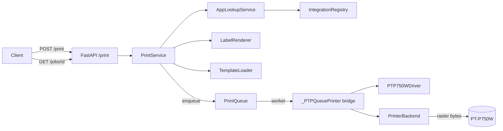

# First-Print Pipeline Design

- **Status:** Draft (brainstorming complete 2026-05-15)
- **Tracking issue:** #22 (master)
- **Branch:** `feat/first-print-design`

## Goal

End-to-end pipeline from REST endpoint to a physical print on a Brother PT-P750W. After this phase the hub can:

- accept a print request via `POST /print`,
- resolve a template (either via an integration plugin lookup OR with raw payload data),
- render the label,
- enqueue the job in the existing `PrintQueue` and process it asynchronously,
- physically print on a network-reachable PT-P750W,
- expose status via `GET /jobs/{job_id}` for polling.

**Definition of Done:** A manual smoke test (`backend/scripts/smoke_first_print.py`) prints a QR-only label successfully on real hardware.

## Scope

In scope:

- `PrinterBackend` Protocol as the extension point for hardware adapters.
- `PTouchBackend` as the first concrete adapter, wrapping the `ptouch` library.
- `PTP750WDriver` (PrinterModel, see ADR 0004) plus a private `_PTPQueuePrinter` bridge it produces via `make_queue_printer(...)` for the PrintQueue's `_PrinterLike` Protocol.
- `PrintService` orchestrating lookup → render → enqueue.
- REST endpoints `POST /print` and `GET /jobs/{job_id}`.
- App lifespan initialization with backend selection from settings.
- A mock backend (under `tests/`) for unit and integration tests.
- A manual hardware smoke script against a real PT-P750W.

Out of scope (deferred to later phases):

- SQLite persistence for jobs (Phase 5).
- Multiple printer instances and routing between them.
- Web UI and template editor (Phase 7).
- Cross-job auto-retry.
- `brother-ql` backend for the QL series.

## Architecture



### Component map

| Component | File | Responsibility |
|---|---|---|
| `PrinterBackend` Protocol | `app/printer_backends/base.py` | Transport + encoding contract: `print_image`, `send_bytes`, `query_status` |
| `PTouchBackend` | `app/printer_backends/ptouch_backend.py` | Wraps the `ptouch` library; synchronous I/O is dispatched via `asyncio.to_thread` |
| `MockPrinterBackend` | `app/printer_backends/mock_backend.py` | Mock for tests and local dev without hardware |
| Exceptions | `app/printer_backends/exceptions.py` | `PrinterError` hierarchy |
| `PTP750WDriver` | `app/printer_models/pt.py` (extends existing module) | PrinterModel driver + `make_queue_printer(...)` factory that returns a `_PrinterLike`. Per ADR 0004 all PT-specific code lives in this file. |
| `ModelRegistry` | `app/printer_models/registry.py` (existing, extended) | Discovers driver plugins via `setuptools entry_points` (group `label_hub.printer_models`); ships with the built-in PT-Series driver registered |
| Backend registry | `app/printer_backends/__init__.py` (new) | Discovers backend plugins via `setuptools entry_points` (group `label_hub.printer_backends`); ships with `ptouch` + `mock` registered |
| `PrintService` | `app/services/print_service.py` | Use-case orchestrator |
| REST routes | `app/api/routes/print.py` | `POST /print`, `GET /jobs/{id}`, exception mapping |
| Lifespan init | `app/main.py` | Backend selection, queue start/stop |
| Settings | `app/config.py` | `printer_backend`, `printer_pt_host`, ... |

## Backend Protocol

### Contract

```python
@runtime_checkable
class PrinterBackend(Protocol):
    backend_id: str
    host: str

    async def print_image(
        self,
        image: Image.Image,
        tape_spec: TapeSpec,
        *,
        auto_cut: bool = True,
        high_resolution: bool = False,
    ) -> None: ...

    async def send_bytes(self, raster: bytes) -> None: ...

    async def query_status(self) -> StatusBlock: ...
```

**Hybrid-API rationale:**

- `print_image` is the high-level path — the caller hands in a PIL image plus a `TapeSpec` and the backend encodes and sends.
- `send_bytes` is the escape hatch for future raw raster experiments (template editor, power users). The caller is responsible for validation.
- `query_status` is the cheap pre-print check and health probe.

### `PTouchBackend` implementation

- Constructor takes `host: str` and a `ptouch.printers.*` class (default `PT_P750W`).
- All `ptouch` calls are synchronous and dispatched via `asyncio.to_thread`.
- `query_status` parses the ptouch status block into our `StatusBlock` dataclass.
- `print_image` validates against the cached status (see Error handling) and calls `printer.print(label, auto_cut=..., high_resolution=...)`.
- `send_bytes` opens a raw TCP connection to `host:9100` via `asyncio.open_connection` (so the call is non-blocking inside an `async def`), writes the bytes, and closes.

### `PTP750WDriver` (PrinterModel + queue-printer factory)

The driver implements the existing `PrinterModel` Protocol AND provides a factory method that produces a `_PrinterLike` for the queue. Keeping the bridge as a method on the driver means: subclassing the driver automatically inherits the bridge, and `printer_models/pt.py` stays the single home for PT-specific code (ADR 0004).

```python
class PTP750WDriver:
    # PrinterModel attrs
    model_id = "PT-P750W"
    pjl_signatures = ["PT-P750W"]
    snmp_model_oid_value_substr = "PT-P750W"
    dpi = (180, 180)
    print_head_pins = 128

    def __init__(self, backend: PrinterBackend) -> None:
        self._backend = backend

    # --- PrinterModel methods ---
    async def query_status(self, host: str = "", port: int = 9100, timeout_s: float = 5.0):
        # host is bound to the backend already; argument kept for Protocol compat
        return await self._backend.query_status()

    def width_to_pixels(self, tape_spec: TapeSpec) -> int:
        return tape_spec.print_area_pins

    def build_print_job(self, image, tape_spec, auto_cut=True, high_resolution=False) -> bytes:
        raise NotImplementedError(
            "PT-P750W uses high-level backend.print_image; "
            "raw raster encoding stays inside the ptouch library."
        )

    # --- queue-printer factory ---
    def make_queue_printer(
        self,
        tape_registry: TapeRegistry,
        *,
        default_media_type: MediaType = MediaType.LAMINATED,
    ) -> "_PTPQueuePrinter":
        """Return a `_PrinterLike` bound to this driver + its backend."""
        return _PTPQueuePrinter(
            driver=self,
            backend=self._backend,
            tape_registry=tape_registry,
            default_media_type=default_media_type,
        )


class _PTPQueuePrinter:
    """Internal `_PrinterLike` adapter — not part of the public API. Use the
    driver's `make_queue_printer(...)` factory to construct one.
    """
    # `_PrinterLike` (print_queue.py) requires `id: str`.
    id: str  # e.g. "pt-p750w@<host>"

    async def print_image(self, image, *, tape_mm, **options):
        media_type = options.get("media_type", self._default_media_type)
        tape_spec = self._tape_registry.lookup_pt(tape_mm, media_type)
        await self._backend.print_image(
            image, tape_spec,
            auto_cut=options.get("auto_cut", True),
            high_resolution=options.get("high_resolution", False),
        )
```

**Why the factory pattern:**

- A custom driver (e.g. `class PTP710BTDriver(PTP750WDriver)`) inherits `make_queue_printer` for free — no second adapter class to subclass.
- The PT-series adapter (`_PTPQueuePrinter`) is shared across every PT model and stays private to `pt.py`.
- The QL series will mirror this in `ql.py` with its own `_QLQueuePrinter` adapter; no cross-series coupling.

**TapeRegistry API:** `TapeRegistry.lookup_pt(width_mm, media_type)` requires an explicit `MediaType` (laminated, non-laminated, ...). The PT adapter takes a `default_media_type` from the factory (typically `MediaType.LAMINATED` because TZe-Tapes dominate PT use) and lets a per-print `options["media_type"]` override it. The pre-print status check catches a mismatched physical tape via `TapeMismatchError`.

## Data Flow

### POST /print (async + job ID)

1. Client sends a `PrintRequest` (template ID + either `lookup` OR `data` + options).
2. The API calls `PrintService.submit_print_job(request)`.
3. PrintService loads the template via `TemplateLoader.get(template_id)`. On miss → `TemplateNotFoundError` (404, synchronous).
4. PrintService resolves `LabelData`:
   - When `lookup` is set: `AppLookupService.lookup(app, identifier)` → `LabelData`. On failure → `LookupFailedError` (502, synchronous).
   - When `data` is set: `LabelData.from_dict(data)`.
5. PrintService calls `LabelRenderer.render(template, label_data)` → PIL image.
6. PrintService calls `PrintQueue.enqueue(image, tape_mm=template.tape_mm, options=...)` → `job_id`.
7. The API responds `202 {job_id, status: "queued"}`.
8. The queue worker dequeues (existing FSM) and calls `print_image(...)` on the `_PrinterLike` returned by `driver.make_queue_printer(...)`.
9. The backend runs pre-print validation and prints.
10. Job status transitions: `queued → running → done` (or `→ failed` with `error_code`).

### GET /jobs/{job_id}

- Lookup in the in-memory job store of `PrintQueue`.
- 404 when the job ID does not exist (or the TTL has expired).
- Response contains `status`, `error_code`, `error_message`, `error_detail`, timestamps.

### Persistence

In-memory store with a 5-minute TTL (existing). No database in this phase.

## REST Schemas

```python
class PrintLookupRequest(BaseModel):
    app: str
    identifier: str

class PrintOptions(BaseModel):
    copies: int = Field(1, ge=1, le=10)
    auto_cut: bool = True
    high_resolution: bool = False

class PrintRequest(BaseModel):
    template_id: str
    lookup: PrintLookupRequest | None = None
    data: dict[str, str] | None = None
    options: PrintOptions = PrintOptions()

    @model_validator(mode="after")
    def _exactly_one_source(self) -> Self:
        if (self.lookup is None) == (self.data is None):
            raise ValueError("Exactly one of `lookup` or `data` must be set.")
        return self

class PrintJobResponse(BaseModel):
    job_id: str
    status: Literal["queued"]

class PrintJobStatusResponse(BaseModel):
    job_id: str
    status: Literal["queued", "running", "done", "failed"]
    error_code: str | None = None
    error_message: str | None = None
    error_detail: dict[str, Any] | None = None
    created_at: datetime
    started_at: datetime | None = None
    finished_at: datetime | None = None
```

## App Lifespan

```python
@asynccontextmanager
async def lifespan(app: FastAPI) -> AsyncIterator[None]:
    settings = get_settings()

    TemplateLoader.load_dir(_SEED_TEMPLATES_DIR)  # already from Phase 4

    # Discover all driver + backend plugins via entry_points (built-ins ship pre-registered)
    ModelRegistry.ensure_discovered()
    BackendRegistry.ensure_discovered()

    backend = _build_backend(settings)
    driver_cls = ModelRegistry.find_by_model_id(settings.printer_model)
    driver = driver_cls(backend=backend)
    printer = driver.make_queue_printer(tape_registry)
    queue = PrintQueue(printers=[printer])  # matches current __init__ signature
    await queue.start()

    app.state.print_queue = queue
    app.state.printer_id = printer.id  # callers reference this on enqueue()
    app.state.print_service = PrintService(
        template_loader=TemplateLoader,
        renderer=LabelRenderer(),
        print_queue=queue,
        integration_registry=IntegrationRegistry,
    )

    try:
        yield
    finally:
        await queue.stop(timeout_s=settings.printer_queue_timeout_s)


def _build_backend(settings: Settings) -> PrinterBackend:
    """Backend factory — discovers backend implementations via entry_points
    (group `label_hub.printer_backends`) and instantiates the one named by
    `settings.printer_backend`. The built-in `ptouch` and `mock` backends
    self-register; third-party backends ship as separate pip packages.
    """
    backend_factory = BackendRegistry.find_by_backend_id(settings.printer_backend)
    return backend_factory.from_settings(settings)
```

Each backend factory exposes a tiny `from_settings(settings) → PrinterBackend` class method so the lifespan code stays trivial and series-agnostic. `PTouchBackend.from_settings` checks `printer_pt_host` and looks up the ptouch class for the configured `printer_model`; `MockPrinterBackend.from_settings` ignores host/model and returns a fresh mock.

**Mock backend lives in `app/`, not `tests/`** — the earlier open question is resolved. Rationale:

- Importing from `tests/` in production code is a maintainability anti-pattern (Gemini-flagged).
- Local dev without real hardware is a real use case (`PRINTER_HUB_PRINTER_BACKEND=mock`), so the mock needs to ship with the application.
- Tests still pick the mock up the same way — just import path moves to `app.printer_backends.mock_backend`.

## Settings

```python
class Settings(BaseSettings):
    # ...existing fields...
    printer_backend: str = "ptouch"           # backend_id; default built-ins: "ptouch", "mock"
    printer_model: str = "PT-P750W"           # model_id resolved against ModelRegistry
    printer_pt_host: str | None = None        # required for ptouch backend
    printer_queue_timeout_s: float = 30.0
```

The env-var prefix `PRINTER_HUB_` is already established. Example: `PRINTER_HUB_PRINTER_PT_HOST=<printer-ip>`.

`printer_backend` and `printer_model` are plain strings (not `Literal[...]`), so a freshly installed third-party plugin can be selected without a code change. Validation happens at app start — if either value does not resolve to a registered plugin, the lifespan fails fast with a clear error.

Per-printer concurrency is **not** a setting — `PrintQueue` already gives each printer its own dedicated worker (one in flight per printer at a time). Concurrency would only become a knob if a single physical printer could process several jobs in parallel, which Brother PT-Series doesn't.

## Extensibility — Adding More Printers Without Core Changes

The core (PrintQueue, LabelRenderer, TemplateLoader, PrintService, REST routes, both Protocols) does not change when new hardware is added. Five extension paths cover the realistic scenarios, ordered from smallest to largest intervention:

### Path 1 — New model in the same series (e.g. PT-P900)

Add a class to `app/printer_models/pt.py`:

```python
class PTP900Driver(PTP750WDriver):
    model_id = "PT-P900"
    pjl_signatures = ["PT-P900"]
    snmp_model_oid_value_substr = "PT-P900"
    dpi = (360, 360)
    print_head_pins = 454
```

Register at import time (via the module-level `ModelRegistry.register(PTP900Driver)` call that already exists in `pt.py`). The bridge is inherited via `make_queue_printer`. Users select it with `PRINTER_HUB_PRINTER_MODEL=PT-P900`. **One file, no core change.**

### Path 2 — Decorator backend (smallest fix for vendor-library bugs)

When the existing backend is 95% right but one method needs a patch — e.g. PT-P710BT firmware lies about `tape_empty`:

```python
class QuirkyPTP710BTBackend:
    backend_id = "ptouch-p710bt-quirk"
    def __init__(self, inner: PTouchBackend) -> None:
        self._inner = inner
        self.host = inner.host
    async def query_status(self) -> StatusBlock:
        status = await self._inner.query_status()
        if status.tape_empty and self._secondary_check_says_ok():
            status = replace(status, tape_empty=False)
        return status
    async def print_image(self, image, tape_spec, **kw):
        await self._inner.print_image(image, tape_spec, **kw)
    async def send_bytes(self, raster):
        await self._inner.send_bytes(raster)
```

One wrapper class implementing `PrinterBackend` again. `ptouch` library stays untouched, no driver change.

### Path 3 — Subclass driver (model-specific status / encoding)

When the anomaly lives in the driver layer (status-block parsing, raster encoding for one model), subclass the closest driver and override the affected method. The bridge factory is inherited; no other changes are needed.

### Path 4 — New series with its own backend (e.g. QL via `brother-ql`)

```
app/printer_models/ql.py            (new — QL drivers, QL tape data)
app/printer_backends/brother_ql.py  (new — wraps brother-ql library)
```

Both register via `ensure_discovered()` at app start. `PrinterBackend` Protocol is unchanged — its contract already covers `brother-ql`. **Core unchanged, two new files.**

### Path 5 — Third-party driver / backend as a separate pip package

External package ships its own `pyproject.toml`:

```toml
[project.entry-points."label_hub.printer_models"]
zebra-zd420 = "label_hub_zebra.driver:ZebraZD420Driver"

[project.entry-points."label_hub.printer_backends"]
zebra-zpl = "label_hub_zebra.backend:ZebraZPLBackend"
```

`pip install label-hub-zebra-driver` → at app start the discovery loop in `app/printer_models/__init__.py` and `app/printer_backends/__init__.py` picks them up automatically. User sets `PRINTER_HUB_PRINTER_MODEL=zebra-zd420` and `PRINTER_HUB_PRINTER_BACKEND=zebra-zpl`. **Zero edits in the core repository.**

### What this means for First-Print scope

To enable paths 1, 2, 4 and 5 from day one, First-Print delivers:

1. `ModelRegistry` is driven by `setuptools entry_points` (group `label_hub.printer_models`); built-in PT driver self-registers.
2. A new `BackendRegistry` mirrors that for backends (group `label_hub.printer_backends`); built-in `ptouch` and `mock` backends self-register.
3. Backends expose `from_settings(settings) → PrinterBackend` so the lifespan stays trivial.
4. Driver exposes `make_queue_printer(...)` so subclasses inherit the bridge.

Path 3 (subclass driver) needs no extra plumbing — it falls out of the inheritance model. Lifecycle hooks (pre/post-print) are deliberately **out of scope** for First-Print (YAGNI): paths 2 and 3 cover every realistic case today. They can be added to `PrinterModel` later as optional methods with a default no-op if a concrete need arises.

## Error Handling

### Exception hierarchy

```python
class PrinterError(Exception): ...
class PrinterOfflineError(PrinterError): ...
class TapeMismatchError(PrinterError):
    expected_mm: int
    loaded_mm: int | None
class TapeEmptyError(PrinterError): ...
class PrinterCoverOpenError(PrinterError): ...
class PrintFailedError(PrinterError): ...
class StatusQueryFailedError(PrinterError): ...
```

Plus `TemplateNotFoundError` and `LookupFailedError` on the lookup/template side.

### Pre-print validation (inside `PTouchBackend.print_image`)

1. `query_status()` with retry/back-off. On final network failure → `PrinterOfflineError`.
2. Check hardware state: `tape_empty`, `cover_open`, `error_flags` → specific exception.
3. Tape match: `status.loaded_tape_mm == tape_spec.tape_mm`. Otherwise → `TapeMismatchError`.
4. Validate image dimensions against `tape_spec.print_area_pins`. Otherwise → `PrintFailedError` with an explanatory message.
5. Synchronous ptouch print dispatched via `asyncio.to_thread`.

### HTTP status mapping

| Exception | HTTP | `error_code` |
|---|---|---|
| `TemplateNotFoundError` | 404 | `template_not_found` |
| `LookupFailedError` | 502 | `integration_lookup_failed` |
| `TapeMismatchError` | 409 | `tape_mismatch` |
| `TapeEmptyError` | 409 | `tape_empty` |
| `PrinterCoverOpenError` | 409 | `printer_cover_open` |
| `PrinterOfflineError` | 503 | `printer_offline` |
| `StatusQueryFailedError` | 503 | `printer_status_unavailable` |
| `PrintFailedError` | 500 | `print_failed` |

**Important:** `TemplateNotFoundError` and `LookupFailedError` are mapped to HTTP errors **synchronously** in the POST handler (they happen before the enqueue). All other errors come from the worker and end up in the job record (`status="failed"`).

### Retry policy

- `query_status` retries 3 times with back-off (0s, 1s, 2s) on `socket.timeout` / `OSError`.
- No cross-job auto-retries. If a job fails, the user fixes the cause and posts again.

### Logging

- `INFO` on each job state transition.
- `WARNING` on retry attempts.
- `ERROR` with `exc_info=True` on failed outcomes.
- `DEBUG` (opt-in) for raw bytes.

## Testing Strategy

### Test pyramid

- **Unit (pure):** exception hierarchy, settings validation, Pydantic validators.
- **Unit (with mocks):** backend, driver, bridge, `PrintService`.
- **Integration:** FastAPI `AsyncClient` + `MockPrinterBackend`, end-to-end via `POST /print` → `GET /jobs/{id}`.
- **Hardware smoke (manual):** `scripts/smoke_first_print.py` against a real PT-P750W.

### Unit tests

| File | Focus |
|---|---|
| `tests/printer_backends/test_exceptions.py` | Hierarchy, `TapeMismatchError` fields accessible |
| `tests/printer_backends/test_ptouch_backend.py` | ptouch via monkeypatch; all error paths; retry back-off |
| `tests/printer_models/test_ptp750w_driver.py` | Tape→pixel mapping; `build_print_job` raises |
| `tests/services/test_pt_printer_bridge.py` | Bridge calls backend with correct `TapeSpec`; `_PrinterLike` conformance |
| `tests/services/test_print_service.py` | Lookup/render/enqueue order; raw `data` path bypasses integration |
| `tests/api/test_print_routes.py` | 202 with `job_id`; XOR validation; `GET /jobs/{id}` for all statuses |
| `tests/test_lifespan.py` | Mock backend starts; plugin discovery runs; `queue.stop()` runs in `finally` |
| `tests/test_settings_printer.py` | `printer_pt_host` required when `printer_backend=ptouch`; unknown `printer_model` / `printer_backend` fail fast at startup |
| `tests/printer_models/test_registry.py` | `ModelRegistry.find_by_model_id` returns the right driver; entry-point discovery picks up a fake plugin |
| `tests/printer_backends/test_registry.py` | `BackendRegistry.find_by_backend_id` returns the right backend factory; built-in `ptouch` + `mock` are pre-registered |

### Integration tests

`tests/api/test_print_e2e.py` with scenarios:

- Happy path (raw data) → `done`; mock backend received exactly one image with correct dimensions.
- Tape mismatch (mock `loaded_tape_mm=12`, template `tape_mm=24`) → `failed`, `error_code=tape_mismatch`.
- Offline (mock `offline=True`) → `failed` after 3 retries, `error_code=printer_offline`.
- Template not found → 404 synchronous.
- Lookup failure → 502 synchronous.
- Cover open / tape empty → `failed` with the matching `error_code`.

### Hardware smoke

`backend/scripts/smoke_first_print.py` — starts the lifespan in-process, prints `qr-only-24mm` with `primary_id="SMOKE-001"`, validates success. Not in CI. Run manually at phase close.

Two additional manual scenarios:

1. Swap the tape mid-job → verify `tape_mismatch`.
2. Power off the printer mid-job → verify `printer_offline` + retry.

### CI gates

- `ruff check .` and `ruff format --check .` (both).
- `mypy --strict app`.
- `pytest --cov=app --cov-fail-under=80`.

## Acceptance Criteria

1. `POST /print` with `template_id="qr-only-24mm"` and `data={"primary_id": "X"}` returns 202 with a `job_id`.
2. `GET /jobs/{job_id}` returns statuses in sequence: `queued`, `running`, `done`.
3. The mock backend received exactly the expected image (dimensions match the `TapeSpec`).
4. Tape mismatch ends as `failed` with the correct `error_code` and `error_detail`.
5. Printer offline ends as `failed` after exactly 3 status query attempts.
6. Template-not-found is a synchronous 404; no job record is created.
7. Lookup failure is a synchronous 502; no job record is created.
8. Lifespan shutdown stops the queue within `printer_queue_timeout_s`.
9. Settings without `printer_pt_host` and `printer_backend=ptouch` fail at app start with a clear error.
10. An unknown `printer_model` or `printer_backend` fails at app start with a clear error listing the registered options.
11. A fake driver plugin registered via `setuptools entry_points` is picked up by `ModelRegistry.ensure_discovered()` in a test, demonstrating that third-party drivers work end-to-end without core changes.
12. `scripts/smoke_first_print.py` prints successfully on a real PT-P750W (verified manually).
13. Coverage ≥80%; `ruff check`, `ruff format --check`, and `mypy --strict` all green.

## Open Questions and Risks

- **ptouch status parsing:** which fields the `ptouch` library exposes from the status block must be verified in plan Phase 1 (read `ptouch.printers.PT_P750W.get_status`). If the fields are insufficient (e.g. no `loaded_tape_mm`), we need a fall-back raw parser following the Brother Raster Command Reference (PT-Series).
- **PT-P750W transport:** the design assumes network TCP. The ptouch class lookup happens inside `PTouchBackend.from_settings` and is easy to extend if a future model needs a different connection class.
- **In-memory TTL drift:** the 5-minute TTL could expire during very long polls. Not blocking for First-Print; will be revisited together with the persistence work in Phase 5.
- **Default `MediaType` for the bridge:** `MediaType.LAMINATED` covers the common TZe-Tape case, but the bridge accepts a per-print `options["media_type"]` override. If a request comes in with the wrong media type, the pre-print status check will catch the mismatch via `TapeMismatchError`.
- **Lifecycle hooks (`before_print` / `after_print`):** intentionally **not** part of First-Print. Adding them would extend the `PrinterModel` Protocol once (with no-op defaults). Deferred until a concrete need surfaces — paths 2 and 3 in the Extensibility section cover every realistic case today.

## References

- ADR 0004 — Plugin architecture for printer models
- ADR 0005 — Print queue is mandatory
- ADR 0011 — OpenAPI as API contract
- `docs/architecture.md` — high-level overview
- Brother Raster Command Reference (PT-Series) — `docs/research/`
- Master tracking issue: #22
