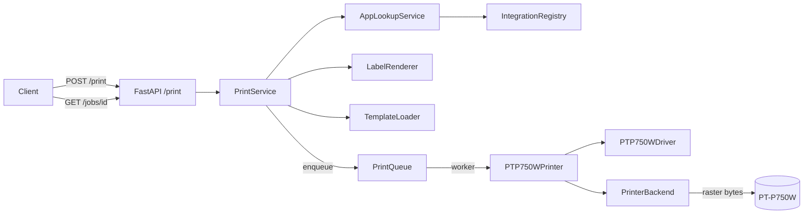

# First-Print Pipeline Design

- **Status:** Draft (brainstorming complete 2026-05-15)
- **Tracking issue:** #22 (master)
- **Branch:** `feat/first-print-design`

## Goal

End-to-end pipeline from REST endpoint to a physical print on a Brother PT-P750W. After this phase the hub can:

- accept a print request via `POST /print`,
- resolve a template (either via an integration plugin lookup OR with raw payload data),
- render the label,
- enqueue the job in the existing `PrintQueue` and process it asynchronously,
- physically print on a network-reachable PT-P750W,
- expose status via `GET /jobs/{job_id}` for polling.

**Definition of Done:** A manual smoke test (`backend/scripts/smoke_first_print.py`) prints a QR-only label successfully on real hardware.

## Scope

In scope:

- `PrinterBackend` Protocol as the extension point for hardware adapters.
- `PTouchBackend` as the first concrete adapter, wrapping the `ptouch` library.
- `PTP750WDriver` (PrinterModel, see ADR 0004) and `PTP750WPrinter` (bridge to PrintQueue's `_PrinterLike` Protocol).
- `PrintService` orchestrating lookup → render → enqueue.
- REST endpoints `POST /print` and `GET /jobs/{job_id}`.
- App lifespan initialization with backend selection from settings.
- A mock backend (under `tests/`) for unit and integration tests.
- A manual hardware smoke script against a real PT-P750W.

Out of scope (deferred to later phases):

- SQLite persistence for jobs (Phase 5).
- Multiple printer instances and routing between them.
- Web UI and template editor (Phase 7).
- Cross-job auto-retry.
- `brother-ql` backend for the QL series.

## Architecture



### Component map

| Component | File | Responsibility |
|---|---|---|
| `PrinterBackend` Protocol | `app/printer_backends/base.py` | Transport + encoding contract: `print_image`, `send_bytes`, `query_status` |
| `PTouchBackend` | `app/printer_backends/ptouch_backend.py` | Wraps the `ptouch` library; synchronous I/O is dispatched via `asyncio.to_thread` |
| `MockPrinterBackend` | `tests/_fakes/mock_backend.py` | Test double, no network I/O |
| Exceptions | `app/printer_backends/exceptions.py` | `PrinterError` hierarchy |
| `PTP750WDriver` | `app/printer_models/ptp750w.py` | PrinterModel driver, holds model-specific constants |
| `PTP750WPrinter` | `app/services/printers.py` | Bridge: PrinterModel + Backend → PrintQueue's `_PrinterLike` |
| `PrintService` | `app/services/print_service.py` | Use-case orchestrator |
| REST routes | `app/api/routes/print.py` | `POST /print`, `GET /jobs/{id}`, exception mapping |
| Lifespan init | `app/main.py` | Backend selection, queue start/stop |
| Settings | `app/config.py` | `printer_backend`, `printer_pt_host`, ... |

## Backend Protocol

### Contract

```python
@runtime_checkable
class PrinterBackend(Protocol):
    backend_id: str
    host: str

    async def print_image(
        self,
        image: Image.Image,
        tape_spec: TapeSpec,
        *,
        auto_cut: bool = True,
        high_resolution: bool = False,
    ) -> None: ...

    async def send_bytes(self, raster: bytes) -> None: ...

    async def query_status(self) -> StatusBlock: ...
```

**Hybrid-API rationale:**

- `print_image` is the high-level path — the caller hands in a PIL image plus a `TapeSpec` and the backend encodes and sends.
- `send_bytes` is the escape hatch for future raw raster experiments (template editor, power users). The caller is responsible for validation.
- `query_status` is the cheap pre-print check and health probe.

### `PTouchBackend` implementation

- Constructor takes `host: str` and a `ptouch.printers.*` class (default `PT_P750W`).
- All `ptouch` calls are synchronous and dispatched via `asyncio.to_thread`.
- `query_status` parses the ptouch status block into our `StatusBlock` dataclass.
- `print_image` validates against the cached status (see Error handling) and calls `printer.print(label, auto_cut=..., high_resolution=...)`.
- `send_bytes` opens a raw TCP connection to `host:9100`, writes the bytes, and closes.

### `PTP750WDriver` (PrinterModel)

- `model_id = "PT-P750W"`, `dpi=(180, 180)`, `print_head_pins=128`.
- `width_to_pixels(tape_spec)` returns `tape_spec.print_area_pins`.
- `build_print_job` raises `NotImplementedError` — encoding is done inside `ptouch`, not in the driver.
- `query_status(host="", port=9100, timeout_s=5.0)` delegates to `self._backend.query_status()`. The `host` argument is ignored because the backend is already bound to a connection.

### `PTP750WPrinter` (bridge to PrintQueue)

Adapter that combines PrinterModel + backend into the shape `PrintQueue._PrinterLike` expects (`async def print_image(image, *, tape_mm, **options)`):

```python
class PTP750WPrinter:
    printer_id: str  # "PT-P750W@<host>"

    async def print_image(self, image, *, tape_mm, **options):
        tape_spec = self._tape_registry.for_pt_series(tape_mm)
        await self._backend.print_image(
            image, tape_spec,
            auto_cut=options.get("auto_cut", True),
            high_resolution=options.get("high_resolution", False),
        )
```

## Data Flow

### POST /print (async + job ID)

1. Client sends a `PrintRequest` (template ID + either `lookup` OR `data` + options).
2. The API calls `PrintService.submit_print_job(request)`.
3. PrintService loads the template via `TemplateLoader.get(template_id)`. On miss → `TemplateNotFoundError` (404, synchronous).
4. PrintService resolves `LabelData`:
   - When `lookup` is set: `AppLookupService.lookup(app, identifier)` → `LabelData`. On failure → `LookupFailedError` (502, synchronous).
   - When `data` is set: `LabelData.from_dict(data)`.
5. PrintService calls `LabelRenderer.render(template, label_data)` → PIL image.
6. PrintService calls `PrintQueue.enqueue(image, tape_mm=template.tape_mm, options=...)` → `job_id`.
7. The API responds `202 {job_id, status: "queued"}`.
8. The queue worker dequeues (existing FSM) and calls `PTP750WPrinter.print_image(...)`.
9. The backend runs pre-print validation and prints.
10. Job status transitions: `queued → running → done` (or `→ failed` with `error_code`).

### GET /jobs/{job_id}

- Lookup in the in-memory job store of `PrintQueue`.
- 404 when the job ID does not exist (or the TTL has expired).
- Response contains `status`, `error_code`, `error_message`, `error_detail`, timestamps.

### Persistence

In-memory store with a 5-minute TTL (existing). No database in this phase.

## REST Schemas

```python
class PrintLookupRequest(BaseModel):
    app: str
    identifier: str

class PrintOptions(BaseModel):
    copies: int = Field(1, ge=1, le=10)
    auto_cut: bool = True
    high_resolution: bool = False

class PrintRequest(BaseModel):
    template_id: str
    lookup: PrintLookupRequest | None = None
    data: dict[str, str] | None = None
    options: PrintOptions = PrintOptions()

    @model_validator(mode="after")
    def _exactly_one_source(self) -> Self:
        if (self.lookup is None) == (self.data is None):
            raise ValueError("Exactly one of `lookup` or `data` must be set.")
        return self

class PrintJobResponse(BaseModel):
    job_id: str
    status: Literal["queued"]

class PrintJobStatusResponse(BaseModel):
    job_id: str
    status: Literal["queued", "running", "done", "failed"]
    error_code: str | None = None
    error_message: str | None = None
    error_detail: dict[str, Any] | None = None
    created_at: datetime
    started_at: datetime | None = None
    finished_at: datetime | None = None
```

## App Lifespan

```python
@asynccontextmanager
async def lifespan(app: FastAPI) -> AsyncIterator[None]:
    settings = get_settings()

    TemplateLoader.load_dir(_SEED_TEMPLATES_DIR)  # already from Phase 4

    backend = _build_backend(settings)
    driver = PTP750WDriver(backend=backend)
    printer = PTP750WPrinter(driver=driver, backend=backend, tape_registry=tape_registry)
    queue = PrintQueue(printer=printer, max_concurrency=settings.printer_max_concurrency)
    await queue.start()

    app.state.print_queue = queue
    app.state.print_service = PrintService(
        template_loader=TemplateLoader,
        renderer=LabelRenderer(),
        print_queue=queue,
        integration_registry=IntegrationRegistry,
    )

    try:
        yield
    finally:
        await queue.stop(timeout_s=settings.printer_queue_timeout_s)


def _build_backend(settings: Settings) -> PrinterBackend:
    if settings.printer_backend == "mock":
        # Import locally so production deployments without test deps still start
        from tests._fakes.mock_backend import MockPrinterBackend
        return MockPrinterBackend()
    if settings.printer_backend == "ptouch":
        if not settings.printer_pt_host:
            raise ConfigurationError("printer_pt_host required for printer_backend=ptouch")
        return PTouchBackend(
            host=settings.printer_pt_host,
            ptouch_printer_cls=_resolve_ptouch_model(settings.printer_pt_model),
        )
    raise ConfigurationError(f"unknown printer_backend: {settings.printer_backend}")
```

Open question: the mock backend currently lives under `tests/_fakes/`. If we want it to be usable for local development without hardware, we should consider moving it to `app/printer_backends/mock_backend.py` instead and feature-flagging it via settings. To be decided during the implementation plan.

## Settings

```python
class Settings(BaseSettings):
    # ...existing fields...
    printer_backend: Literal["ptouch", "mock"] = "ptouch"
    printer_pt_host: str | None = None
    printer_pt_model: str = "PT-P750W"
    printer_max_concurrency: int = 1
    printer_queue_timeout_s: float = 30.0
```

The env-var prefix `PRINTER_HUB_` is already established. Example: `PRINTER_HUB_PRINTER_PT_HOST=<printer-ip>`.

## Error Handling

### Exception hierarchy

```python
class PrinterError(Exception): ...
class PrinterOfflineError(PrinterError): ...
class TapeMismatchError(PrinterError):
    expected_mm: int
    loaded_mm: int | None
class TapeEmptyError(PrinterError): ...
class PrinterCoverOpenError(PrinterError): ...
class PrintFailedError(PrinterError): ...
class StatusQueryFailedError(PrinterError): ...
```

Plus `TemplateNotFoundError` and `LookupFailedError` on the lookup/template side.

### Pre-print validation (inside `PTouchBackend.print_image`)

1. `query_status()` with retry/back-off. On final network failure → `PrinterOfflineError`.
2. Check hardware state: `tape_empty`, `cover_open`, `error_flags` → specific exception.
3. Tape match: `status.loaded_tape_mm == tape_spec.tape_mm`. Otherwise → `TapeMismatchError`.
4. Validate image dimensions against `tape_spec.print_area_pins`. Otherwise → `PrintFailedError` with an explanatory message.
5. Synchronous ptouch print dispatched via `asyncio.to_thread`.

### HTTP status mapping

| Exception | HTTP | `error_code` |
|---|---|---|
| `TemplateNotFoundError` | 404 | `template_not_found` |
| `LookupFailedError` | 502 | `integration_lookup_failed` |
| `TapeMismatchError` | 409 | `tape_mismatch` |
| `TapeEmptyError` | 409 | `tape_empty` |
| `PrinterCoverOpenError` | 409 | `printer_cover_open` |
| `PrinterOfflineError` | 503 | `printer_offline` |
| `StatusQueryFailedError` | 503 | `printer_status_unavailable` |
| `PrintFailedError` | 500 | `print_failed` |

**Important:** `TemplateNotFoundError` and `LookupFailedError` are mapped to HTTP errors **synchronously** in the POST handler (they happen before the enqueue). All other errors come from the worker and end up in the job record (`status="failed"`).

### Retry policy

- `query_status` retries 3 times with back-off (0s, 1s, 2s) on `socket.timeout` / `OSError`.
- No cross-job auto-retries. If a job fails, the user fixes the cause and posts again.

### Logging

- `INFO` on each job state transition.
- `WARNING` on retry attempts.
- `ERROR` with `exc_info=True` on failed outcomes.
- `DEBUG` (opt-in) for raw bytes.

## Testing Strategy

### Test pyramid

- **Unit (pure):** exception hierarchy, settings validation, Pydantic validators.
- **Unit (with mocks):** backend, driver, bridge, `PrintService`.
- **Integration:** FastAPI `AsyncClient` + `MockPrinterBackend`, end-to-end via `POST /print` → `GET /jobs/{id}`.
- **Hardware smoke (manual):** `scripts/smoke_first_print.py` against a real PT-P750W.

### Unit tests

| File | Focus |
|---|---|
| `tests/printer_backends/test_exceptions.py` | Hierarchy, `TapeMismatchError` fields accessible |
| `tests/printer_backends/test_ptouch_backend.py` | ptouch via monkeypatch; all error paths; retry back-off |
| `tests/printer_models/test_ptp750w_driver.py` | Tape→pixel mapping; `build_print_job` raises |
| `tests/services/test_pt_printer_bridge.py` | Bridge calls backend with correct `TapeSpec`; `_PrinterLike` conformance |
| `tests/services/test_print_service.py` | Lookup/render/enqueue order; raw `data` path bypasses integration |
| `tests/api/test_print_routes.py` | 202 with `job_id`; XOR validation; `GET /jobs/{id}` for all statuses |
| `tests/test_lifespan.py` | Mock backend starts; `queue.stop()` runs in `finally` |
| `tests/test_settings_printer.py` | `printer_pt_host` required when `printer_backend=ptouch` |

### Integration tests

`tests/api/test_print_e2e.py` with scenarios:

- Happy path (raw data) → `done`; mock backend received exactly one image with correct dimensions.
- Tape mismatch (mock `loaded_tape_mm=12`, template `tape_mm=24`) → `failed`, `error_code=tape_mismatch`.
- Offline (mock `offline=True`) → `failed` after 3 retries, `error_code=printer_offline`.
- Template not found → 404 synchronous.
- Lookup failure → 502 synchronous.
- Cover open / tape empty → `failed` with the matching `error_code`.

### Hardware smoke

`backend/scripts/smoke_first_print.py` — starts the lifespan in-process, prints `qr-only-24mm` with `primary_id="SMOKE-001"`, validates success. Not in CI. Run manually at phase close.

Two additional manual scenarios:

1. Swap the tape mid-job → verify `tape_mismatch`.
2. Power off the printer mid-job → verify `printer_offline` + retry.

### CI gates

- `ruff check .` and `ruff format --check .` (both).
- `mypy --strict app`.
- `pytest --cov=app --cov-fail-under=80`.

## Acceptance Criteria

1. `POST /print` with `template_id="qr-only-24mm"` and `data={"primary_id": "X"}` returns 202 with a `job_id`.
2. `GET /jobs/{job_id}` returns statuses in sequence: `queued`, `running`, `done`.
3. The mock backend received exactly the expected image (dimensions match the `TapeSpec`).
4. Tape mismatch ends as `failed` with the correct `error_code` and `error_detail`.
5. Printer offline ends as `failed` after exactly 3 status query attempts.
6. Template-not-found is a synchronous 404; no job record is created.
7. Lookup failure is a synchronous 502; no job record is created.
8. Lifespan shutdown stops the queue within `printer_queue_timeout_s`.
9. Settings without `printer_pt_host` and `printer_backend=ptouch` fail at app start with a clear error.
10. `scripts/smoke_first_print.py` prints successfully on a real PT-P750W (verified manually).
11. Coverage ≥80%; `ruff check`, `ruff format --check`, and `mypy --strict` all green.

## Open Questions and Risks

- **ptouch status parsing:** which fields the `ptouch` library exposes from the status block must be verified in plan Phase 1 (read `ptouch.printers.PT_P750W.get_status`). If the fields are insufficient (e.g. no `loaded_tape_mm`), we need a fall-back raw parser following the Brother Raster Command Reference (PT-Series).
- **PT-P750W transport:** the design assumes network TCP. The library may force a specific connection class — the class lookup in `_resolve_ptouch_model` is a plain string map and easy to extend.
- **In-memory TTL drift:** the 5-minute TTL could expire during very long polls. Not blocking for First-Print; will be revisited together with the persistence work in Phase 5.
- **Mock backend location:** see App-Lifespan section above — open decision whether to move the mock backend from `tests/` into `app/` for local dev use without hardware.

## References

- ADR 0004 — Plugin architecture for printer models
- ADR 0005 — Print queue is mandatory
- ADR 0011 — OpenAPI as API contract
- `docs/architecture.md` — high-level overview
- Brother Raster Command Reference (PT-Series) — `docs/research/`
- Master tracking issue: #22
