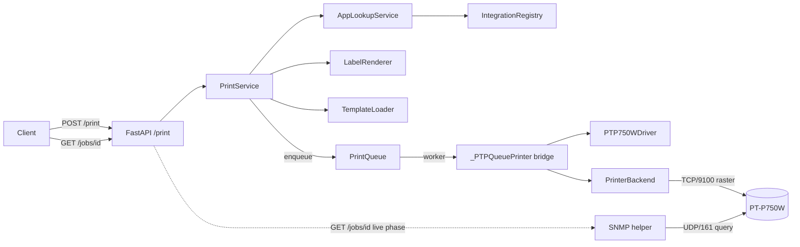

# First-Print Pipeline Design

- **Status:** Draft (brainstorming complete 2026-05-15)
- **Tracking issue:** #22 (master)
- **Branch:** `feat/first-print-design`

## Goal

End-to-end pipeline from REST endpoint to a physical print on a Brother PT-P750W. After this phase the hub can:

- accept a print request via `POST /print`,
- resolve a template (either via an integration plugin lookup OR with raw payload data),
- render the label,
- enqueue the job in the existing `PrintQueue` and process it asynchronously,
- physically print on a network-reachable PT-P750W,
- expose status via `GET /jobs/{job_id}` for polling.

**Definition of Done:** A manual smoke test (`backend/scripts/smoke_first_print.py`) prints a QR-only label successfully on real hardware.

## Scope

In scope:

- `PrinterBackend` Protocol as the extension point for hardware adapters.
- `PTouchBackend` as the first concrete adapter, wrapping the `ptouch` library.
- **SNMP query helpers** for two purposes that the print TCP channel cannot serve:
  1. **Model discovery at startup** — read the printer's PJL string (`1.3.6.1.4.1.2435.2.3.9.1.1.7.0`) and resolve it via `ModelRegistry.find_by_pjl`. Fulfils ADR 0004.
  2. **Live status during print** — Brother PT-Series allows only **one** TCP/9100 session, so ESC i S cannot be polled while ptouch holds the print connection. SNMP runs on UDP/161 and stays usable.
- `PTP750WDriver` (PrinterModel, see ADR 0004) plus a private `_PTPQueuePrinter` bridge it produces via `make_queue_printer(...)` for the PrintQueue's `_PrinterLike` Protocol.
- `PrintService` orchestrating lookup → render → enqueue.
- REST endpoints `POST /print` and `GET /jobs/{job_id}`.
- App lifespan initialization with backend selection from settings.
- A mock backend (under `tests/`) for unit and integration tests.
- A manual hardware smoke script against a real PT-P750W.

Out of scope (deferred to later phases):

- SQLite persistence for jobs (Phase 5).
- Multiple printer instances and routing between them.
- Web UI and template editor (Phase 7).
- Cross-job auto-retry.
- `brother-ql` backend for the QL series.

## Architecture



The SNMP helper sits beside the backend, not behind it. The backend keeps owning print + pre-print ESC i S validation on TCP/9100; SNMP owns discovery and during-print live status on UDP/161. Both can run concurrently against the same physical printer.

### Component map

| Component | File | Responsibility |
|---|---|---|
| `PrinterBackend` Protocol | `app/printer_backends/base.py` | Transport + encoding contract: `print_image` + `query_status` |
| `PTouchBackend` | `app/printer_backends/ptouch_backend.py` | Wraps the `ptouch` library; synchronous I/O is dispatched via `asyncio.to_thread` |
| `MockPrinterBackend` | `app/printer_backends/mock_backend.py` | Mock for tests and local dev without hardware |
| Exceptions | `app/printer_backends/exceptions.py` | `PrinterError` hierarchy |
| `PTP750WDriver` | `app/printer_models/pt.py` (extends existing module) | PrinterModel driver + `make_queue_printer(...)` factory that returns a `_PrinterLike`. Per ADR 0004 all PT-specific code lives in this file. |
| `ModelRegistry` | `app/printer_models/registry.py` (existing, extended) | Discovers driver plugins via `setuptools entry_points` (group `label_hub.printer_models`); ships with the built-in PT-Series driver registered |
| Backend registry | `app/printer_backends/__init__.py` (new) | Discovers backend plugins via `setuptools entry_points` (group `label_hub.printer_backends`); ships with `ptouch` + `mock` registered |
| `PrintService` | `app/services/print_service.py` | Use-case orchestrator |
| SNMP helper | `app/printer_backends/snmp_helper.py` (new) | UDP/161 queries: PJL-string for model discovery, `hrPrinterStatus` + `hrPrinterDetectedErrorState` for live status |
| REST routes | `app/api/routes/print.py` | `POST /print`, `GET /jobs/{id}` (includes live SNMP phase when the queue says the job is printing), exception mapping |
| Lifespan init | `app/main.py` | SNMP-discovery → resolve model from PJL → backend selection → queue start/stop |
| Settings | `app/config.py` | `printer_backend`, `printer_model`, `printer_discover_via_snmp`, `printer_snmp_community`, reuses existing `pt750w_host` / `pt750w_port` |

## Backend Protocol

### Contract

```python
@runtime_checkable
class PrinterBackend(Protocol):
    backend_id: str
    host: str

    async def print_image(
        self,
        image: Image.Image,
        tape_spec: TapeSpec,
        *,
        auto_cut: bool = True,
        high_resolution: bool = False,
    ) -> None: ...

    async def query_status(self) -> StatusBlock: ...
```

**Two-method surface, deliberate YAGNI:**

- `print_image` is the only print path. Caller hands in a PIL image plus a `TapeSpec`; the backend encodes and sends.
- `query_status` is the cheap pre-print check and health probe.

An earlier draft included a `send_bytes(raster: bytes)` escape hatch for raw raster experiments (template editor, custom encoders). It was removed: there is no concrete caller in First-Print, adding it now means parallel TCP/9100 connection logic that must be tested and maintained, and Brother PT hardware allows only one TCP session at a time — opening a raw socket while `ptouch` holds one would cause `Resource Busy` errors. The hook can be added back additively if a real use case appears (Customization Path 2 — decorator backend — does not need `send_bytes`).

### `PTouchBackend` implementation

- Constructor takes `host: str` and a `ptouch.printers.*` class (default `PT_P750W`).
- All `ptouch` calls are synchronous and dispatched via `asyncio.to_thread`.
- `query_status` parses the ptouch status block into our `StatusBlock` dataclass.
- `print_image` validates against the cached status (see Error handling) and calls `printer.print(label, auto_cut=..., high_resolution=...)`.

### `PTP750WDriver` (PrinterModel + queue-printer factory)

The driver implements the existing `PrinterModel` Protocol AND provides a factory method that produces a `_PrinterLike` for the queue. Keeping the bridge as a method on the driver means: subclassing the driver automatically inherits the bridge, and `printer_models/pt.py` stays the single home for PT-specific code (ADR 0004).

```python
class PTP750WDriver:
    # PrinterModel attrs
    model_id = "PT-P750W"
    pjl_signatures = ["PT-P750W"]
    snmp_model_oid_value_substr = "PT-P750W"
    dpi = (180, 180)
    print_head_pins = 128

    def __init__(self, backend: PrinterBackend) -> None:
        self._backend = backend

    # --- PrinterModel methods ---
    async def query_status(self, host: str = "", port: int = 9100, timeout_s: float = 5.0):
        # The backend is already bound to a host. If the caller passes an explicit
        # non-empty host that doesn't match, that's a programmer error — fail loudly
        # rather than silently querying a different printer.
        #
        # Note on Protocol shape: the `host` argument originally implies a stateless
        # driver. With the bound-backend design the driver is stateful and `host` is
        # dead. A cleaner long-term fix is to refactor `PrinterModel.query_status`
        # to take no `host` argument; that is a follow-up PR that touches the
        # Protocol itself and is intentionally not bundled with First-Print.
        if host and host != self._backend.host:
            raise ValueError(
                f"Driver bound to backend.host={self._backend.host!r}; "
                f"got host={host!r}. Construct a new driver/backend pair instead."
            )
        return await self._backend.query_status()

    def width_to_pixels(self, tape_spec: TapeSpec) -> int:
        return tape_spec.print_area_pins

    def build_print_job(self, image, tape_spec, auto_cut=True, high_resolution=False) -> bytes:
        """Encode an image into the Brother raster byte stream for PT-Series.

        First-Print happy path goes through `backend.print_image()` and does
        **not** call this method. It is kept here for callers that need raw
        bytes (export-to-file, debugging) and for Protocol conformance.

        Implementation: delegates to the ptouch library's internal raster
        builder (e.g. `ptouch.label.ImageLabel(image, ...).encode()`). The
        exact entry point will be confirmed in implementation Phase 1 — if
        ptouch does not expose a public encoder, the fallback is a raw
        encoder built from the Brother Raster Command Reference.

        Alternative considered: refactoring `PrinterModel` so rasterization
        is in a separate sub-protocol (`RasterizablePrinterModel`). That is
        a cleaner shape if a backend genuinely cannot expose an encoder
        and is flagged as a possible follow-up. For First-Print we keep the
        Protocol unchanged and assume the ptouch encoder is reachable.
        """
        # impl details deferred to plan
        ...

    # --- queue-printer factory ---
    def make_queue_printer(
        self,
        tape_registry: TapeRegistry,
        *,
        default_media_type: MediaType = MediaType.LAMINATED,
    ) -> "_PTPQueuePrinter":
        """Return a `_PrinterLike` bound to this driver + its backend."""
        return _PTPQueuePrinter(
            driver=self,
            backend=self._backend,
            tape_registry=tape_registry,
            default_media_type=default_media_type,
        )


class _PTPQueuePrinter:
    """Internal `_PrinterLike` adapter — not part of the public API. Use the
    driver's `make_queue_printer(...)` factory to construct one.
    """
    # `_PrinterLike` (print_queue.py) requires `id: str`.
    id: str  # e.g. "pt-p750w@<host>"

    async def print_image(self, image, *, tape_mm, **options):
        media_type = options.get("media_type", self._default_media_type)
        tape_spec = self._tape_registry.lookup_pt(tape_mm, media_type)
        await self._backend.print_image(
            image, tape_spec,
            auto_cut=options.get("auto_cut", True),
            high_resolution=options.get("high_resolution", False),
        )
```

**Why the factory pattern:**

- A custom driver (e.g. `class PTP710BTDriver(PTP750WDriver)`) inherits `make_queue_printer` for free — no second adapter class to subclass.
- The PT-series adapter (`_PTPQueuePrinter`) is shared across every PT model and stays private to `pt.py`.
- The QL series will mirror this in `ql.py` with its own `_QLQueuePrinter` adapter; no cross-series coupling.

**TapeRegistry API:** `TapeRegistry.lookup_pt(width_mm, media_type)` requires an explicit `MediaType` (laminated, non-laminated, ...). The PT adapter takes a `default_media_type` from the factory (typically `MediaType.LAMINATED` because TZe-Tapes dominate PT use) and lets a per-print `options["media_type"]` override it. The pre-print status check catches a mismatched physical tape via `TapeMismatchError`.

## Data Flow

### POST /print (async + job ID)

1. Client sends a `PrintRequest` (template ID + either `lookup` OR `data` + options).
2. The API calls `PrintService.submit_print_job(request)`.
3. PrintService loads the template via `TemplateLoader.get(template_id)`. On miss → `TemplateNotFoundError` (404, synchronous).
4. PrintService resolves `LabelData`:
   - When `lookup` is set: `AppLookupService.lookup(app, identifier)` → `LabelData`. On failure → `LookupFailedError` (502, synchronous).
   - When `data` is set: PrintService constructs `LabelData(**raw.model_dump(), source_app="manual")` from the validated `RawLabelData`. The list-to-tuple coercion for `secondary` happens during the `LabelData` construction (since `LabelData.secondary: tuple[str, ...]`).
5. PrintService calls `LabelRenderer.render(template, label_data)` → PIL image.
6. PrintService calls `PrintQueue.submit(printer_id, image, tape_mm=template.tape_mm, **options)` → `job_id`. The `printer_id` is the only printer's `id` from `app.state.printer_id` (First-Print supports one printer; multi-printer routing comes with the persistence work).
7. The API responds `202 {job_id, status: "queued"}`.
8. The queue worker dequeues (existing FSM) and calls `print_image(...)` on the `_PrinterLike` returned by `driver.make_queue_printer(...)`.
9. The backend runs pre-print validation and prints.
10. Job status transitions: `queued → printing → completed` (or `→ failed` with `error_code`). These are the literal `JobState` enum values from `app/services/job_lifecycle.py`. The other enum members (`paused`, `cancelled`) are not produced by the First-Print path but remain visible in `/jobs/{id}` for forward compatibility.

### GET /jobs/{job_id}

- Lookup in the in-memory job store of `PrintQueue`.
- 404 when the job ID does not exist (since there is no eviction in First-Print, this is only the case for unknown/typo job IDs; the dict survives until process restart).
- Response contains `status`, `error_code`, `error_message`, `error_detail`, timestamps.

### Persistence

In-memory store, no eviction (the current `PrintQueue._jobs` dict keeps every job for the process lifetime — there is a TODO in the queue source about unbounded growth). A bounded job store with TTL or LRU eviction is **planned for Phase 5** alongside SQLite persistence; not part of First-Print.

For First-Print the practical impact is acceptable: jobs are tiny (a few KB each — PNG payload + metadata), the maintainer's deployment prints maybe dozens of labels per day, and a periodic process restart (e.g. via Watchtower image updates) acts as a coarse eviction in practice. If memory becomes an issue before Phase 5, the simplest stop-gap is a startup-time cap on the dict size with FIFO eviction — kept out of scope here to avoid scope creep.

## REST Schemas

```python
class PrintLookupRequest(BaseModel):
    app: str
    identifier: str

class PrintOptions(BaseModel):
    model_config = ConfigDict(frozen=True)
    copies: int = Field(1, ge=1, le=10)
    auto_cut: bool = True
    high_resolution: bool = False

class RawLabelData(BaseModel):
    """Payload shape accepted by the raw-data path. Validated into a
    `LabelData` instance inside `PrintService` via `LabelData.model_validate`.
    Mirrors `LabelData` field-by-field, but lets the client pass `secondary`
    as a JSON array (Pydantic coerces to tuple).
    """
    title: str
    primary_id: str
    qr_payload: str
    secondary: list[str] = Field(default_factory=list)
    # source_app is set to "manual" by PrintService — not accepted from the client

class PrintRequest(BaseModel):
    template_id: str
    lookup: PrintLookupRequest | None = None
    data: RawLabelData | None = None
    # Use default_factory so each PrintRequest gets its own PrintOptions instance
    # rather than sharing a single mutable default (Pydantic anti-pattern).
    options: PrintOptions = Field(default_factory=PrintOptions)

    @model_validator(mode="after")
    def _exactly_one_source(self) -> Self:
        if (self.lookup is None) == (self.data is None):
            raise ValueError("Exactly one of `lookup` or `data` must be set.")
        return self

class PrintJobResponse(BaseModel):
    job_id: str
    status: Literal["queued"]

class PrintJobStatusResponse(BaseModel):
    job_id: str
    status: JobState   # queued | paused | printing | completed | failed | cancelled
    error_code: str | None = None
    error_message: str | None = None
    error_detail: dict[str, Any] | None = None
    created_at: datetime
    started_at: datetime | None = None
    finished_at: datetime | None = None
```

## App Lifespan

```python
@asynccontextmanager
async def lifespan(app: FastAPI) -> AsyncIterator[None]:
    settings = get_settings()

    TemplateLoader.load_dir(_SEED_TEMPLATES_DIR)  # already from Phase 4

    # Discover all driver + backend plugins via entry_points (built-ins ship pre-registered)
    ModelRegistry.ensure_discovered()
    BackendRegistry.ensure_discovered()

    backend = _build_backend(settings)
    # Resolve model via SNMP first (when enabled), fall back to settings.printer_model.
    # The full flow is in the "SNMP — discovery + live status" section.
    discovery_host = settings.pt750w_host or ""
    if discovery_host and settings.printer_discover_via_snmp:
        model_id = await _resolve_printer_model(settings, discovery_host)
    else:
        model_id = settings.printer_model
        if not model_id:
            raise ValueError("printer_model is empty and SNMP discovery is disabled.")

    driver_cls = ModelRegistry.find_by_model_id(model_id)
    driver = driver_cls(backend=backend)
    printer = driver.make_queue_printer(tape_registry)
    queue = PrintQueue(printers=[printer])  # matches current __init__ signature
    await queue.start()

    app.state.print_queue = queue
    app.state.printer_id = printer.id  # PrintService passes this to PrintQueue.submit(...)
    app.state.printer_host = discovery_host  # used by route handler for live SNMP
    app.state.printer_snmp_community = settings.printer_snmp_community
    app.state.print_service = PrintService(
        template_loader=TemplateLoader,
        renderer=LabelRenderer(),
        print_queue=queue,
        integration_registry=IntegrationRegistry,
    )

    try:
        yield
    finally:
        await queue.stop(timeout_s=settings.printer_queue_timeout_s)


def _build_backend(settings: Settings) -> PrinterBackend:
    """Backend factory — discovers backend implementations via entry_points
    (group `label_hub.printer_backends`) and instantiates the one named by
    `settings.printer_backend`. The built-in `ptouch` and `mock` backends
    self-register; third-party backends ship as separate pip packages.
    """
    backend_factory = BackendRegistry.find_by_backend_id(settings.printer_backend)
    return backend_factory.from_settings(settings)
```

Each backend factory exposes a tiny `from_settings(settings) → PrinterBackend` class method so the lifespan code stays trivial and series-agnostic. `PTouchBackend.from_settings` reads `settings.pt750w_host` / `settings.pt750w_port` (existing PT-Series fields) and looks up the ptouch class for the configured `printer_model`; `MockPrinterBackend.from_settings` ignores host/model and returns a fresh mock.

**Mock backend lives in `app/`, not `tests/`** — the earlier open question is resolved. Rationale:

- Importing from `tests/` in production code is a maintainability anti-pattern (Gemini-flagged).
- Local dev without real hardware is a real use case (`PRINTER_HUB_PRINTER_BACKEND=mock`), so the mock needs to ship with the application.
- Tests still pick the mock up the same way — just import path moves to `app.printer_backends.mock_backend`.

## Settings

First-Print **reuses the existing per-model fields** in `app/config.py` (e.g. `pt750w_host`, `pt750w_port`, `ql820_host`, `ql820_port`) rather than renaming them. New fields are added on top:

```python
class Settings(BaseSettings):
    # --- existing (kept as-is) ---
    pt750w_host: str = ""
    pt750w_port: int = 9100
    ql820_host: str = ""
    ql820_port: int = 9100
    # ...

    # --- NEW for First-Print ---
    printer_backend: str = "ptouch"           # backend_id; default built-ins: "ptouch", "mock"
    printer_model: str = "PT-P750W"           # fallback model_id when SNMP discovery is off or fails
    printer_discover_via_snmp: bool = True    # try SNMP first, fall back to printer_model
    printer_snmp_community: str = "public"    # SNMP v2c community (read-only)
    printer_queue_timeout_s: float = 30.0
```

Env-var prefix `PRINTER_HUB_` is established. Examples:

```
PRINTER_HUB_PT750W_HOST=<printer-ip>         # existing
PRINTER_HUB_PRINTER_MODEL=PT-P750W           # new
PRINTER_HUB_PRINTER_BACKEND=ptouch           # new
```

`PTouchBackend.from_settings(settings)` reads `settings.pt750w_host` / `settings.pt750w_port` for PT-Series, similarly `BrotherQLBackend.from_settings` (when QL lands) reads `settings.ql820_*`. The mapping from `printer_model` to the right host field lives inside each backend's `from_settings`; the lifespan does not need to know.

If multi-printer or multi-instance support becomes a real requirement, the per-model host/port pairs will be refactored into a more general structure (e.g. a list of printer configs). That refactor is deferred — it has no design-shaping impact today.

`printer_backend` and `printer_model` are plain strings (not `Literal[...]`), so a freshly installed third-party plugin can be selected without a code change. Validation happens at app start — if either value does not resolve to a registered plugin, the lifespan fails fast with a clear error.

Per-printer concurrency is **not** a setting — `PrintQueue` already gives each printer its own dedicated worker (one in flight per printer at a time). Concurrency would only become a knob if a single physical printer could process several jobs in parallel, which Brother PT-Series doesn't.

## Extensibility — Adding More Printers Without Core Changes

The core (PrintQueue, LabelRenderer, TemplateLoader, PrintService, REST routes, both Protocols) does not change when new hardware is added. Five extension paths cover the realistic scenarios, ordered from smallest to largest intervention:

### Path 1 — New model in the same series (e.g. PT-P900)

Add a class to `app/printer_models/pt.py`:

```python
class PTP900Driver(PTP750WDriver):
    model_id = "PT-P900"
    pjl_signatures = ["PT-P900"]
    snmp_model_oid_value_substr = "PT-P900"
    dpi = (360, 360)
    print_head_pins = 454
```

Register at import time (via the module-level `ModelRegistry.register(PTP900Driver)` call that already exists in `pt.py`). The bridge is inherited via `make_queue_printer`. Users select it with `PRINTER_HUB_PRINTER_MODEL=PT-P900`. **One file, no core change.**

### Path 2 — Decorator backend (smallest fix for vendor-library bugs)

When the existing backend is 95% right but one method needs a patch — e.g. PT-P710BT firmware lies about `tape_empty`:

```python
class QuirkyPTP710BTBackend:
    backend_id = "ptouch-p710bt-quirk"
    def __init__(self, inner: PTouchBackend) -> None:
        self._inner = inner
        self.host = inner.host
    async def query_status(self) -> StatusBlock:
        status = await self._inner.query_status()
        if status.tape_empty and self._secondary_check_says_ok():
            status = replace(status, tape_empty=False)
        return status
    async def print_image(self, image, tape_spec, **kw):
        await self._inner.print_image(image, tape_spec, **kw)
```

One wrapper class implementing `PrinterBackend` again. `ptouch` library stays untouched, no driver change.

### Path 3 — Subclass driver (model-specific status / encoding)

When the anomaly lives in the driver layer (status-block parsing, raster encoding for one model), subclass the closest driver and override the affected method. The bridge factory is inherited; no other changes are needed.

### Path 4 — New series with its own backend (e.g. QL via `brother-ql`)

```
app/printer_models/ql.py            (new — QL drivers, QL tape data)
app/printer_backends/brother_ql.py  (new — wraps brother-ql library)
```

Both register via `ensure_discovered()` at app start. `PrinterBackend` Protocol is unchanged — its contract already covers `brother-ql`. **Core unchanged, two new files.**

### Path 5 — Third-party driver / backend as a separate pip package

External package ships its own `pyproject.toml`:

```toml
[project.entry-points."label_hub.printer_models"]
zebra-zd420 = "label_hub_zebra.driver:ZebraZD420Driver"

[project.entry-points."label_hub.printer_backends"]
zebra-zpl = "label_hub_zebra.backend:ZebraZPLBackend"
```

`pip install label-hub-zebra-driver` → at app start the discovery loop in `app/printer_models/__init__.py` and `app/printer_backends/__init__.py` picks them up automatically. User sets `PRINTER_HUB_PRINTER_MODEL=zebra-zd420` and `PRINTER_HUB_PRINTER_BACKEND=zebra-zpl`. **Zero edits in the core repository.**

### What this means for First-Print scope

To enable paths 1, 2, 4 and 5 from day one, First-Print delivers:

1. `ModelRegistry` is driven by `setuptools entry_points` (group `label_hub.printer_models`); built-in PT driver self-registers.
2. A new `BackendRegistry` mirrors that for backends (group `label_hub.printer_backends`); built-in `ptouch` and `mock` backends self-register.
3. Backends expose `from_settings(settings) → PrinterBackend` so the lifespan stays trivial.
4. Driver exposes `make_queue_printer(...)` so subclasses inherit the bridge.

Path 3 (subclass driver) needs no extra plumbing — it falls out of the inheritance model. Lifecycle hooks (pre/post-print) are deliberately **out of scope** for First-Print (YAGNI): paths 2 and 3 cover every realistic case today. They can be added to `PrinterModel` later as optional methods with a default no-op if a concrete need arises.

## SNMP — discovery + live status

The print path uses TCP/9100 (single session, owned by ptouch during a print). SNMP gives us a second, parallel channel for the things TCP/9100 cannot serve.

### Two helper functions, both async

```python
# app/printer_backends/snmp_helper.py
async def query_model_pjl(host: str, *, community: str = "public", timeout_s: float = 3.0) -> str:
    """Read Brother private OID 1.3.6.1.4.1.2435.2.3.9.1.1.7.0 → PJL identification string.
    Example reply: 'MFG:Brother;CMD:PJL;MDL:PT-P750W;CLS:PRINTER;DES:Brother PT-P750W;'
    """

async def query_live_status(host: str, *, community: str = "public", timeout_s: float = 3.0) -> LiveStatus:
    """Read standard Host-Resources Printer-MIB:
       * hrPrinterStatus       1.3.6.1.2.1.25.3.5.1.1.1  → idle | printing | warmup | other
       * hrPrinterDetectedErrorState  1.3.6.1.2.1.25.3.5.1.2.1  → 8-byte bitmask
    Returns a small LiveStatus dataclass — used by GET /jobs/{id} to surface
    "really printing right now" vs "queued behind another job".
    """
```

Both helpers use `pysnmp.hlapi.v3arch.asyncio.get_cmd` (asyncio-native, no thread dispatch needed). `pysnmp>=6.2` is already pinned in `pyproject.toml`.

### What SNMP gives us that ESC i S does not

| Use case | ESC i S (TCP/9100) | SNMP (UDP/161) |
|---|---|---|
| Pre-print validation (tape mm, media type) | direct integer/byte | text description — parsing needed |
| **Model auto-discovery (PJL string for ADR 0004)** | **no** — only series/model code bytes | **yes** — full `MFG:Brother;...;MDL:PT-P750W;...` |
| **Live status during a running print** | **no** — TCP is busy | **yes** — UDP independent |
| Brother-specific error bits (jam, overheating) | yes | no — only standard `hrPrinterDetectedErrorState` |

We keep both. ESC i S in `PTouchBackend.print_image` does the detailed pre-print check it is already good at. SNMP does discovery at startup and live-status during print.

### Lifespan discovery flow

```python
async def _resolve_printer_model(settings: Settings, host: str) -> str:
    """Returns the model_id that ModelRegistry.find_by_model_id will use."""
    if not settings.printer_discover_via_snmp:
        return settings.printer_model
    try:
        pjl = await query_model_pjl(host, community=settings.printer_snmp_community)
    except SnmpDiscoveryError as exc:
        if settings.printer_model:
            log.warning("SNMP discovery failed (%s); falling back to printer_model=%r", exc, settings.printer_model)
            return settings.printer_model
        raise  # no fallback configured → fail fast
    driver = ModelRegistry.find_by_pjl(pjl)
    return driver.model_id
```

Three configurations:

| `printer_discover_via_snmp` | `printer_model` (env) | Behaviour |
|---|---|---|
| `True` (default) | `""` | SNMP must succeed; failure raises at app start |
| `True` (default) | `"PT-P750W"` | Try SNMP, fall back to env var if SNMP fails (warned in log) |
| `False` | `"PT-P750W"` | Skip SNMP entirely, use env var |
| `False` | `""` | Refused at app start |

### Live-status path

`GET /jobs/{job_id}` keeps reading the in-memory FSM (Job.state, error_code, ...) as today. **Additionally**: when `job.state == JobState.PRINTING`, the route handler calls `query_live_status(host)` and attaches the returned `LiveStatus` to the response as a sub-object. Failure of the SNMP query is non-fatal — the live block is just omitted.

Schema sketch:

```python
class LiveStatus(BaseModel):
    model_config = ConfigDict(frozen=True)
    hr_printer_status: Literal["other", "unknown", "idle", "printing", "warmup"]
    error_flags: list[str]  # decoded bit names from hrPrinterDetectedErrorState

class PrintJobStatusResponse(BaseModel):
    # ...existing fields...
    live: LiveStatus | None = None  # populated only while job.state == PRINTING
```

## Error Handling

### Exception hierarchy

```python
class PrinterError(Exception): ...
class PrinterOfflineError(PrinterError): ...
class TapeMismatchError(PrinterError):
    expected_mm: int
    loaded_mm: int | None
class TapeEmptyError(PrinterError): ...
class PrinterCoverOpenError(PrinterError): ...
class PrintFailedError(PrinterError): ...
class StatusQueryFailedError(PrinterError): ...
class SnmpDiscoveryError(PrinterError): ...   # SNMP unreachable / OID missing
class SnmpQueryError(PrinterError): ...       # live-status SNMP failed at runtime (non-fatal)
```

Plus `TemplateNotFoundError` and `LookupFailedError` on the lookup/template side.

### Pre-print validation (inside `PTouchBackend.print_image`)

1. `query_status()` with retry/back-off. On final network failure → `PrinterOfflineError`.
2. Check hardware state: `tape_empty`, `cover_open`, `error_flags` → specific exception.
3. Tape match: `status.loaded_tape_mm == tape_spec.tape_mm`. Otherwise → `TapeMismatchError`.
4. Validate image dimensions against `tape_spec.print_area_pins`. Otherwise → `PrintFailedError` with an explanatory message.
5. Synchronous ptouch print dispatched via `asyncio.to_thread`.

### HTTP status mapping

| Exception | HTTP | `error_code` |
|---|---|---|
| `TemplateNotFoundError` | 404 | `template_not_found` |
| `LookupFailedError` | 502 | `integration_lookup_failed` |
| `TapeMismatchError` | 409 | `tape_mismatch` |
| `TapeEmptyError` | 409 | `tape_empty` |
| `PrinterCoverOpenError` | 409 | `printer_cover_open` |
| `PrinterOfflineError` | 503 | `printer_offline` |
| `StatusQueryFailedError` | 503 | `printer_status_unavailable` |
| `PrintFailedError` | 500 | `print_failed` |
| `SnmpDiscoveryError` | 503 (only at app start; never reaches a request) | `snmp_discovery_failed` |

**Important:** `TemplateNotFoundError` and `LookupFailedError` are mapped to HTTP errors **synchronously** in the POST handler (they happen before the enqueue). All other errors come from the worker and end up in the job record (`status="failed"`).

### Retry policy

- `query_status` retries 3 times with back-off (0s, 1s, 2s) on `socket.timeout` / `OSError`.
- No cross-job auto-retries. If a job fails, the user fixes the cause and posts again.

### Logging

- `INFO` on each job state transition.
- `WARNING` on retry attempts.
- `ERROR` with `exc_info=True` on failed outcomes.
- `DEBUG` (opt-in) for raw bytes.

## Testing Strategy

### Test pyramid

- **Unit (pure):** exception hierarchy, settings validation, Pydantic validators.
- **Unit (with mocks):** backend, driver, bridge, `PrintService`.
- **Integration:** FastAPI `AsyncClient` + `MockPrinterBackend`, end-to-end via `POST /print` → `GET /jobs/{id}`.
- **Hardware smoke (manual):** `scripts/smoke_first_print.py` against a real PT-P750W.

### Unit tests

| File | Focus |
|---|---|
| `tests/printer_backends/test_exceptions.py` | Hierarchy, `TapeMismatchError` fields accessible |
| `tests/printer_backends/test_ptouch_backend.py` | ptouch via monkeypatch; all error paths; retry back-off |
| `tests/printer_models/test_ptp750w_driver.py` | Tape→pixel mapping; `build_print_job` raises |
| `tests/services/test_pt_printer_bridge.py` | Bridge calls backend with correct `TapeSpec`; `_PrinterLike` conformance |
| `tests/services/test_print_service.py` | Lookup/render/enqueue order; raw `data` path bypasses integration |
| `tests/api/test_print_routes.py` | 202 with `job_id`; XOR validation; `GET /jobs/{id}` for all statuses |
| `tests/test_lifespan.py` | Mock backend starts; plugin discovery runs; `queue.stop()` runs in `finally` |
| `tests/test_settings_printer.py` | Empty `pt750w_host` with `printer_backend=ptouch` + `printer_model=PT-P750W` fails fast; unknown `printer_model` / `printer_backend` fail fast at startup |
| `tests/printer_models/test_registry.py` | `ModelRegistry.find_by_model_id` returns the right driver; entry-point discovery picks up a fake plugin |
| `tests/printer_backends/test_registry.py` | `BackendRegistry.find_by_backend_id` returns the right backend factory; built-in `ptouch` + `mock` are pre-registered |

### Integration tests

`tests/api/test_print_e2e.py` with scenarios:

- Happy path (raw data) → `completed`; mock backend received exactly one image with correct dimensions.
- Tape mismatch (mock `loaded_tape_mm=12`, template `tape_mm=24`) → `failed`, `error_code=tape_mismatch`.
- Offline (mock `offline=True`) → `failed` after 3 retries, `error_code=printer_offline`.
- Template not found → 404 synchronous.
- Lookup failure → 502 synchronous.
- Cover open / tape empty → `failed` with the matching `error_code`.

### Hardware smoke

`backend/scripts/smoke_first_print.py` — starts the lifespan in-process, prints `qr-only-24mm` with `primary_id="SMOKE-001"`, validates success. Not in CI. Run manually at phase close.

Two additional manual scenarios:

1. Swap the tape mid-job → verify `tape_mismatch`.
2. Power off the printer mid-job → verify `printer_offline` + retry.

### CI gates

- `ruff check .` and `ruff format --check .` (both).
- `mypy --strict app`.
- `pytest --cov=app --cov-fail-under=80`.

## Acceptance Criteria

1. `POST /print` with `template_id="qr-only-24mm"` and `data={"primary_id": "X"}` returns 202 with a `job_id`.
2. `GET /jobs/{job_id}` returns statuses in sequence: `queued`, `printing`, `completed` (the literal `JobState` enum values).
3. The mock backend received exactly the expected image (dimensions match the `TapeSpec`).
4. Tape mismatch ends as `failed` with the correct `error_code` and `error_detail`.
5. Printer offline ends as `failed` after exactly 3 status query attempts.
6. Template-not-found is a synchronous 404; no job record is created.
7. Lookup failure is a synchronous 502; no job record is created.
8. Lifespan shutdown stops the queue within `printer_queue_timeout_s`.
9. Empty `pt750w_host` with `printer_backend=ptouch` and `printer_model=PT-P750W` fails at app start with a clear error.
10. An unknown `printer_model` or `printer_backend` fails at app start with a clear error listing the registered options.
11. A fake driver plugin registered via `setuptools entry_points` is picked up by `ModelRegistry.ensure_discovered()` in a test, demonstrating that third-party drivers work end-to-end without core changes.
12. SNMP discovery resolves a stubbed PJL-string reply (`MFG:Brother;...;MDL:PT-P750W;...`) to the `PTP750WDriver` via `ModelRegistry.find_by_pjl` in an integration test.
13. With `printer_discover_via_snmp=True` and an unreachable host, app start fails with `SnmpDiscoveryError` **only when** `printer_model` is empty; with a populated `printer_model` the lifespan falls back to it and logs a warning.
14. `GET /jobs/{job_id}` for a job in `JobState.PRINTING` includes a `live` sub-object with `hr_printer_status` and `error_flags`; for any other job state `live` is `None`.
15. `scripts/smoke_first_print.py` prints successfully on a real PT-P750W (verified manually).
16. Coverage ≥80%; `ruff check`, `ruff format --check`, and `mypy --strict` all green.

## Open Questions and Risks

- **ptouch status parsing:** which fields the `ptouch` library exposes from the status block must be verified in plan Phase 1 (read `ptouch.printers.PT_P750W.get_status`). If the fields are insufficient (e.g. no `loaded_tape_mm`), we need a fall-back raw parser following the Brother Raster Command Reference (PT-Series).
- **PT-P750W transport:** the design assumes network TCP. The ptouch class lookup happens inside `PTouchBackend.from_settings` and is easy to extend if a future model needs a different connection class.
- **Job eviction:** the current `_jobs` dict grows unbounded (existing TODO). Bounded eviction is part of the Phase 5 persistence work; deliberately not in First-Print.
- **Default `MediaType` for the bridge:** `MediaType.LAMINATED` covers the common TZe-Tape case, but the bridge accepts a per-print `options["media_type"]` override. If a request comes in with the wrong media type, the pre-print status check will catch the mismatch via `TapeMismatchError`.
- **Lifecycle hooks (`before_print` / `after_print`):** intentionally **not** part of First-Print. Adding them would extend the `PrinterModel` Protocol once (with no-op defaults). Deferred until a concrete need surfaces — paths 2 and 3 in the Extensibility section cover every realistic case today.
- **PrinterModel Protocol shape — possible follow-up:** two parts of the current Protocol are awkward with the bound-backend driver design: (a) `query_status(host=...)` has a dead `host` argument, and (b) `build_print_job` is required even when a backend owns encoding. A clean follow-up PR would refactor the Protocol — either make `query_status` stateless-less (`query_status()` without `host`) or split rasterization into a `RasterizablePrinterModel` sub-protocol. Bundling that into First-Print would mean touching every existing PrinterModel call site; out of scope here.
- **Raw-bytes path:** removed for now (`send_bytes` is **not** part of `PrinterBackend`). If a real caller appears — e.g. a future template editor that wants to send pre-encoded raster, or a non-library backend — `send_bytes` can be added additively to the Protocol with no breaking change. Until then, every print goes through `print_image`.

## References

- ADR 0004 — Plugin architecture for printer models
- ADR 0005 — Print queue is mandatory
- ADR 0011 — OpenAPI as API contract
- `docs/architecture.md` — high-level overview
- Brother Raster Command Reference (PT-Series) — `docs/research/`
- Master tracking issue: #22
