# Label Template Layouts

Diese Seite zeigt die aktuellen Phase-3.5/4-Templates als Vektor-SVG. Sie ist die
Diskussions-Grundlage für [Phase 7e #81](https://github.com/strausmann/label-printer-hub/issues/81)
(Template Layout System v2).

Erzeugt durch `make docs-svg-samples`.

Die SVGs sind pure-vector: Text ist als `<text>`, QR-Codes als `<path>` gerendert — keine
Raster-Embeds. Das macht Git-Diffs der SVGs sinnvoll wenn sich Layout-Parameter ändern.

---

## 12mm Tape (TAPE_HEIGHT_PX = 106 px)

### grocy-12mm

<object data="svg-samples/grocy-12mm.svg" type="image/svg+xml" width="600" height="124">
  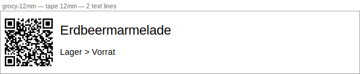
</object>

### qr-only-12mm

<object data="svg-samples/qr-only-12mm.svg" type="image/svg+xml" width="600" height="124">
  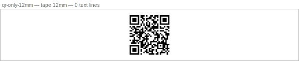
</object>

### snipeit-12mm

<object data="svg-samples/snipeit-12mm.svg" type="image/svg+xml" width="600" height="124">
  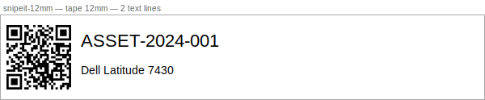
</object>

### spoolman-12mm

<object data="svg-samples/spoolman-12mm.svg" type="image/svg+xml" width="600" height="124">
  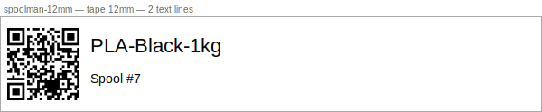
</object>

---

## 18mm Tape (TAPE_HEIGHT_PX = 165 px)

### grocy-18mm

<object data="svg-samples/grocy-18mm.svg" type="image/svg+xml" width="600" height="183">
  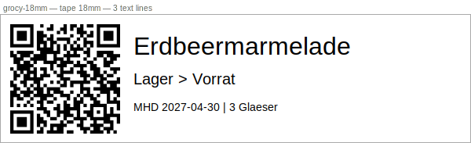
</object>

### qr-only-18mm

<object data="svg-samples/qr-only-18mm.svg" type="image/svg+xml" width="600" height="183">
  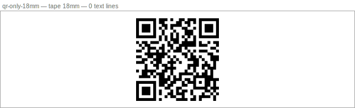
</object>

### snipeit-18mm

<object data="svg-samples/snipeit-18mm.svg" type="image/svg+xml" width="600" height="183">
  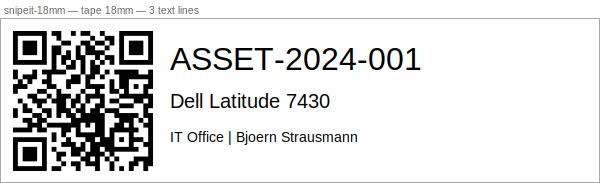
</object>

### spoolman-18mm

<object data="svg-samples/spoolman-18mm.svg" type="image/svg+xml" width="600" height="183">
  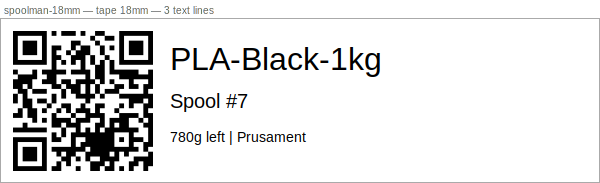
</object>

---

## 24mm Tape (TAPE_HEIGHT_PX = 256 px)

### grocy-24mm

<object data="svg-samples/grocy-24mm.svg" type="image/svg+xml" width="600" height="274">
  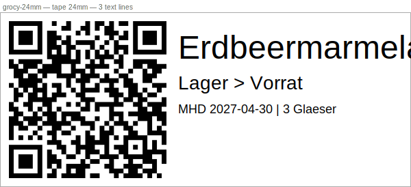
</object>

### qr-only-24mm

<object data="svg-samples/qr-only-24mm.svg" type="image/svg+xml" width="600" height="274">
  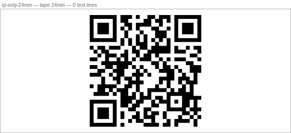
</object>

### snipeit-24mm

<object data="svg-samples/snipeit-24mm.svg" type="image/svg+xml" width="600" height="274">
  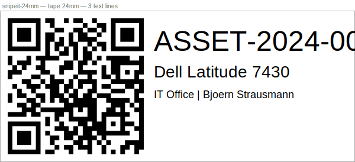
</object>

### spoolman-24mm

<object data="svg-samples/spoolman-24mm.svg" type="image/svg+xml" width="600" height="274">
  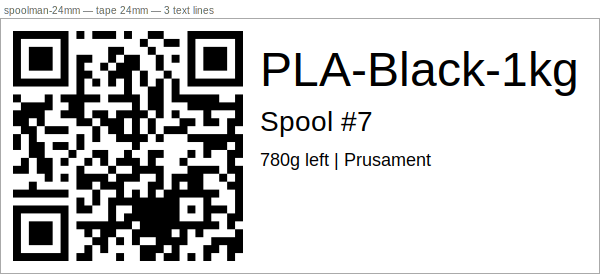
</object>

---

## Technische Details

### Koordinatensystem

Die SVGs spiegeln das Pixel-Koordinatensystem des `LabelRenderer` 1:1 wider:

| Tape | `TAPE_HEIGHT_PX` | SVG total height |
|------|-----------------|-----------------|
| 12mm | 106 px | 124 px (+ 18 px Annotation) |
| 18mm | 165 px | 183 px (+ 18 px Annotation) |
| 24mm | 256 px | 274 px (+ 18 px Annotation) |

Canvas-Breite ist immer 600 px (`DEFAULT_LABEL_WIDTH_PX`). Element-Koordinaten (`x`, `y`)
entsprechen direkt den Werten in den YAML-Template-Definitionen.

### QR-Code-Rendering

QR-Codes werden über `qrcode.image.svg.SvgPathImage` (box_size=1, border=0) als
`<path>`-Element gerendert und via `transform="translate(x,y) scale(factor)"` auf die
Zielgrösse skaliert. Kein Raster-Fallback — der QR-Pfad ist immer pure-vector.

### Regenerierung

```bash
make docs-svg-samples
```

Die SVGs werden neu erzeugt wenn sich `preview_sample`-Daten oder Element-Koordinaten
in den Seed-Templates ändern. Die generierten Dateien sind versioniert damit sie ohne
Python-Umgebung lesbar sind.
