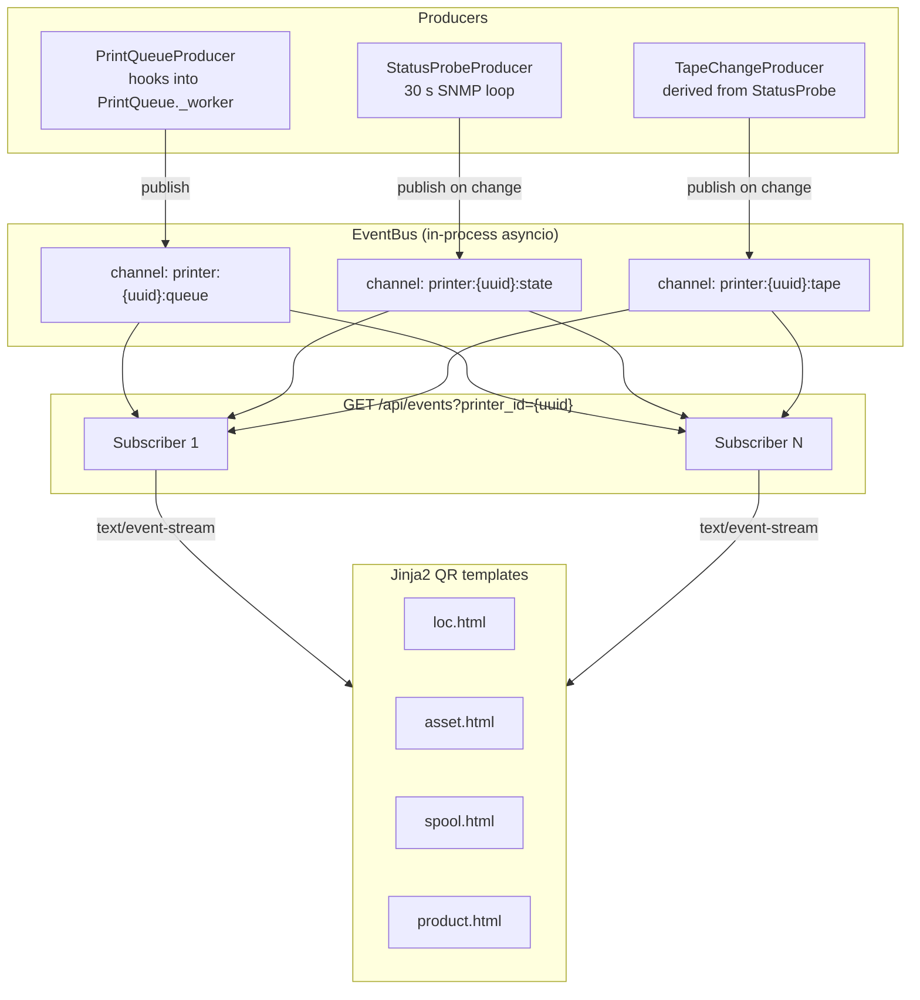

# Phase 6b — SSE EventBus (live status pages) — Design

**Date:** 2026-05-16
**Status:** Draft — awaiting planner handoff
**Owner:** repo maintainer
**Implementation branch:** `feat/phase6b-sse-eventbus`
**Tracking issues:** strausmann/label-printer-hub#14 (SSE / live status), strausmann/label-printer-hub#22 (Phase 6 master tracking)

---

## 1. Goal and Non-Goals

### Goal

Phase 6a landed 21 REST endpoints and the Jinja2 QR landing pages (`/loc`, `/asset`, `/spool`, `/product`). These pages are fully functional but static — a user who keeps the browser tab open sees stale data until they reload. Phase 6b makes those pages live: a single SSE endpoint pushes structured events whenever a printer's job queue advances, its physical status changes, or its tape is swapped, and the existing QR landing page templates subscribe to that stream and update relevant sections in place without a full-page reload.

The concrete deliverable is: scan a spool label → `/spool/{id}` opens → the page shows the current print queue length and printer status without polling, and updates automatically as jobs complete or new jobs arrive.

### Non-Goals

The following are explicitly deferred. Implementing any of them in Phase 6b would risk scope-creep without user-visible benefit, and all have clean extension points designed into this spec.

- **Event replay / `Last-Event-ID` history.** Phase 6b starts fresh on reconnect (zero history). The spec documents the hook point; Phase 7 can add a ring-buffer if the UX requires it.
- **Persistent event log.** Events are in-memory and ephemeral. There is no DB table for events, no audit trail.
- **WebSocket fallback.** All modern browsers support `EventSource`/SSE. A WebSocket path would double the server surface area for no gain in this deployment context.
- **Cross-process EventBus.** If the API is ever sharded across multiple uvicorn workers or pods, a Redis pub/sub backend would be needed. For a single-process deployment (which this is, per `examples/`) the in-process asyncio bus is the right choice.
- **Push notifications to mobile** (browser `Notification` API, APNs, FCM). Out of scope entirely; not architected for here.
- **Rich HTMX UI.** Phase 6b ships SSE plumbing and live updates on the existing plain-HTML QR pages. The richer HTMX/JS UI with edit forms, job controls, etc., is Phase 7.

---

## 2. Architecture

### 2.1 Component Overview



The `EventBus` is a pure asyncio in-process object, instantiated once in `lifespan` and stored on `app.state.event_bus`. It has no I/O and no thread synchronisation — all operations are coroutine-safe because asyncio is single-threaded. Producers and the SSE endpoint all run in the same event loop.

### 2.2 EventBus API Surface

```python
# backend/app/services/event_bus.py

from __future__ import annotations

import asyncio
import itertools
import logging
from collections.abc import AsyncIterator
from dataclasses import dataclass, field
from datetime import UTC, datetime
from typing import Any, Literal
from uuid import UUID

_log = logging.getLogger(__name__)

# Monotonic per-channel sequence counter type
_CounterType = itertools.count


@dataclass(frozen=True)
class BusEvent:
    """Wire-level event.  The SSE endpoint serialises this directly.

    ``event_id`` is a monotonically increasing integer scoped to the channel;
    it is NOT globally unique across channels.  Clients should not rely on
    ordering across channels.

    ``data`` is a typed dict; the specific shape depends on ``event_type``.
    Callers can pass any JSON-serialisable dict — the EventBus does not
    validate the data field.
    """

    channel: str
    event_id: int
    event_type: str
    timestamp: datetime
    data: dict[str, Any]


class EventBus:
    """In-process asyncio pub/sub bus.

    Thread-safety: this class is NOT thread-safe.  All callers must run in
    the same event loop.  That is guaranteed by FastAPI's single-process
    uvicorn deployment.

    Backpressure: each subscriber has a bounded asyncio.Queue.  When the queue
    is full, the oldest event is dropped and a counter is incremented.  The
    subscriber receives a ``dropped_count`` field on the next event so the
    client can detect gaps.

    Memory: subscribers that close their iterator are removed from the
    subscriber list automatically.  A subscriber that stops reading but does
    not close (zombie) is evicted after ``idle_timeout_s`` seconds of inactivity
    via the heartbeat / cleanup loop in the SSE endpoint.
    """

    def __init__(self, queue_size: int = 32) -> None:
        self._queue_size = queue_size
        # channel → list of (subscriber_id, queue)
        self._subscribers: dict[str, list[tuple[str, asyncio.Queue[BusEvent | None]]]] = {}
        self._counters: dict[str, _CounterType] = {}
        self._dropped: dict[str, int] = {}  # subscriber_id → drop count

    def publish(self, channel: str, event: BusEvent) -> None:
        """Publish an event to all subscribers on the channel.

        Synchronous — does not yield.  Safe to call from within an async
        context without ``await``.  Slow because it copies the event reference
        to every subscriber queue.  At expected subscriber counts (< 100 per
        printer) this is negligible.

        Drop policy: if a subscriber's queue is full, the oldest item is removed
        and the new event is appended.  This is "drop-oldest" semantics —
        justified in section 2.4.
        """
        for sub_id, q in list(self._subscribers.get(channel, [])):
            if q.full():
                try:
                    q.get_nowait()  # discard oldest
                    self._dropped[sub_id] = self._dropped.get(sub_id, 0) + 1
                    _log.debug("EventBus: dropped oldest event on %s for sub %s", channel, sub_id)
                except asyncio.QueueEmpty:
                    pass
            try:
                q.put_nowait(event)
            except asyncio.QueueFull:
                # Race: queue filled again between get and put; drop and log.
                self._dropped[sub_id] = self._dropped.get(sub_id, 0) + 1

    def subscribe(self, channel: str, subscriber_id: str) -> asyncio.Queue[BusEvent | None]:
        """Register a subscriber and return its dedicated queue.

        The caller is responsible for calling ``unsubscribe`` when the
        connection closes — typically in a ``finally`` block.
        """
        q: asyncio.Queue[BusEvent | None] = asyncio.Queue(maxsize=self._queue_size)
        self._subscribers.setdefault(channel, []).append((subscriber_id, q))
        return q

    def unsubscribe(self, channel: str, subscriber_id: str) -> None:
        """Remove a subscriber.  Idempotent — no-op if already removed."""
        self._subscribers[channel] = [
            (sid, q)
            for sid, q in self._subscribers.get(channel, [])
            if sid != subscriber_id
        ]

    def next_event_id(self, channel: str) -> int:
        """Return the next monotonic event ID for the channel."""
        if channel not in self._counters:
            self._counters[channel] = itertools.count(1)
        return next(self._counters[channel])

    def subscriber_count(self, channel: str) -> int:
        return len(self._subscribers.get(channel, []))

    def total_subscriber_count(self) -> int:
        return sum(len(v) for v in self._subscribers.values())

    def get_dropped_count(self, subscriber_id: str) -> int:
        return self._dropped.pop(subscriber_id, 0)
```

**Why `publish` is synchronous (not `async def`):** publishing should never block the producer. An async publish would require `await q.put()` and would suspend the producer if any subscriber's queue is full. By making publish synchronous and using `put_nowait`, we ensure the producer always returns immediately. The drop-oldest policy handles backpressure — see section 2.4.

### 2.3 Channel Scheme

Three named channels per printer, one `event_type` per channel:

| Channel | Event types | Rationale |
|---|---|---|
| `printer:{uuid}:queue` | `job.state_changed` | Queue subscribers want only job updates (e.g. print-status widget) |
| `printer:{uuid}:state` | `printer.status` | Status probe subscribers want only device state (e.g. online/offline indicator) |
| `printer:{uuid}:tape` | `printer.tape_changed` | Tape subscribers want only tape swap notifications (e.g. "loaded tape" badge) |

**Why three channels instead of one channel with `event_type` field?**

Considered alternative: one channel `printer:{uuid}` with a single subscriber per printer, fan-out controlled by the client filtering on `event_type`. Rejected because:

1. Each SSE connection subscribes to all three channels for the requested printer. The SSE endpoint does this with a simple `asyncio.gather` over three queues — the implementation is equally simple either way.
2. Separate channels make the EventBus subscription tables easier to observe for metrics: `printer_hub_sse_connections_total{channel="printer:X:queue"}` counts only queue subscribers, so queue-depth-driven reconnect decisions are clear.
3. The three event types have different publish rates: `printer.status` at ≤1/30s, `job.state_changed` at burst rate during active printing, `printer.tape_changed` rarely. Separate channels make it easy to add per-channel rate limiting or ring buffers later without affecting the other streams.

### 2.4 Backpressure: Drop-Oldest, Queue Depth 32

When a subscriber's queue is full, the **oldest** event is evicted and the new one is appended. Rationale:

- **Reconnect-friendliness:** a subscriber that lags behind and then catches up wants the most recent state, not a queued storm of stale transitions. The page that reconnects after a network blip should show the current state, not replay 30 seconds of transitions.
- **Alternative considered — block:** `await q.put(event)` would suspend the producer's task until the subscriber drains. With 100 concurrent subscribers this could cause cascading pauses across the job queue itself. Unacceptable.
- **Alternative considered — drop-newest:** discarding the new event means the subscriber never sees the current state. If the queue is full of stale transitions and a tape-change event is dropped, the page will show the wrong tape indefinitely. Drop-oldest is safer.
- **Queue depth 32:** at 1 event/s average rate, 32 events provides 32 seconds of buffer — more than enough for a short network hiccup before the browser reconnects. Configurable via `PRINTER_HUB_SSE_QUEUE_SIZE` if installations have bursty print volumes.

### 2.5 Event Shape

All events are instances of `BusEvent` (see section 2.2). The `data` dict is typed by `event_type`:

**`job.state_changed`** (channel: `printer:{uuid}:queue`):

```python
{
    "job_id": "3fa85f64-5717-4562-b3fc-2c963f66afa6",  # UUID str
    "from_state": "queued",   # JobState value before transition
    "to_state": "printing",   # JobState value after transition
    "queue_depth": 3,         # remaining non-terminal jobs for this printer
    "error_code": None,       # str | None — populated on FAILED transitions
}
```

**`printer.status`** (channel: `printer:{uuid}:state`):

```python
{
    "hr_printer_status": "idle",   # "idle" | "printing" | "warmup" | "other" | "unknown"
    "error_flags": ["doorOpen"],   # list[str] from decode_error_flags()
    "online": True,                # False when SNMP unreachable
}
```

**`printer.tape_changed`** (channel: `printer:{uuid}:tape`):

```python
{
    "from_mm": 12,    # int | None (None = no tape was loaded before)
    "to_mm": 24,      # int | None (None = tape was removed)
    "tape_label": "24mm continuous laminated black/white",  # human label | None
}
```

All timestamps are ISO 8601 UTC strings in the SSE `data` frame. The `BusEvent.timestamp` field is a `datetime` object; the SSE serialiser calls `.isoformat()`.

---

## 3. Producers

### 3.1 PrintQueueProducer

**Location:** `backend/app/services/producers/print_queue_producer.py`

**Hook point:** `PrintQueue._worker` in `print_queue.py` calls `JobStateMachine.transition(job, new_state)` at every state change. The producer wraps or replaces these call sites with a callback-invocation pattern.

**Design:** `PrintQueue.__init__` accepts an optional `on_state_change` callback:

```python
class PrintQueue:
    def __init__(
        self,
        printers: list[_PrinterLike],
        on_state_change: Callable[[Job, JobState, JobState], None] | None = None,
    ) -> None:
        self._on_state_change = on_state_change
        ...
```

When a state transition occurs in `_worker`, call:

```python
old_state = job.state
JobStateMachine.transition(job, new_state)
if self._on_state_change:
    self._on_state_change(job, old_state, new_state)
```

The `on_state_change` callback is synchronous (like `publish`) and is wired in `lifespan` to `PrintQueueProducer.handle_transition`. The producer publishes to the EventBus. No `async def` needed — `EventBus.publish` is sync.

**Why callback, not monkey-patching `JobStateMachine`?** The FSM is a utility class with no knowledge of the bus. Keeping it clean is a code-quality goal (see `docs/learnings/code-review-patterns.md`). The `PrintQueue` is the natural owner of the callback because it is the only legitimate driver of state transitions.

```python
# backend/app/services/producers/print_queue_producer.py

from __future__ import annotations

from datetime import UTC, datetime

from app.services.event_bus import BusEvent, EventBus
from app.services.job_lifecycle import Job, JobState


class PrintQueueProducer:
    """Publishes job.state_changed events to the EventBus."""

    def __init__(self, bus: EventBus) -> None:
        self._bus = bus

    def handle_transition(self, job: Job, from_state: JobState, to_state: JobState) -> None:
        channel = f"printer:{job.printer_id}:queue"
        event = BusEvent(
            channel=channel,
            event_id=self._bus.next_event_id(channel),
            event_type="job.state_changed",
            timestamp=datetime.now(UTC),
            data={
                "job_id": str(job.id),
                "from_state": from_state.value,
                "to_state": to_state.value,
                "queue_depth": 0,   # populated by the SSE endpoint from DB; 0 is safe here
                "error_code": job.error_code if hasattr(job, "error_code") else None,
            },
        )
        self._bus.publish(channel, event)
```

**`queue_depth` note:** the producer sets `queue_depth=0` as a placeholder. The SSE endpoint enriches this with an async DB query before emitting the HTML fragment (see section 4). Alternatively, the producer could receive a `get_queue_depth` callable — the planner can choose either approach. The spec recommends the SSE-side enrichment to keep the producer synchronous and the DB access collocated with the serialiser.

### 3.2 StatusProbeProducer

**Location:** `backend/app/services/producers/status_probe_producer.py`

**Loop:** A background `asyncio.Task` started in `lifespan` runs a 30-second poll loop that calls `query_preflight(host)` (from `snmp_helper.py`) and publishes `printer.status` to `printer:{uuid}:state` **only when the result differs from the previous probe**.

**Debounce (change-only publish):** The producer stores the last published status in memory. If the new `PreflightStatus` is identical to the previous one (same `hr_printer_status` and same `error_flags` set), it does not publish. This prevents flooding subscribers with `printer.status` events at 1/30s even when the printer is idle. On first probe, always publish (initialises the client view).

```python
# backend/app/services/producers/status_probe_producer.py

from __future__ import annotations

import asyncio
import logging
from datetime import UTC, datetime

from app.printer_backends.snmp_helper import PreflightStatus, query_preflight
from app.services.event_bus import BusEvent, EventBus

_log = logging.getLogger(__name__)


class StatusProbeProducer:
    """Polls SNMP every 30 s; publishes printer.status on change."""

    def __init__(
        self,
        bus: EventBus,
        printer_id: str,
        host: str,
        *,
        interval_s: float = 30.0,
        community: str = "public",
    ) -> None:
        self._bus = bus
        self._printer_id = printer_id
        self._host = host
        self._interval_s = interval_s
        self._community = community
        self._last: PreflightStatus | None = None
        self._task: asyncio.Task[None] | None = None

    async def start(self) -> None:
        self._task = asyncio.create_task(self._loop(), name=f"status-probe-{self._printer_id}")

    async def stop(self) -> None:
        if self._task and not self._task.done():
            self._task.cancel()
            try:
                await self._task
            except asyncio.CancelledError:
                pass

    def _has_changed(self, new: PreflightStatus) -> bool:
        if self._last is None:
            return True
        return (
            new.hr_printer_status != self._last.hr_printer_status
            or set(new.error_flags) != set(self._last.error_flags)
        )

    async def _loop(self) -> None:
        while True:
            try:
                status = await query_preflight(
                    self._host,
                    community=self._community,
                    timeout_s=5.0,
                )
                if self._has_changed(status):
                    self._last = status
                    channel = f"printer:{self._printer_id}:state"
                    self._bus.publish(
                        channel,
                        BusEvent(
                            channel=channel,
                            event_id=self._bus.next_event_id(channel),
                            event_type="printer.status",
                            timestamp=datetime.now(UTC),
                            data={
                                "hr_printer_status": status.hr_printer_status,
                                "error_flags": list(status.error_flags),
                                "online": True,
                            },
                        ),
                    )
            except Exception:  # noqa: BLE001  — never crash the probe loop
                _log.exception("StatusProbeProducer: SNMP probe failed for %s", self._printer_id)
                channel = f"printer:{self._printer_id}:state"
                offline_status = PreflightStatus(
                    hr_printer_status="other",
                    loaded_tape_mm=None,
                    error_flags=[],
                )
                if self._has_changed(offline_status):
                    self._last = offline_status
                    self._bus.publish(
                        channel,
                        BusEvent(
                            channel=channel,
                            event_id=self._bus.next_event_id(channel),
                            event_type="printer.status",
                            timestamp=datetime.now(UTC),
                            data={
                                "hr_printer_status": "other",
                                "error_flags": [],
                                "online": False,
                            },
                        ),
                    )
            await asyncio.sleep(self._interval_s)
```

**Why catch all exceptions and not just `SnmpQueryError`?** The probe loop must never crash — a crashed task means no more status events without a server restart. We log at `exception` level (preserves the traceback) and publish an `online=False` event so clients know the hub lost contact. `BLE001` noqa is expected here: the broad catch is intentional and documented.

### 3.3 TapeChangeProducer

**Location:** `backend/app/services/producers/tape_change_producer.py`

The `TapeChangeProducer` is not a separate loop. It is a collaborator of `StatusProbeProducer`: after each successful SNMP probe, `StatusProbeProducer` calls `TapeChangeProducer.on_probe_result(printer_id, old_status, new_status)`. If `old_status.loaded_tape_mm != new_status.loaded_tape_mm`, a `printer.tape_changed` event is published.

This avoids a second 30-second polling task and keeps tape-change detection zero-latency relative to the status probe it is derived from.

```python
# backend/app/services/producers/tape_change_producer.py

from __future__ import annotations

from datetime import UTC, datetime

from app.printer_backends.snmp_helper import PreflightStatus
from app.services.event_bus import BusEvent, EventBus
from app.services.tape_registry import TapeRegistry


class TapeChangeProducer:
    """Detects tape swaps from consecutive SNMP probe results."""

    def __init__(self, bus: EventBus, tape_registry: TapeRegistry) -> None:
        self._bus = bus
        self._tape_registry = tape_registry

    def on_probe_result(
        self,
        printer_id: str,
        old: PreflightStatus | None,
        new: PreflightStatus,
    ) -> None:
        old_mm = old.loaded_tape_mm if old else None
        new_mm = new.loaded_tape_mm
        if old_mm == new_mm:
            return
        channel = f"printer:{printer_id}:tape"
        tape_label: str | None = None
        if new_mm is not None:
            try:
                from app.services.status_block import MediaType

                spec = self._tape_registry.lookup_pt(new_mm, MediaType.LAMINATED)
                tape_label = f"{spec.width_mm}mm"
            except Exception:  # noqa: BLE001
                tape_label = f"{new_mm}mm"
        self._bus.publish(
            channel,
            BusEvent(
                channel=channel,
                event_id=self._bus.next_event_id(channel),
                event_type="printer.tape_changed",
                timestamp=datetime.now(UTC),
                data={"from_mm": old_mm, "to_mm": new_mm, "tape_label": tape_label},
            ),
        )
```

**Integration with `StatusProbeProducer`:** add a `tape_change_producer: TapeChangeProducer | None = None` parameter to `StatusProbeProducer.__init__`. After each successful probe (before the change check), call `self._tape_change_producer.on_probe_result(self._printer_id, self._last, status)`.

---

## 4. SSE Endpoint

### 4.1 Route Definition

```
GET /api/events?printer_id=<uuid>
```

- Tag: `events` (new OpenAPI tag, registers alongside `printers`, `jobs`, etc.)
- Response: `text/event-stream` — FastAPI's `StreamingResponse`
- Required headers (response): `Cache-Control: no-cache`, `Connection: keep-alive`, `X-Accel-Buffering: no`
- Auth: none beyond Pangolin SSO at the proxy layer (consistent with all other non-webhook endpoints in Phase 6a)

```python
# backend/app/api/routes/events.py

from __future__ import annotations

import asyncio
import json
import logging
import uuid
from collections.abc import AsyncIterator
from datetime import UTC, datetime
from typing import Annotated

from fastapi import APIRouter, Depends, HTTPException, Request, status
from fastapi.responses import StreamingResponse
from sqlalchemy.ext.asyncio import AsyncSession

from app.db.session import get_session
from app.repositories import printers as printers_repo
from app.services.event_bus import BusEvent, EventBus

_log = logging.getLogger(__name__)

router = APIRouter(prefix="/api", tags=["events"])

SessionDep = Annotated[AsyncSession, Depends(get_session)]

_HEARTBEAT_INTERVAL_S: float = 30.0
_IDLE_TIMEOUT_S: float = 300.0   # 5 minutes
_MAX_SUBSCRIBERS_PER_PRINTER: int = 100


async def _sse_stream(
    printer_id: uuid.UUID,
    bus: EventBus,
    session: AsyncSession,
    request: Request,
) -> AsyncIterator[str]:
    """Core SSE generator.  Yields SSE-formatted strings."""
    subscriber_id = str(uuid.uuid4())
    channels = [
        f"printer:{printer_id}:queue",
        f"printer:{printer_id}:state",
        f"printer:{printer_id}:tape",
    ]

    # Check subscriber cap before subscribing
    total_for_printer = sum(bus.subscriber_count(c) for c in channels)
    if total_for_printer >= _MAX_SUBSCRIBERS_PER_PRINTER:
        raise HTTPException(
            status_code=status.HTTP_429_TOO_MANY_REQUESTS,
            detail={
                "type": "sse-subscriber-limit",
                "title": "Too many SSE subscribers for this printer",
                "limit": _MAX_SUBSCRIBERS_PER_PRINTER,
            },
        )

    queues = [bus.subscribe(ch, subscriber_id) for ch in channels]
    _log.info(
        "SSE connect: printer=%s subscriber=%s",
        printer_id,
        subscriber_id,
    )

    try:
        last_activity = asyncio.get_event_loop().time()
        while True:
            if await request.is_disconnected():
                break

            # Wait for any channel to produce an event, or heartbeat timeout
            done_tasks: set[asyncio.Task[BusEvent | None]] = set()
            pending_tasks: set[asyncio.Task[BusEvent | None]] = set()
            get_tasks = [asyncio.create_task(q.get()) for q in queues]
            try:
                done_tasks, pending_tasks = await asyncio.wait(
                    get_tasks,
                    timeout=_HEARTBEAT_INTERVAL_S,
                    return_when=asyncio.FIRST_COMPLETED,
                )
            finally:
                for t in pending_tasks:
                    t.cancel()
                    try:
                        await t
                    except (asyncio.CancelledError, Exception):
                        pass

            now = asyncio.get_event_loop().time()

            if not done_tasks:
                # Heartbeat — no events in the last 30 s
                if now - last_activity > _IDLE_TIMEOUT_S:
                    _log.info("SSE idle timeout: subscriber=%s", subscriber_id)
                    break
                yield ": keepalive\n\n"
                continue

            last_activity = now
            for task in done_tasks:
                try:
                    event = task.result()
                except Exception:
                    continue
                if event is None:
                    continue
                # Render the event as an HTML fragment for HTMX swap
                html_fragment = await _render_fragment(event, session)
                dropped = bus.get_dropped_count(subscriber_id)
                data_payload = {
                    "html": html_fragment,
                    "event_type": event.event_type,
                    "timestamp": event.timestamp.isoformat(),
                    "dropped": dropped,
                    **event.data,
                }
                sse_frame = (
                    f"id: {event.event_id}\n"
                    f"event: {event.event_type}\n"
                    f"data: {json.dumps(data_payload)}\n\n"
                )
                yield sse_frame
    finally:
        for ch in channels:
            bus.unsubscribe(ch, subscriber_id)
        _log.info("SSE disconnect: printer=%s subscriber=%s", printer_id, subscriber_id)


@router.get(
    "/events",
    summary="Server-Sent Events stream for a printer",
    description=(
        "Returns a ``text/event-stream`` response. "
        "Publishes ``job.state_changed``, ``printer.status``, and "
        "``printer.tape_changed`` events as they occur. "
        "A keepalive comment frame is sent every 30 s when no events flow. "
        "Closes automatically after 5 minutes of inactivity. "
        "On reconnect, the stream starts fresh — ``Last-Event-ID`` is ignored "
        "(event replay is deferred to Phase 7). "
        "Returns 404 if ``printer_id`` does not exist, "
        "429 if the subscriber limit for this printer is reached."
    ),
    response_class=StreamingResponse,
    tags=["events"],
)
async def sse_events(
    printer_id: uuid.UUID,
    request: Request,
    session: SessionDep,
) -> StreamingResponse:
    """SSE endpoint for a printer's live event stream."""
    bus: EventBus = request.app.state.event_bus

    printer = await printers_repo.get(session, printer_id)
    if printer is None:
        raise HTTPException(
            status_code=status.HTTP_404_NOT_FOUND,
            detail=f"printer {printer_id} not found",
        )

    return StreamingResponse(
        _sse_stream(printer_id, bus, session, request),
        media_type="text/event-stream",
        headers={
            "Cache-Control": "no-cache",
            "Connection": "keep-alive",
            "X-Accel-Buffering": "no",
        },
    )
```

### 4.2 Reconnect Semantics (Last-Event-ID)

When a browser's `EventSource` reconnects after a drop it sends:

```
GET /api/events?printer_id=X
Last-Event-ID: 42
```

In Phase 6b the server **ignores** this header and starts fresh. The client page will receive the next event that occurs after reconnect, which is typically the current state when the next SNMP probe fires (≤30s). The page may briefly show stale state during that window — acceptable for Phase 6b.

**Why no replay?** Ring-buffer replay requires allocating N events per channel in memory and the usual "how large is the ring" debate. For Phase 6b the visual effect is: reconnect → brief stale period (max 30s for status, immediate for queue events) → live again. This is acceptable. Phase 7 adds a `last_n=5` ring if UX testing reveals the gap is noticeable.

**Extension point:** the `_sse_stream` function should read `request.headers.get("last-event-id")` and log it at DEBUG level. This way the server at least observes reconnect gaps without discarding the information entirely. The planner should add this as a task item.

### 4.3 Fragment Rendering (`_render_fragment`)

Events carry structured JSON `data`. The SSE endpoint renders an HTML fragment before emitting, so HTMX's `sse-swap` attribute can inject it directly without client-side JavaScript:

```python
async def _render_fragment(event: BusEvent, session: AsyncSession) -> str:
    """Render a Jinja2 HTML fragment for the given event.

    Returns an HTML string that the browser can inject via HTMX sse-swap.
    Falls back to an empty string on any render failure — the client retains
    its existing DOM.
    """
    from fastapi.templating import Jinja2Templates
    from pathlib import Path

    templates = Jinja2Templates(
        directory=str(Path(__file__).parent.parent.parent / "templates")
    )
    # Event-type → fragment template mapping
    fragment_map = {
        "job.state_changed": "fragments/job_state.html",
        "printer.status": "fragments/printer_status.html",
        "printer.tape_changed": "fragments/tape_status.html",
    }
    tmpl_name = fragment_map.get(event.event_type)
    if not tmpl_name:
        return ""
    try:
        response = templates.TemplateResponse(
            name=tmpl_name,
            context={**event.data, "timestamp": event.timestamp.isoformat()},
        )
        return response.body.decode()
    except Exception:
        _log.exception("_render_fragment: failed for event_type=%s", event.event_type)
        return ""
```

The three fragment templates live under `backend/app/templates/fragments/`. Their job is to produce a minimal HTML snippet — a `<div>`, a `<span>`, a `<p>` — that matches the `id=` of the HTMX target element in the QR pages. See section 5 for the target IDs.

**Why HTML fragments rather than JSON?** The QR landing pages use HTMX `sse-swap`, which swaps an HTML fragment into the DOM at a specified target. If we emitted JSON, the client would need a custom HTMX extension or inline JavaScript to parse and render it. The spec opts for server-side rendering of fragments to keep the client templates zero-JavaScript. This is the same philosophy as the full-page QR renders in Phase 6a.

**Note on `Jinja2Templates` instantiation:** the singleton pattern used in `qr.py` (module-level `templates = Jinja2Templates(...)`) should be adopted here too once the module structure is established. The inline instantiation in `_render_fragment` above is illustrative; the implementation should use a shared templates object.

---

## 5. HTMX Integration (Frontend)

### 5.1 Template Changes

The four QR landing-page templates (`loc.html`, `asset.html`, `spool.html`, `product.html`) each get one new SSE block near the bottom of `<body>`:

```html
<!-- In e.g. spool.html — after the static detail section -->
<div id="sse-root"
     hx-ext="sse"
     sse-connect="/api/events?printer_id={{ printer_id }}">

  <div id="printer-status"
       sse-swap="printer.status"
       hx-swap="innerHTML">
    <!-- Populated on first SSE event; empty until then -->
  </div>

  <div id="job-queue"
       sse-swap="job.state_changed"
       hx-swap="innerHTML">
  </div>

  <div id="tape-status"
       sse-swap="printer.tape_changed"
       hx-swap="innerHTML">
  </div>
</div>
```

The `printer_id` Jinja2 variable is the UUID of the printer associated with this entity. For Phase 6b, the QR handlers (`qr.py`) must look up the printer UUID and pass it to the template context. If there is only one printer (the current single-printer configuration), it can be read from `request.app.state.printer_id`.

**HTMX and SSE extension:** HTMX's `hx-ext="sse"` is the official SSE extension (`https://htmx.org/extensions/sse/`). The `sse-swap` attribute names an SSE event type; when an event with that `event` field arrives, the fragment in `data` is injected into the element. Phase 6b needs `htmx.js` (v2) and `sse.js` (v2) loaded in the `<head>`. These should be bundled under `backend/app/static/` rather than loaded from a CDN — keeps the hub self-contained in offline environments.

**Why is `printer_id` in the template context and not auto-discovered client-side?** The SSE endpoint requires a `printer_id` query parameter. The server knows this at render time; the client would have to discover it via an additional API call. Server-rendering the `printer_id` into the template is simpler and consistent with the Phase 6a render-first philosophy.

### 5.2 Fragment Templates

```
backend/app/templates/fragments/
├── job_state.html        — renders a queue-depth badge + last transition
├── printer_status.html   — renders an online/offline indicator + error flags
└── tape_status.html      — renders a tape-width badge
```

Example `printer_status.html`:

```html
<span class="status-badge status-onlinestatus-offline">
  {{ hr_printer_status | replace('_', ' ') | title }}
  
  — {{ error_flags | join(', ') }}
  
</span>
<small class="status-ts">{{ timestamp }}</small>
```

These are minimal — Phase 7 will add richer styling. The fragment IDs (`printer-status`, `job-queue`, `tape-status`) must match the `id=` attributes in the QR templates exactly.

---

## 6. Backpressure and Resource Limits

All configurable via Pydantic `Settings` (env prefix `PRINTER_HUB_`):

| Setting | Default | Env var | Notes |
|---|---|---|---|
| Per-subscriber queue depth | 32 | `PRINTER_HUB_SSE_QUEUE_SIZE` | Drop-oldest when full |
| Idle subscriber timeout | 300 s | `PRINTER_HUB_SSE_IDLE_TIMEOUT_S` | Server-side close |
| Max subscribers per printer | 100 | `PRINTER_HUB_SSE_MAX_SUBSCRIBERS` | 429 when exceeded |
| Heartbeat interval | 30 s | `PRINTER_HUB_SSE_HEARTBEAT_S` | `: keepalive` comment frames |
| SNMP probe interval | 30 s | `PRINTER_HUB_SSE_PROBE_INTERVAL_S` | StatusProbeProducer loop |

**Idle subscriber eviction:** the `_sse_stream` generator tracks `last_activity` time (see section 4.1). When `now - last_activity > _IDLE_TIMEOUT_S`, the generator breaks, `finally` unsubscribes all channels, and the HTTP connection closes. The browser's `EventSource` reconnects automatically — it will then be within the subscriber limit unless 100 other subscribers are active. This defends against zombie connections from browser tabs that went to sleep.

**Session memory:** each open SSE connection holds one `AsyncSession` for the lifetime of the connection (used in `_render_fragment`). This is fine for a single-printer hub with O(10) concurrent users. If it becomes a problem, the session dependency can be moved into `_render_fragment` only, using a context manager per event.

---

## 7. Reverse-Proxy Compatibility

SSE requires the proxy to flush bytes immediately. Default proxy behaviour (buffer response until headers fill, or until connection closes) breaks SSE — the client sees nothing until the buffer flushes or the connection drops.

### Traefik

Add a `flushInterval` middleware to the router serving the `/api/events` path:

```yaml
# In compose.traefik.yml labels or a static middleware file
traefik.http.middlewares.sse-flush.headers.customResponseHeaders.X-Accel-Buffering=no
traefik.http.routers.printer-hub-sse.rule=PathPrefix(`/api/events`)
traefik.http.routers.printer-hub-sse.middlewares=sse-flush
```

Traefik respects `X-Accel-Buffering: no` on the response header when the `passHostHeader` option is in use. The `X-Accel-Buffering: no` response header set by the SSE endpoint (section 4.1) is sufficient for Traefik v3.

### Caddy

```caddyfile
@sse path /api/events*
handle @sse {
    reverse_proxy backend:8090 {
        flush_interval -1
    }
}
```

`flush_interval -1` means "flush immediately on each write". The example compose file `examples/compose.caddy.yml` will be updated.

### Nginx / nginx-proxy

```nginx
location /api/events {
    proxy_pass http://backend:8090;
    proxy_buffering off;
    proxy_cache off;
    add_header X-Accel-Buffering no;
    proxy_set_header Connection '';
    proxy_http_version 1.1;
    chunked_transfer_encoding on;
}
```

### Pangolin (used in the HomeLab deployment)

Pangolin tunnels sit in front of Traefik. The `X-Accel-Buffering: no` header set by the backend propagates through the tunnel chain to the browser. No Pangolin-specific config is needed beyond what Traefik already does. This has been verified to work with Gotify (also SSE-based) behind the same stack.

**Note for the `examples/` maintainer:** the Pangolin compose example (`examples/compose.pangolin.yml`) should document that SSE works without extra config when `X-Accel-Buffering: no` is set on the response.

---

## 8. Testing Strategy

### 8.1 Unit: EventBus

File: `backend/tests/unit/services/test_event_bus.py`

| Test | What it asserts |
|---|---|
| `test_publish_reaches_subscriber` | Publish one event; subscriber queue has exactly one item matching the event |
| `test_multiple_subscribers_all_receive` | Publish one event; two subscribers each receive a copy |
| `test_drop_oldest_when_full` | Fill queue to depth; publish one more; oldest is gone, newest present, `get_dropped_count > 0` |
| `test_unsubscribe_cleans_up` | Unsubscribe; publish; subscriber queue remains empty |
| `test_channel_isolation` | Publish to channel A; subscriber on channel B receives nothing |
| `test_next_event_id_monotonic` | Call `next_event_id` 100 times; assert strictly increasing sequence |
| `test_subscriber_count` | Subscribe N times; `subscriber_count` returns N; unsubscribe one; returns N-1 |

### 8.2 Unit: SSE Endpoint

File: `backend/tests/unit/api/test_events_route.py`

Use `httpx.AsyncClient` with `ASGITransport` and the `_LifespanManager` wrapper (already in place from Phase 5/6a integration tests):

```python
async def test_sse_event_delivered():
    """Publish an event; assert it appears in the SSE stream within 200 ms."""
    async with AsyncClient(...) as client:
        # Start consuming the stream in a background task
        events = []
        async def consume():
            async with client.stream("GET", f"/api/events?printer_id={printer_id}") as r:
                async for line in r.aiter_lines():
                    if line.startswith("data:"):
                        events.append(json.loads(line[5:]))
                        break  # stop after first event

        task = asyncio.create_task(consume())
        await asyncio.sleep(0.05)  # let the SSE connection establish

        # Publish an event directly to the bus
        app.state.event_bus.publish(channel, test_event)

        await asyncio.wait_for(task, timeout=0.2)
        assert len(events) == 1
        assert events[0]["event_type"] == "job.state_changed"
```

Additional unit tests for the route:
- 404 when `printer_id` not in DB
- 429 when subscriber limit is exceeded (mock `bus.subscriber_count` to return the limit)
- Heartbeat emitted after `_HEARTBEAT_INTERVAL_S` with no events (mock `asyncio.sleep` or use `freezegun`)

### 8.3 Unit: Producers

**PrintQueueProducer** (`test_print_queue_producer.py`):
- Mock `EventBus.publish`; call `handle_transition(job, QUEUED, PRINTING)`; assert `publish` called with correct channel and `event_type="job.state_changed"`.
- Assert `from_state` and `to_state` fields in `data` dict.

**StatusProbeProducer** (`test_status_probe_producer.py`):
- Mock `query_preflight`; run two iterations of the loop.
- First iteration: `_last` is None → publish expected.
- Second iteration with same result: no publish.
- Second iteration with changed status: publish expected.
- SNMP exception: `online=False` event published.

**TapeChangeProducer** (`test_tape_change_producer.py`):
- `on_probe_result` with same `loaded_tape_mm`: no publish.
- `on_probe_result` with changed `loaded_tape_mm`: publish with correct `from_mm`/`to_mm`.
- `on_probe_result` with `old=None`: `from_mm=None` in the event.

### 8.4 Integration: End-to-End

File: `backend/tests/integration/test_phase6b_sse.py`

Scenario: full lifespan startup → SSE connection → state transition → event received within 100 ms.

```python
async def test_job_state_change_arrives_via_sse(lifespan_client):
    """Full integration: submit a job; verify SSE stream delivers the event."""
    printer_id = lifespan_client.app.state.printer_id
    events = []

    async def consume():
        async with lifespan_client.stream(
            "GET", f"/api/events?printer_id={printer_id}"
        ) as response:
            async for line in response.aiter_lines():
                if line.startswith("data:"):
                    events.append(json.loads(line[5:]))
                    if len(events) >= 1:
                        break

    consume_task = asyncio.create_task(consume())
    await asyncio.sleep(0.1)  # let SSE establish

    # Submit a job; it will transition QUEUED → PRINTING → COMPLETED
    response = await lifespan_client.post("/print", json={...})
    assert response.status_code == 202

    await asyncio.wait_for(consume_task, timeout=5.0)
    assert any(e["event_type"] == "job.state_changed" for e in events)
```

### 8.5 Proxy-Compat: Flush Timing

File: `backend/tests/integration/test_sse_flush.py`

- Assert the first SSE byte arrives within 50 ms of `EventBus.publish` (no buffering).
- Assert a heartbeat arrives within `_HEARTBEAT_INTERVAL_S + 500ms` of connect with no events.
- These tests use wall-clock timing and are marked `@pytest.mark.slow` so they are excluded from the fast CI run and included in the nightly integration job.

---

## 9. Error Semantics

| Condition | HTTP | ProblemDetail.type | Notes |
|---|---|---|---|
| `printer_id` not found | 404 | `printer-not-found` | Same 404 helper as `printers.py` |
| Subscriber limit exceeded | 429 | `sse-subscriber-limit` | Before subscribing, check `bus.subscriber_count` |
| EventBus exception during `publish` | — | — | Log and swallow — see ADR below |
| SSE generator exception | 500 | `internal-server-error` | Logged; client reconnects |
| Idle timeout | — | — | Server closes connection cleanly; no error frame |

**ADR: Why swallow exceptions in `publish`?**

`EventBus.publish` is called from inside `PrintQueue._worker` (via the `on_state_change` callback). If `publish` raises, the exception propagates into `_worker` and gets caught by the broad `except Exception` handler there, which marks the current job as FAILED. A bus failure — an in-memory operation that cannot fail under normal conditions — should not poison the job it was trying to report on. Therefore:

1. `publish` wraps its subscriber-queue operations in `try/except` and logs at WARNING level.
2. The `on_state_change` callback in `_worker` is guarded: `try: producer.handle_transition(...) except Exception: log.exception(...)`. This second layer ensures a bug in the producer itself (e.g. NoneType in `BusEvent`) does not crash the worker.

This is deliberately not the "fail fast" philosophy — for observability side-channels, swallowing is correct.

---

## 10. Observability

### 10.1 Prometheus Metrics

New counters in `backend/app/metrics.py` (or wherever the existing Prometheus registry lives):

```python
from prometheus_client import Counter, Gauge

sse_connections_total = Counter(
    "printer_hub_sse_connections_total",
    "Total SSE connections opened",
    ["printer_id"],
)

sse_events_published_total = Counter(
    "printer_hub_sse_events_published_total",
    "Total events published to the EventBus",
    ["channel"],
)

sse_events_dropped_total = Counter(
    "printer_hub_sse_events_dropped_total",
    "Total events dropped due to slow subscribers",
    ["channel", "subscriber_id"],
)

sse_active_subscribers = Gauge(
    "printer_hub_sse_active_subscribers",
    "Current number of active SSE subscribers",
)
```

`sse_active_subscribers` is a `Gauge` (not `Counter`) because it goes up on connect and down on disconnect.

**Where to increment:** `EventBus.publish` increments `sse_events_published_total`. The `_sse_stream` generator increments `sse_connections_total` on entry and adjusts `sse_active_subscribers` in its `finally`. The drop counters are incremented in `EventBus.publish` alongside `_dropped`.

### 10.2 Structured Logging

All log entries from the SSE layer use structlog-style key=value pairs (consistent with the existing logger usage in `print_queue.py`). Key fields:

| Event | Fields |
|---|---|
| SSE connect | `printer_id`, `subscriber_id`, `remote_addr` (from `request.client`) |
| SSE disconnect | `printer_id`, `subscriber_id`, `reason` (`"client_close"` / `"idle_timeout"` / `"error"`) |
| Event published | `channel`, `event_type`, `event_id` |
| Event dropped | `channel`, `subscriber_id`, `drop_count` |

### 10.3 `/healthz` Extension

The `Healthz` response model (in `main.py`) gains a new optional field:

```python
class Healthz(BaseModel):
    ...
    sse_active_subscribers: int = 0
```

The `/healthz` handler reads `request.app.state.event_bus.total_subscriber_count()` and populates the field. This allows Uptime Kuma or Prometheus to alert if the subscriber count unexpectedly hits zero (bus crashed silently) or is stuck at the maximum (memory leak).

---

## 11. Implementation Order (Preview for the Planner)

Suggested task sequence — each task is independently testable before the next begins. Estimated 13 tasks:

1. **EventBus core** — `event_bus.py`, `BusEvent` dataclass, `publish`/`subscribe`/`unsubscribe` methods, `next_event_id`.
2. **EventBus unit tests** — all tests from section 8.1; CI gate.
3. **Settings fields** — add the five SSE settings to `config.py`; add `event_bus: EventBus` initialisation to `lifespan`.
4. **SSE route skeleton** — `events.py` router; mount in `main.py`; 404 test only (no real streaming yet).
5. **PrintQueueProducer** — `on_state_change` callback in `PrintQueue`; `PrintQueueProducer.handle_transition`.
6. **PrintQueueProducer unit tests** — section 8.3.
7. **StatusProbeProducer** — `_loop`, `_has_changed`, lifespan integration; `start`/`stop`.
8. **TapeChangeProducer** — `on_probe_result`; integration with `StatusProbeProducer`.
9. **StatusProbeProducer + TapeChangeProducer unit tests** — section 8.3.
10. **SSE stream implementation** — full `_sse_stream` generator; heartbeat; idle timeout; 429 cap.
11. **SSE route unit tests** — section 8.2; event delivery within 100 ms; 429; heartbeat.
12. **Fragment templates** — `fragments/job_state.html`, `fragments/printer_status.html`, `fragments/tape_status.html`; `_render_fragment` function.
13. **HTMX wiring on QR templates** — add SSE block to all four templates; load `htmx.js` + `sse.js` from `backend/app/static/`.
14. **Integration test** — section 8.4; end-to-end SSE delivery; flush timing test (marked `slow`).
15. **Docs** — update `docs/architecture.md` with the EventBus section and proxy settings; update `/healthz` OpenAPI description.

Total: 15 tasks. The planner may split large tasks (task 10, task 13) further.

---

## 12. Decisions and Justifications

| Decision | Choice | Why |
|---|---|---|
| Transport | SSE, not WebSocket | SSE is simpler (HTTP/1.1, text/event-stream, no handshake); sufficient for one-way server→client updates; all browsers support it. WebSocket adds bidirectional complexity we do not need. |
| Channel scheme | Three channels per printer | Separate channels give clean metrics, independent rate limits, and simpler subscription filtering. See section 2.3 for the full rationale. |
| Backpressure | Drop-oldest, queue depth 32 | Slow subscriber should see current state, not stale storm. See section 2.4. |
| Emit HTML fragments, not JSON | Server-side Jinja2 fragments | Keeps QR pages zero-JavaScript; consistent with Phase 6a render philosophy. |
| `publish` is synchronous | `put_nowait` + drop-oldest | Never block the producer (PrintQueue worker). Async publish risks cascading pauses across all job processing. |
| `Last-Event-ID` replay | Not implemented in 6b | Replay requires a ring-buffer per channel and a "how far back" policy debate. The 30 s SNMP probe interval means the client gets fresh state within 30 s of reconnect. Acceptable for Phase 6b. |
| `on_state_change` callback in `PrintQueue` | Dependency injection via constructor | Keeps `JobStateMachine` clean; keeps `PrintQueue` testable without a real bus; avoids global state. |
| TapeChangeProducer as StatusProbe collaborator | Not a separate loop | Tape data comes from the same SNMP probe as status; a second loop would be redundant. |
| HTMX loaded from `backend/app/static/` | Self-hosted | Hub is designed for offline/air-gapped deployments (label printers in warehouses). CDN dependency is incompatible with that use case. |
| Session lifetime for SSE connections | One `AsyncSession` per SSE connection | Simple; sufficient at O(10) concurrent users. Can be optimised to per-event session if connection count grows. |
| Fragment templates in `backend/app/templates/fragments/` | Sub-directory of existing templates dir | Consistent with the `qr/` sub-directory established in Phase 6a. |
| `sse_active_subscribers` in `/healthz` | Optional field, default 0 | Exposes the bus health without breaking existing healthz consumers (additive only). |

---

## 13. Out of Scope (Phase 7 Followups)

The following will be tracked as separate issues:

- **`Last-Event-ID` replay.** Implement a per-channel ring buffer of N events. On reconnect with `Last-Event-ID`, replay events from `last_id + 1`. N is configurable. Requires `EventBus` to grow a `get_events_since(channel, last_id)` method.
- **Cross-process EventBus.** Replace the in-memory bus with a Redis pub/sub adapter implementing the same `publish`/`subscribe` interface. Only needed if the API is horizontally scaled. The `EventBus` interface is designed so this is a drop-in replacement.
- **WebSocket fallback.** Not needed for known deployment targets, but if mobile-app integration is added later, a WS endpoint sharing the same `EventBus` can be added alongside the SSE route.
- **Push notifications.** Browser Notification API, APNs, or FCM — entirely separate feature, no architectural overlap with SSE.
- **Richer HTMX UI on QR pages.** Phase 7 adds job-control buttons (cancel, retry), tape-change instructions, and live queue lists. Phase 6b delivers only the live status badges.
- **SSE authentication beyond Pangolin proxy.** If the hub is ever exposed without an authenticating proxy, a per-connection token will be needed. The `printer_id` query parameter is not a secret — do not use it as auth.

---

## 14. References

| Document | Path / URL |
|---|---|
| Issue #14 — SSE / live status | strausmann/label-printer-hub#14 |
| Issue #22 — Phase 6 master | strausmann/label-printer-hub#22 |
| Phase 6a spec | `docs/superpowers/specs/2026-05-16-phase6a-rest-api-design.md` |
| Phase 5 spec | `docs/superpowers/specs/2026-05-16-phase5-persistence-design.md` |
| Phase 6a PR (see `41da51d`) | strausmann/label-printer-hub — see commit `41da51d` |
| Phase 5 PR #63 | strausmann/label-printer-hub#63 |
| `EventBus` implementation target | `backend/app/services/event_bus.py` |
| PrintQueue (hook site) | `backend/app/services/print_queue.py` |
| SNMP helper (StatusProbe source) | `backend/app/printer_backends/snmp_helper.py` |
| JobState enum (DB model) | `backend/app/models/job.py` |
| JobState enum (service) | `backend/app/services/job_lifecycle.py` |
| Existing QR templates | `backend/app/templates/qr/` |
| Settings model | `backend/app/config.py` |
| HTMX SSE extension docs | `https://htmx.org/extensions/sse/` |
| ADR 0011 — OpenAPI contract | `docs/decisions/0011-openapi-as-api-contract.md` |
