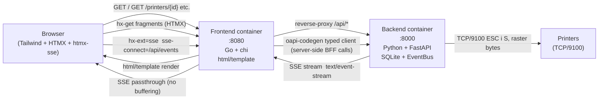

# Phase 7a — Frontend-Basis (Tailwind v4 + Layout + Hauptseiten — Read-only UI) — Design

**Date:** 2026-05-16
**Status:** Draft — awaiting planner handoff
**Owner:** repo maintainer
**Implementation branch:** `feat/phase7a-frontend-base`
**Tracking issues:** strausmann/label-printer-hub#22 (Phase master tracking — no dedicated 7a issue yet)

---

## 1. Goal and Non-Goals

### 1.1 Goal

Phase 6b landed the backend SSE EventBus and four QR landing pages with live HTMX fragment
updates. The frontend container currently serves only `/healthz`. Phase 7a fills that container
with a working read-only web UI:

- **Dashboard** — see all printers at a glance with live status badges
- **Printer detail** — per-printer status, tape, active job, recent history; live-updated via SSE
- **Jobs list** — browse, filter, and paginate the job history
- **Job detail** — inspect a single job's full record with a retry action (the one write operation allowed in 7a — it is idempotent from the user's perspective and clones to a new job)
- **Templates list** — browse templates by app, see name and dimension in a tile grid
- **Template detail** — YAML source preview + server-rendered thumbnail image
- **Lookup display** — wraps the `/api/lookup/{app}/{id}` endpoint in a browser-friendly page

All pages are rendered server-side by the Go frontend using `html/template`, styled with
Tailwind CSS v4 (Standalone CLI — no Node.js), and updated in-place for live data via HTMX.

### 1.2 Non-Goals (deferred sub-phases)

| Feature | Sub-phase |
|---|---|
| Template editor (YAML edit, dimension control, preview-on-type) | 7b |
| PWA manifest, service worker, offline shell, install banner | 7c |
| Browser push notifications, `Notification` API, APNs/FCM | 7d |
| User authentication UI | Never — Pangolin SSO is the upstream gate; the frontend trusts the proxy |
| Dark mode toggle | Deferred — semantic color tokens are set up in 7a so the swap is mechanical later |
| Mobile-first pixel-perfect redesign | Desktop-first for 7a; mobile is workable but not polished |
| Prometheus `/metrics` in the frontend binary | Deferred — backend already exports metrics; frontend is not a bottleneck |
| i18n | Not in scope |
| Print-job submission from the UI | 7b or later (read-only UI first; the retry button is the single exception) |

---

## 2. Architecture

### 2.1 Two-Container Split (per ADR-0001)

The two containers communicate over the internal Docker network. Only the frontend is exposed to
the user's reverse proxy (Traefik, Pangolin, Caddy — see `examples/`).



**Key points:**

- The frontend renders the HTML shell server-side on every page load, populated with initial data
  fetched from the backend via the typed Go client.
- After initial render, HTMX takes over for fragment refreshes:
  - Printer detail page uses `hx-ext="sse"` for live updates (job state, printer status, tape).
  - Non-printer pages (jobs list, templates list) use `hx-get` with `hx-trigger="every 30s"`
    for background polling — SSE is overkill for resources that change infrequently.
- The frontend proxies all `/api/*` (REST) and `/api/events` (SSE) to the backend. The browser
  never talks to the backend directly.
- Static assets (Tailwind-compiled CSS, HTMX JS, htmx-sse JS, icons) are embedded in the Go
  binary via `//go:embed` so the container is self-contained with no runtime asset filesystem.

### 2.2 Rendering Strategy: Why Server-Side Templates, Not a JS Framework

**Why not React/Vue/SvelteKit?**
A JS SPA requires a Node.js build step, increases the attack surface, complicates the
Dockerfile, and moves rendering to the browser — which conflicts with the "static binary"
philosophy established by the Go frontend choice (ADR-0003). HTMX with server-side rendering is
idiomatic for this stack.

**Why vanilla `html/template`, not `templ`?**
`templ` (a compile-time Go templating library) offers type-safe template calls but requires a
separate `templ generate` build step. That would be the *second* extra build step alongside the
Tailwind CLI, adding complexity without proportional value for a read-only UI where template
typos surface as integration-test failures anyway. Vanilla `html/template` is part of the Go
standard library, zero-dependency, and sufficient for Phase 7a's scope.

**Why HTMX instead of raw JavaScript `fetch`?**
HTMX expresses fragment-swap semantics declaratively in HTML attributes. The Go handlers return
either a full page or a partial fragment (same URL, detected via `HX-Request` header), which
keeps the server-side code simple and the browser-side code near-zero.

### 2.3 OpenAPI Client: `oapi-codegen`

The backend's OpenAPI spec is canonical (ADR-0011). The Go typed client in
`frontend/internal/api/` is generated from `backend/openapi.json` via `oapi-codegen`. This is
already established in the architecture document (`docs/architecture.md`). Phase 7a is the first
phase that actually exercises the client.

**Why `oapi-codegen` instead of manual typed structs?**
Manual structs drift. `oapi-codegen` makes schema drift a CI build failure: if the backend adds a
required field and the frontend client is not regenerated, `go build` fails. The codegen runs
inside the Dockerfile builder stage, not as a developer tool, so there is no risk of an
out-of-date generated file being committed.

**Codegen configuration** (`frontend/oapi-codegen.yaml`):

```yaml
package: api
generate:
  models: true
  client: true
  strict-server: false
output: internal/api/client.gen.go
```

The backend exposes `GET /openapi.json`. During the Docker build, the builder stage downloads it
from `BACKEND_OPENAPI_URL` (build arg, defaults to the spec file path in the monorepo) and runs
`oapi-codegen`. In local development, `make gen-client` handles the same step.

**Note:** The generated client is checked into the repo (`internal/api/client.gen.go`). This is
intentional: it means `go build ./...` works without internet access or a running backend, and CI
can diff the generated file to catch backend spec changes that the frontend has not yet absorbed.

---

## 3. Page Inventory

### 3.1 Pages Delivered in Phase 7a

| Route | Handler file | HTMX update strategy | Justification |
|---|---|---|---|
| `GET /` | `handlers/dashboard.go` | `hx-get` every 30 s (printer status badges) | Aggregate view; polling suffices |
| `GET /printers/{id}` | `handlers/printer.go` | `hx-ext="sse"` on SSE container div | Per-printer status changes frequently |
| `GET /jobs` | `handlers/jobs.go` | `hx-get` every 30 s + manual filter form | Job list rarely needs sub-second freshness |
| `GET /jobs/{id}` | `handlers/job.go` | `hx-get` every 10 s | Single job state can advance quickly |
| `GET /templates` | `handlers/templates.go` | `hx-get` every 60 s | Templates change rarely |
| `GET /templates/{id}` | `handlers/template.go` | Static (no live update) | Template YAML + preview image is stable |
| `GET /lookup/{app}/{id}` | `handlers/lookup.go` | Static | Lookup result is point-in-time |

### 3.2 QR Landing Pages: Leave in Backend

The four QR landing pages (`/loc`, `/asset`, `/spool`, `/product`) already exist in the backend
container (`backend/app/api/routes/qr.py`) with live HTMX SSE wiring from Phase 6b.

**Decision: do not move them to the frontend in Phase 7a.**

Rationale:
1. They are QR-scan targets. A label printed today may be scanned years from now. If the hub is
   deployed in backend-only mode (no frontend container), the QR page must still resolve.
2. Moving them would require duplicating the `AppLookupService` logic in Go — high complexity,
   low gain.
3. The existing Jinja2 templates with HTMX SSE wiring already provide the live experience
   promised by Phase 6b.

The frontend's API proxy (`/api/*`) makes these reachable through the frontend if desired (the
frontend proxies `/loc/*`, `/asset/*`, `/spool/*`, `/product/*` to the backend alongside
`/api/*`). Users who access the hub through the frontend reverse-proxy entry point get the
backend-rendered QR pages transparently.

### 3.3 Page Descriptions

#### `GET /` — Dashboard

Initial render: calls `GET /api/printers` via the typed client, renders a status card per
printer (name, model, paused flag, online indicator, active-jobs count from queue endpoint).

Live update: a hidden `<div hx-get="/" hx-trigger="every 30s" hx-select="#printer-grid"
hx-target="#printer-grid" hx-swap="outerHTML">` re-fetches and replaces only the printer grid
section. No SSE on the dashboard — polling is sufficient and avoids opening one SSE connection
per dashboard user (which would be wasteful for a rarely-refreshed overview page).

```html
<!-- Example printer status card (Tailwind v4 utility classes) -->
<div class="rounded-lg border border-surface-border p-4 flex flex-col gap-2">
  <div class="flex items-center justify-between">
    <span class="font-semibold text-content">PT-P750W</span>
    <span class="badge badge-online">Online</span>  <!-- conditional class -->
  </div>
  <p class="text-sm text-content-secondary">pt_series · 198.51.100.42:9100</p>
  <p class="text-sm">Active jobs: <strong>2</strong></p>
</div>
```

#### `GET /printers/{id}` — Printer Detail

Initial render: calls `GET /api/printers/{id}/status`, `GET /api/printers/{id}/tape`, and
`GET /api/printers/{id}/queue` in parallel (three concurrent Go goroutines using
`errgroup.Group`). Renders the full page including current tape, status block, and active-jobs
table.

Live update via SSE: a top-level container div subscribes to the backend SSE stream proxied at
`/api/events?printer_id={id}`. Three `sse-swap` targets handle the three event types:

```html
<div id="sse-root"
     hx-ext="sse"
     sse-connect="/api/events?printer_id={{.Printer.ID}}">

  <!-- Swapped by printer.status events -->
  <div id="printer-status-panel"
       sse-swap="printer.status"
       hx-swap="innerHTML">
    <!-- initial server-rendered content here -->
  </div>

  <!-- Swapped by job.state_changed events -->
  <div id="job-queue-panel"
       sse-swap="job.state_changed"
       hx-swap="innerHTML">
  </div>

  <!-- Swapped by printer.tape_changed events -->
  <div id="tape-panel"
       sse-swap="printer.tape_changed"
       hx-swap="innerHTML">
  </div>
</div>
```

The SSE event `data` field contains the pre-rendered HTML fragment (this is the existing Phase
6b behaviour from `backend/app/api/routes/events.py` — the backend renders fragments from
`app/templates/fragments/*.html` and embeds them in the SSE data payload). The frontend proxies
the stream transparently; HTMX injects the fragment.

#### `GET /jobs` — Jobs List

Initial render: calls `GET /api/jobs?limit=50` (default view). Supports URL query params
`?state=`, `?printer_id=`, `?since=` which are forwarded to the backend.

Filter form: a `<form hx-get="/jobs" hx-push-url="true" hx-target="#jobs-table">` allows
filtering by state and printer. Phase 7a is nominally read-only but this is a GET-only filter
form — no state mutation.

Polled refresh: `hx-get="/jobs" hx-trigger="every 30s" hx-select="#jobs-table"
hx-target="#jobs-table"` on the jobs table element refreshes the visible rows. This is
intentionally less aggressive than SSE — the jobs list is not the primary monitoring surface.

Pagination: backend supports `limit` up to 200. Phase 7a renders a simple "next page" link using
`?since=<oldest_job_created_at>` cursor-based pagination rather than offset (offset-based
pagination over a growing jobs table is O(n) at the DB layer).

#### `GET /jobs/{id}` — Job Detail

Initial render: calls `GET /api/jobs/{id}`. Displays state, printer name, template key, payload
(JSON pretty-printed), created/updated timestamps.

**Retry button (7a exception to read-only):** A `<form method="post" action="/jobs/{id}/retry">`
button is present on failed/cancelled jobs. The handler `POST /jobs/{id}/retry` in the frontend
calls `POST /api/jobs/{id}/retry` on the backend and redirects to the new job's detail page with
a `303 See Other`. This is the only write-path operation in Phase 7a, and it is safe: the
backend creates a new job (clones the failed one) and returns `201 Created` with the new job ID.
The original job is unchanged.

Polled refresh: `hx-get="/jobs/{id}" hx-trigger="every 10s" hx-select="#job-status-row"
hx-target="#job-status-row"` for jobs in `queued` or `printing` state. For terminal states
(done, failed, cancelled), the polling trigger is omitted.

#### `GET /templates` — Templates List

Initial render: calls `GET /api/templates` (all templates). Supports `?app=` filter forwarded
to the backend.

Rendered as a tile grid: each tile shows template name, `app` badge (snipeit/grocy/spoolman),
and tape dimensions (`width_mm` × height if available). Clicking a tile goes to the template
detail page.

Polled refresh every 60 s replaces the grid. Templates rarely change in production; 60 s is a
reasonable compromise between freshness and backend load.

#### `GET /templates/{id}` — Template Detail

Initial render: calls `GET /api/templates/{id}` (Phase 6a exposes the list; individual template
fetch is via the list result by key — or the 7a implementation may add `GET /api/templates/{key}`
to the backend as a minor scope addition if the list-then-filter is too awkward).

Displays: template YAML source (in a `<pre>` block with syntax highlighting via CSS only — no JS
highlighter), dimensions, app label, created/updated timestamps.

**Preview image:** The backend's `POST /api/render/preview` endpoint (from Phase 4 / first-print
pipeline) returns a PNG given a template key and optional payload. The frontend calls this
server-side at render time and embeds the result as a base64 data URI in the initial HTML. No
lazy-loading client-side call is needed. If the render fails (printer offline, template error),
a placeholder image is shown.

```go
// In handlers/template.go
previewBytes, err := apiClient.RenderPreview(ctx, templateKey, nil)
if err != nil {
    previewDataURI = "/static/preview-placeholder.svg"
} else {
    previewDataURI = "data:image/png;base64," + base64.StdEncoding.EncodeToString(previewBytes)
}
```

Static page (no polling) — template YAML and preview do not change without user action (which
requires 7b's editor). Polling would waste resources.

#### `GET /lookup/{app}/{id}` — Lookup Display

Calls `GET /api/lookup/{app}/{id}` server-side and renders the result as a styled card (name,
ID, external URL as a clickable link, extra metadata as a key-value table). On 404, renders a
"not found" message (not raw JSON). On 422 (unsupported `app`), renders a "unknown integration"
error page.

This page is a convenience for testing lookups from the admin UI. The QR-scan landing pages
(`/loc`, `/asset`, etc.) are the primary end-user path and remain in the backend.

---

## 4. Navigation and Layout

### 4.1 Layout Template

A single base layout (`web/templates/layout.html`) wraps all pages via Go's `html/template`
block mechanism:

```html
{{define "layout"}}
<!DOCTYPE html>
<html lang="en" class="h-full">
<head>
  <meta charset="UTF-8">
  <meta name="viewport" content="width=device-width, initial-scale=1.0">
  <title>{{block "title" .}}Label Printer Hub{{end}}</title>
  <link rel="stylesheet" href="/static/app.css">
  <script src="/static/htmx.min.js" defer></script>
  <script src="/static/htmx-ext-sse.min.js" defer></script>
</head>
<body class="bg-surface min-h-full flex flex-col">
  <nav class="bg-surface-raised border-b border-surface-border">
    <div class="max-w-7xl mx-auto px-4 sm:px-6 lg:px-8 flex items-center h-14 gap-6">
      <a href="/" class="font-semibold text-primary">Label Printer Hub</a>
      <a href="/"         class="nav-link {{if .ActivePage "dashboard"}}nav-link-active{{end}}">Dashboard</a>
      <a href="/jobs"     class="nav-link {{if .ActivePage "jobs"}}nav-link-active{{end}}">Jobs</a>
      <a href="/templates" class="nav-link {{if .ActivePage "templates"}}nav-link-active{{end}}">Templates</a>
    </div>
  </nav>
  <main class="flex-1 max-w-7xl mx-auto w-full px-4 py-6 sm:px-6 lg:px-8">
    {{block "content" .}}{{end}}
  </main>
  <footer class="border-t border-surface-border py-3 text-center text-xs text-content-secondary">
    v{{.Version}} — <a href="https://github.com/strausmann/label-printer-hub" class="hover:underline">GitHub</a>
  </footer>
</body>
</html>
{{end}}
```

All page templates start with `{{template "layout" .}}` and define `"title"` and `"content"`
blocks.

### 4.2 Tailwind v4 Design Tokens

Phase 7a establishes the design token layer in `web/styles/app.css`. Light-mode only; dark mode
is wired semantically so the token swap in a later phase is a single CSS block change.

```css
/* web/styles/app.css */
@import "tailwindcss";

@theme {
  /* Primary brand color */
  --color-primary:           oklch(55% 0.20 250);
  --color-primary-hover:     oklch(48% 0.20 250);
  --color-primary-fg:        oklch(98% 0.00 0);

  /* Surface hierarchy */
  --color-surface:           oklch(98% 0.00 0);
  --color-surface-raised:    oklch(100% 0.00 0);
  --color-surface-border:    oklch(88% 0.00 0);

  /* Content / text */
  --color-content:           oklch(20% 0.00 0);
  --color-content-secondary: oklch(50% 0.00 0);

  /* Status badges */
  --color-status-online:     oklch(55% 0.18 145);
  --color-status-offline:    oklch(50% 0.15 25);
  --color-status-paused:     oklch(65% 0.16 80);
  --color-status-printing:   oklch(55% 0.18 250);

  /* Job states (match backend JobState enum) */
  --color-state-queued:      oklch(65% 0.16 80);
  --color-state-printing:    oklch(55% 0.18 250);
  --color-state-done:        oklch(55% 0.18 145);
  --color-state-failed:      oklch(50% 0.15 25);
  --color-state-cancelled:   oklch(50% 0.00 0);

  /* Spacing scale supplement */
  --spacing-18: 4.5rem;
  --spacing-22: 5.5rem;
}

/* Semantic shorthand classes defined with @layer components */
@layer components {
  .nav-link {
    @apply text-sm text-content-secondary hover:text-content transition-colors;
  }
  .nav-link-active {
    @apply text-content font-medium;
  }
  .badge {
    @apply inline-flex items-center rounded-full px-2 py-0.5 text-xs font-medium;
  }
  .badge-online   { @apply bg-status-online/15 text-status-online; }
  .badge-offline  { @apply bg-status-offline/15 text-status-offline; }
  .badge-paused   { @apply bg-status-paused/15 text-status-paused; }
  .badge-printing { @apply bg-state-printing/15 text-state-printing; }
  .badge-queued   { @apply bg-state-queued/15 text-state-queued; }
  .badge-done     { @apply bg-state-done/15 text-state-done; }
  .badge-failed   { @apply bg-state-failed/15 text-state-failed; }
  .badge-cancelled{ @apply bg-state-cancelled/15 text-state-cancelled; }
}
```

**Why OKLCH for colors?**
Tailwind v4's native color system uses OKLCH. Using OKLCH directly for design tokens means
Tailwind's alpha-modifier syntax (`/15`, `/50`) works out of the box on all custom colors without
the need for RGB fallbacks. `oklch(55% 0.18 145)` reads as "55% lightness, chroma 0.18, hue
145°" — perceptually uniform, consistent badge contrast across all hues.

---

## 5. Go Module Structure

```
frontend/
├── cmd/
│   └── server/
│       └── main.go                  # Entry point (existing); routes added here
│
├── internal/
│   ├── api/
│   │   ├── client.gen.go            # oapi-codegen output — DO NOT EDIT BY HAND
│   │   └── client.go                # Thin wrapper: NewClient(backendURL), typed helper methods
│   │
│   ├── handlers/
│   │   ├── dashboard.go             # GET /
│   │   ├── printer.go               # GET /printers/{id}
│   │   ├── jobs.go                  # GET /jobs
│   │   ├── job.go                   # GET /jobs/{id}; POST /jobs/{id}/retry
│   │   ├── templates.go             # GET /templates
│   │   ├── template.go              # GET /templates/{id}
│   │   ├── lookup.go                # GET /lookup/{app}/{id}
│   │   ├── healthz.go               # GET /healthz (extended with backend_reachable)
│   │   └── base.go                  # Shared TemplateData type; renderPage() helper
│   │
│   ├── proxy/
│   │   └── proxy.go                 # ReverseProxy for /api/* and QR-scan paths
│   │
│   └── templates/                   # (empty — template files live under web/templates/)
│
├── web/
│   ├── styles/
│   │   └── app.css                  # Tailwind v4 input: @import "tailwindcss" + @theme block
│   │
│   ├── static/                      # Compiled/copied assets (embedded in binary)
│   │   ├── app.css                  # Tailwind CLI output — built at image-build time
│   │   ├── htmx.min.js              # HTMX runtime (pinned version)
│   │   ├── htmx-ext-sse.min.js      # HTMX SSE extension (pinned version)
│   │   ├── preview-placeholder.svg  # Shown when template preview render fails
│   │   └── favicon.ico
│   │
│   └── templates/                   # html/template sources (embedded in binary)
│       ├── layout.html              # Base layout with nav + footer
│       ├── dashboard.html           # / page
│       ├── printer.html             # /printers/{id}
│       ├── jobs.html                # /jobs
│       ├── job.html                 # /jobs/{id}
│       ├── templates.html           # /templates
│       ├── template.html            # /templates/{id}
│       ├── lookup.html              # /lookup/{app}/{id}
│       ├── healthz.html             # (optional HTML view of /healthz)
│       └── error.html               # 404 / 500 error page
│
├── oapi-codegen.yaml                # oapi-codegen config
├── go.mod
├── go.sum
├── Dockerfile
└── README.md
```

### 5.1 `internal/handlers/base.go`

Shared types and helpers used by all page handlers:

```go
package handlers

import (
    "html/template"
    "net/http"
)

// TemplateData is the base data passed to every page template.
// Page handlers embed this and add page-specific fields.
type TemplateData struct {
    Version    string  // build version from env
    ActiveNav  string  // "dashboard" | "jobs" | "templates" | ""
    Error      string  // non-empty for error pages
    HXRequest  bool    // true when request has HX-Request header (fragment mode)
}

// PageHandler wraps the template set and API client for use by all handlers.
type PageHandler struct {
    tmpl    *template.Template
    client  *api.Client
    version string
}

// renderPage writes a full-page or fragment response, choosing the right
// template block based on HX-Request header presence.
func (h *PageHandler) renderPage(w http.ResponseWriter, r *http.Request, name string, data any) {
    if r.Header.Get("HX-Request") == "true" {
        // HTMX fragment request: render only the "content" block
        if err := h.tmpl.ExecuteTemplate(w, name+"-content", data); err != nil {
            http.Error(w, "template error", http.StatusInternalServerError)
        }
        return
    }
    // Full page: render the layout wrapping the page template
    if err := h.tmpl.ExecuteTemplate(w, "layout", data); err != nil {
        http.Error(w, "template error", http.StatusInternalServerError)
    }
}
```

### 5.2 `internal/proxy/proxy.go`

The reverse proxy is the most critical infrastructure piece for the SSE path. Buffering must be
disabled or SSE heartbeats will arrive in batches instead of streaming.

```go
package proxy

import (
    "log/slog"
    "net/http"
    "net/http/httputil"
    "net/url"
    "time"
)

// New returns an http.Handler that proxies requests to backendURL.
// FlushInterval is set to -1 (immediate flush) so SSE events are not
// held in the proxy's internal buffer — each SSE frame must reach the
// browser within milliseconds of being produced by the backend.
//
// Director rewrites the Host header to the backend host (required for
// FastAPI's internal routing; without this the backend may respond 422 or
// drop the request if it enforces Host matching).
func New(backendURL string) http.Handler {
    target, err := url.Parse(backendURL)
    if err != nil {
        panic("invalid BACKEND_URL: " + err.Error())
    }

    rp := &httputil.ReverseProxy{
        Director: func(req *http.Request) {
            req.URL.Scheme = target.Scheme
            req.URL.Host   = target.Host
            req.Host       = target.Host
            // Strip the X-Forwarded-For header added by outer proxies to avoid
            // confusion — the backend trusts the frontend proxy only.
            req.Header.Del("X-Forwarded-For")
        },
        FlushInterval: -1, // -1 = flush immediately; required for SSE
        ErrorHandler: func(w http.ResponseWriter, r *http.Request, err error) {
            slog.Error("proxy error", "path", r.URL.Path, "err", err)
            http.Error(w, "backend unavailable", http.StatusBadGateway)
        },
        // ModifyResponse is not set — pass backend headers (including
        // Content-Type: text/event-stream) through unchanged.
    }

    return rp
}
```

**Why `FlushInterval: -1`?**
Go's `httputil.ReverseProxy` defaults to buffering the response until the write buffer fills.
For SSE, that means heartbeats (`: keepalive`) would accumulate until the buffer flushes — which
could be minutes with a low-event printer. `FlushInterval: -1` flushes after every `Write` call,
matching the behaviour of `http.Flusher` used by the backend's `StreamingResponse`.

**Why pass through the QR landing paths?**
The backend owns `/loc/*`, `/asset/*`, `/spool/*`, `/product/*`. The proxy handler registered
at the frontend chi router forwards these alongside `/api/*` so users reaching the hub through
the frontend container get QR pages without needing a second reverse-proxy rule pointing at the
backend port. See Section 3.2 for the rationale on leaving QR pages in the backend.

### 5.3 Route Registration in `cmd/server/main.go`

```go
func newRouter(ph *handlers.PageHandler, proxy http.Handler) *chi.Mux {
    r := chi.NewRouter()
    r.Use(middleware.RequestID)
    r.Use(middleware.RealIP)
    r.Use(middleware.Recoverer)
    r.Use(slogRequestLogger)

    // Static assets (embedded)
    r.Handle("/static/*", http.StripPrefix("/static/",
        http.FileServer(http.FS(staticFS))))

    // Page handlers
    r.Get("/", ph.Dashboard)
    r.Get("/printers/{id}", ph.PrinterDetail)
    r.Get("/jobs", ph.JobsList)
    r.Get("/jobs/{id}", ph.JobDetail)
    r.Post("/jobs/{id}/retry", ph.JobRetry)
    r.Get("/templates", ph.TemplatesList)
    r.Get("/templates/{id}", ph.TemplateDetail)
    r.Get("/lookup/{app}/{id}", ph.LookupDisplay)

    // Health check (extended)
    r.Get("/healthz", ph.Healthz)

    // Proxy: API, SSE, and QR landing pages
    r.Mount("/api", proxy)
    r.Mount("/loc", proxy)
    r.Mount("/asset", proxy)
    r.Mount("/spool", proxy)
    r.Mount("/product", proxy)

    return r
}
```

---

## 6. Tailwind v4 Setup

### 6.1 Standalone CLI

Tailwind v4 introduced a standalone CLI binary that bundles the engine, PostCSS, and Autoprefixer
with no Node.js requirement. This matches the project's "single binary" philosophy (the Go
frontend binary is self-contained; the CSS build should be too).

**Why Tailwind v4 Standalone CLI, not the npm package?**
The npm package requires Node.js in the build image, a `package.json`, and `node_modules`. The
standalone CLI is a single ~15 MB executable downloaded from GitHub Releases at build time.
The Dockerfile builder stage already has `wget`/`curl`; the only addition is the download step.

**Version pinning:** The Dockerfile pins the exact Tailwind v4 CLI version (e.g.
`v4.0.0` or the latest stable at implementation time). The pin is updated deliberately, not by
Dependabot, because Tailwind v4 minor releases can change utility class names.

### 6.2 Input CSS (`web/styles/app.css`)

```css
@import "tailwindcss";

@theme {
  /* (full token block from Section 4.2) */
}

@layer components {
  /* (semantic shorthand classes from Section 4.2) */
}
```

No `tailwind.config.js` exists in Tailwind v4 — configuration lives entirely in CSS.

### 6.3 Dockerfile Build Stage

```dockerfile
# ===========================================================================
# Stage 0: Tailwind CSS build
# ===========================================================================
# Note: debian:bookworm-slim is required (NOT alpine). The Tailwind v4
# standalone binary is a glibc ELF; alpine (musl libc) cannot execute it.
FROM debian:bookworm-slim AS tailwind-builder

ARG TAILWIND_VERSION=v4.1.5
ARG TARGETARCH

# Download the Tailwind v4 Standalone CLI for the current build architecture.
# TARGETARCH is set by Docker buildx: "amd64" → x64, "arm64" → arm64.
RUN apt-get update -qq && apt-get install -y -qq --no-install-recommends curl ca-certificates && \
    rm -rf /var/lib/apt/lists/* && \
    ARCH_SUFFIX=$([ "$TARGETARCH" = "arm64" ] && echo "arm64" || echo "x64") && \
    curl -fsSL \
      "https://github.com/tailwindlabs/tailwindcss/releases/download/${TAILWIND_VERSION}/tailwindcss-linux-${ARCH_SUFFIX}" \
      -o /usr/local/bin/tailwindcss && \
    chmod +x /usr/local/bin/tailwindcss

WORKDIR /src
COPY web/styles/ ./web/styles/
COPY web/templates/ ./web/templates/

# Build the CSS. --input and --output paths are relative to WORKDIR.
# --minify reduces the output by ~30-50% for production images.
# Content scanning: Tailwind v4 automatically scans HTML files in the
# current working tree for utility classes — passing --content is not
# needed when the templates are present in the build context.
RUN tailwindcss \
      --input  web/styles/app.css \
      --output web/static/app.css \
      --minify

# ===========================================================================
# Stage 1: Go build
# ===========================================================================
FROM golang:1.23-alpine AS go-builder

WORKDIR /build
COPY go.mod go.sum ./
RUN go mod download

COPY . ./
# Copy the compiled CSS into the expected embed path before go build runs.
COPY --from=tailwind-builder /src/web/static/app.css ./web/static/app.css

ARG VERSION=0.0.0-dev
ARG REVISION=unknown
ARG BUILD_DATE=1970-01-01T00:00:00Z

RUN CGO_ENABLED=0 GOOS=linux go build \
      -trimpath \
      -ldflags="-s -w \
        -X main.version=${VERSION} \
        -X main.revision=${REVISION} \
        -X main.buildDate=${BUILD_DATE}" \
      -o /out/server \
      ./cmd/server

# ===========================================================================
# Stage 2: runtime (unchanged from skeleton)
# ===========================================================================
FROM alpine:3.20 AS runtime
# (... identical to current Dockerfile from here ...)
```

### 6.4 Local Development Watch Mode

```bash
# Terminal 1: Tailwind watch (requires the standalone binary on PATH)
./tailwindcss -i web/styles/app.css -o web/static/app.css --watch

# Terminal 2: Go run (hot-reload is manual — CTRL+C + re-run)
go run ./cmd/server

# Or with air for file-watch auto-restart:
air
```

A `Makefile` target documents this:

```makefile
.PHONY: dev-css dev-go

dev-css: ## Watch and rebuild Tailwind CSS
	./tailwindcss -i web/styles/app.css -o web/static/app.css --watch

dev-go: ## Run the Go server with default settings
	BACKEND_URL=http://localhost:8000 go run ./cmd/server
```

### 6.5 Static Asset Versions

HTMX and the HTMX SSE extension are vendored as `web/static/htmx.min.js` and
`web/static/htmx-ext-sse.min.js`. Pinned versions are noted in a `web/static/VERSIONS.txt`
file:

```
htmx          2.0.4   https://unpkg.com/htmx.org@2.0.4/dist/htmx.min.js
htmx-ext-sse  2.2.3   https://unpkg.com/htmx-ext-sse@2.2.3/sse.js
```

These are vendored to:
1. Avoid CDN dependency at runtime.
2. Make the container deployable in air-gapped environments.
3. Ensure the exact version is reproducible across builds.

---

## 7. HTMX Wiring Strategy

### 7.1 Guiding Principles

- **SSE only for high-frequency live data:** Printer detail page (printer status, tape, job queue
  changes). These can fire multiple times per minute while a job is printing.
- **Polling for low-frequency refreshes:** Dashboard, jobs list, templates list. Polling every
  30–60 s is sufficient and avoids the overhead of an SSE connection for every open tab.
- **No forms in 7a (except retry):** All form-based interactions (template editor, print job
  submission) are deferred to 7b. The retry button is the single exception (it is a POST that
  creates a new job, not mutates an existing one; it immediately redirects to the new job's
  read-only page).
- **Progressive enhancement:** All pages render useful content with JavaScript disabled. HTMX
  live updates are an enhancement, not a requirement. Without JS, the page works as a static
  server-rendered page the user can manually refresh.

### 7.2 SSE Fragment Injection (Printer Detail)

The backend SSE payload format (from Phase 6b) is:

```
id: <uuid>
event: printer.status
data: {"html": "<div>...rendered HTML fragment...</div>", "event_type": "printer.status", "timestamp": "...", ...}
```

HTMX's SSE extension reads the `data.html` field and swaps it into the target element when an
event matching `sse-swap="printer.status"` arrives. This is the existing pattern from Phase 6b's
QR landing pages; Phase 7a reuses it on the printer detail page.

The frontend proxy passes the SSE stream through without buffering (Section 5.2). No additional
Go code is needed on the SSE path — `httputil.ReverseProxy` with `FlushInterval: -1` is
sufficient.

### 7.3 HTMX Polling for Non-Printer Pages

Polling uses HTMX's `hx-trigger="every Ns"` modifier. The fragment returned by the server for a
polling request is selected by `hx-select="#element-id"` — the handler returns the full page
HTML and HTMX extracts only the relevant subtree. This avoids the need for separate
fragment-only routes.

```html
<!-- Jobs list: refresh every 30 seconds -->
<div id="jobs-table-container"
     hx-get="/jobs"
     hx-trigger="every 30s"
     hx-select="#jobs-table-container"
     hx-target="this"
     hx-swap="outerHTML">
  <!-- table rendered by server here -->
</div>
```

**Why not a dedicated `/jobs/fragment` endpoint?**
Dedicated fragment endpoints are an anti-pattern in hypermedia-driven apps: they create URL
proliferation and break the "every URL is a resource" principle. HTMX's `hx-select` allows the
full-page handler to serve both full-page and fragment requests from the same URL.

The handler detects the `HX-Request` header to skip the layout wrapper when returning a fragment,
but `hx-select` on the client handles the extraction even if the server returns a full page — so
the `HX-Request` optimisation is a nice-to-have, not a hard dependency.

---

## 8. Reverse-Proxy and API Proxy Semantics

### 8.1 What Is Proxied

| Prefix | Destination | Notes |
|---|---|---|
| `/api/*` | `BACKEND_URL/api/*` | All REST endpoints, SSE at `/api/events` |
| `/loc/*` | `BACKEND_URL/loc/*` | Snipe-IT location QR landing |
| `/asset/*` | `BACKEND_URL/asset/*` | Snipe-IT asset QR landing |
| `/spool/*` | `BACKEND_URL/spool/*` | Spoolman spool QR landing |
| `/product/*` | `BACKEND_URL/product/*` | Grocy product QR landing |

Everything else (`/`, `/printers/*`, `/jobs/*`, `/templates/*`, `/lookup/*`, `/static/*`,
`/healthz`) is handled locally by the Go frontend.

### 8.2 SSE Pass-Through Requirements

Three things must be true for SSE to stream correctly through the proxy:

1. **`FlushInterval: -1`** on `httputil.ReverseProxy` — flushes each write immediately.
2. **No `WriteTimeout`** on the `http.Server` (already set to `0` in the existing skeleton).
   A non-zero `WriteTimeout` would tear down long-lived SSE connections.
3. **`X-Accel-Buffering: no`** header — the backend already sets this in Phase 6b. The proxy
   passes it through unchanged, which disables buffering in nginx-based reverse proxies.

The outer reverse proxy (Traefik/Caddy/Pangolin) also needs buffering disabled:
- Traefik: `traefik.http.middlewares.xxx.buffering.maxResponseBodyBytes: 0` or
  the service-level `flushinterval` label
- Caddy: `flush_interval -1` in the `reverse_proxy` block
- Nginx: `proxy_buffering off; proxy_cache off;`

This is documented in `docs/architecture/sse.md` (Phase 6b) and `examples/` compose files.

### 8.3 Backend Availability Handling

The frontend's page handlers call the backend via the typed client. If the backend is unreachable:

- The handler catches the network error.
- Renders an error page (using `error.html`) with `503 Service Unavailable`.
- The error page includes the raw error string for debugging in development; production deployments
  should set `DISPLAY_BACKEND_ERRORS=false` to suppress it (future env var, see open questions).

The `/healthz` endpoint also checks backend reachability (Section 11).

### 8.4 Request ID Propagation

The frontend adds an `X-Request-ID` header (from chi's `middleware.RequestID`) to all proxied
requests. This allows correlating frontend and backend log lines for a single user action.

---

## 9. Build System

### 9.1 Multi-Stage Dockerfile (Updated)

The existing two-stage Dockerfile (`tailwind-builder`, `go-builder`, `runtime`) adds a Stage 0
for Tailwind. The Go builder stage copies the Tailwind output before embedding. The runtime stage
is unchanged.

Build-time args:

| Arg | Default | Purpose |
|---|---|---|
| `TAILWIND_VERSION` | `v4.1.5` | Pinned Tailwind CLI release |
| `TARGETARCH` | (set by buildx) | `amd64` or `arm64` for binary selection |
| `VERSION` | `0.0.0-dev` | Baked into Go binary via `ldflags` |
| `REVISION` | `unknown` | Git SHA |
| `BUILD_DATE` | `1970-01-01T00:00:00Z` | ISO-8601 |

### 9.2 `//go:embed` Directives

In `cmd/server/main.go` (or a dedicated `embed.go` file):

```go
package main

import "embed"

//go:embed web/static
var staticFS embed.FS

//go:embed web/templates
var templateFS embed.FS
```

`staticFS` is served via `http.FileServer(http.FS(staticFS))` at `/static/`.
`templateFS` is parsed at startup with `template.ParseFS(templateFS, "web/templates/*.html")`.

### 9.3 CI Compatibility

The existing `Build (frontend / amd64 + arm64)` workflow uses `docker buildx build` with the
`frontend/` directory as the build context. The new Tailwind stage uses only files available in
that context — `web/styles/` and `web/templates/` are both inside `frontend/`. No changes to the
CI workflow are needed.

The Tailwind binary download (`curl github.com`) will fail in an air-gapped CI. For environments
where this is a concern, the binary can be vendored into the repo at `frontend/bin/tailwindcss`
and the Dockerfile can `COPY bin/tailwindcss /usr/local/bin/tailwindcss` instead of downloading.
This is documented as a comment in the Dockerfile but not the default path.

### 9.4 `oapi-codegen` in the Build

`oapi-codegen` is run as part of `make gen-client` in local development and in a CI pre-check
step (not the build itself — the generated file is committed). The CI check diffs the output of
`oapi-codegen` against the committed file and fails if they differ, ensuring the frontend client
is always in sync with the backend spec.

```yaml
# .github/workflows/ci.yml — new job
- name: Check oapi-codegen output is up to date
  run: |
    make gen-client
    git diff --exit-code frontend/internal/api/client.gen.go
```

---

## 10. Tests

### 10.1 Strategy

| Layer | Tool | What is tested |
|---|---|---|
| Unit (handlers) | `testing` + `net/http/httptest` | Status codes, `Content-Type`, key strings in response body, error paths (backend 404, 503) |
| Unit (proxy) | `net/http/httptest` | SSE pass-through, header forwarding, `FlushInterval` behaviour |
| Integration | `net/http/httptest` + mock backend | Full round-trip: mock backend returns realistic JSON, handler renders template, response contains expected HTML |
| Visual | Out of scope for 7a | Playwright / screenshot tests deferred to 7c+ |

### 10.2 Mock Backend Pattern

Integration tests spin up a mock backend using `httptest.NewServer`:

```go
func TestDashboardRendersAllPrinters(t *testing.T) {
    // Arrange: mock backend returns two printers
    backend := httptest.NewServer(http.HandlerFunc(func(w http.ResponseWriter, r *http.Request) {
        if r.URL.Path == "/api/printers" {
            w.Header().Set("Content-Type", "application/json")
            fmt.Fprint(w, `[
                {"id":"aaa-...", "name":"PT-P750W", "model":"pt_series",
                 "enabled":true, "paused":false, "connection":{"host":"198.51.100.10","port":9100}},
                {"id":"bbb-...", "name":"QL-800",   "model":"ql_series",
                 "enabled":true, "paused":true,  "connection":{"host":"198.51.100.11","port":9100}}
            ]`)
        }
    }))
    defer backend.Close()

    // Act: build the frontend handler with the mock backend URL
    ph := handlers.NewPageHandler(backend.URL, templateFS, "0.0.0-test")
    req := httptest.NewRequest(http.MethodGet, "/", nil)
    w   := httptest.NewRecorder()
    ph.Dashboard(w, req)

    // Assert
    res := w.Result()
    require.Equal(t, http.StatusOK, res.StatusCode)
    body, _ := io.ReadAll(res.Body)
    assert.Contains(t, string(body), "PT-P750W")
    assert.Contains(t, string(body), "QL-800")
    assert.Contains(t, string(body), "badge-paused") // QL-800 is paused
}
```

### 10.3 Coverage Target

≥70% on `frontend/internal/` packages. Go projects conventionally target lower coverage than
Python projects because the template rendering is harder to unit-test (it is a text comparison).
The integration tests for "key string in body" cover the high-value paths.

Measurement: `go test -coverprofile=coverage.out ./...` + `go tool cover -func coverage.out`.
CI fails the build if overall coverage drops below 70%.

### 10.4 Test File Organisation

Test files live alongside their subjects:

```
internal/handlers/dashboard_test.go
internal/handlers/printer_test.go
internal/proxy/proxy_test.go
internal/api/client_test.go        # round-trip test against the mock backend
```

---

## 11. Observability

### 11.1 Extended `/healthz`

The existing `/healthz` returns static build info. Phase 7a extends it with a live backend
reachability check:

```go
type HealthzResponse struct {
    BuildInfo
    BackendReachable bool   `json:"backend_reachable"`
    BackendLatencyMs int64  `json:"backend_latency_ms,omitempty"`
    BackendError     string `json:"backend_error,omitempty"`
}
```

The handler calls `GET BACKEND_URL/healthz` with a 3-second timeout. If it responds with 200,
`backend_reachable` is `true` and `backend_latency_ms` is populated. On any error (connection
refused, timeout, non-200), `backend_reachable` is `false` and `backend_error` is set.

The frontend's own `/healthz` always returns HTTP 200 — the liveness probe should not fail just
because the backend is temporarily unreachable. Orchestrators and monitoring tools use
`backend_reachable` to determine the readiness of the full stack.

### 11.2 Structured Logging

The existing `slogRequestLogger` middleware is already in place. Phase 7a adds per-call backend
latency logging in the typed client wrapper:

```go
func (c *Client) ListPrinters(ctx context.Context) ([]api.PrinterRead, error) {
    start := time.Now()
    result, err := c.generated.GetApiPrinters(ctx) // oapi-codegen generated
    slog.Debug("backend call",
        "operation", "ListPrinters",
        "latency_ms", time.Since(start).Milliseconds(),
        "error", err,
    )
    return result, err
}
```

Log levels:
- `DEBUG`: backend call details (disabled in production by default — set `LOG_LEVEL=debug`)
- `INFO`: request log line (existing `slogRequestLogger`)
- `WARN`: degraded backend response (non-200, slow)
- `ERROR`: proxy errors, template errors, panics

### 11.3 Prometheus `/metrics` — Deferred

Prometheus metrics for request counts and latencies are not added in Phase 7a. The backend
already exports metrics at `/api/metrics`; the frontend proxy makes those reachable without a
separate frontend exporter. A frontend-specific exporter (request durations by route) can be
added in a later phase if needed.

---

## 12. Design Decisions: Why X, Not Y

| Decision | Choice | Rejected alternative | Reason |
|---|---|---|---|
| CSS framework | Tailwind v4 Standalone CLI | Tailwind via npm | No Node.js in the builder; one less runtime dependency |
| Rendering engine | Vanilla `html/template` | `templ` (Go compile-time templates) | No extra build step; `templ` adds value mainly for large teams with many templates |
| Rendering paradigm | Server-side + HTMX | React / SvelteKit | JS SPA incompatible with "static binary" philosophy; HTMX is idiomatic for Go/chi |
| Live updates: printer detail | SSE via `hx-ext="sse"` | Polling every N seconds | Printer status can change many times per minute while printing; SSE avoids re-fetching stale data |
| Live updates: jobs list | Polling (`hx-trigger="every 30s"`) | SSE | Jobs list is low-frequency; SSE connection per user for the list page would be wasteful |
| OpenAPI client | `oapi-codegen` (committed generated file) | Manual typed structs | Drift detection in CI; type safety for free; zero maintenance overhead |
| QR landing pages | Stay in backend | Move to frontend | Must work in backend-only mode; duplicating `AppLookupService` in Go adds complexity without user-facing value |
| SSE proxy | `httputil.ReverseProxy` with `FlushInterval: -1` | Custom SSE tunnel | Standard library solution; well-understood; `FlushInterval: -1` is the documented Go idiom for SSE proxying |
| Static assets | `//go:embed` in binary | Volume-mounted at runtime | Self-contained binary; no volume mounts; deployable anywhere Go runs |
| Job retry button | Allowed in 7a (POST, redirects to new job) | Defer to 7b | A failed job with no retry path is a poor UX; retry is safe (new job, original unchanged) and requires no editor |
| Color space | OKLCH | sRGB hex | Tailwind v4 native; consistent perceptual brightness across badge hues; `oklch(L C H / alpha)` syntax works out-of-the-box |
| Dark mode | Deferred | Implement now | Semantic tokens are wired in 7a; the mechanical swap (add a `@media prefers-color-scheme: dark` or `.dark` variant block) is 20 lines and belongs in the styling polish phase |
| Template preview | Server-side base64 data URI | `` | Avoids a second client-side request; preview is stable for a given template; base64 increases HTML size slightly but the tradeoff is acceptable |
| Retry redirect | `303 See Other` → new job detail | Return JSON, update page in-place | Standard HTTP redirect pattern; avoids POST-on-refresh double-submission (PRG pattern) |
| Error display | `503` + `error.html` when backend unreachable | White-label 502 from proxy | Custom error page is more informative; shows which backend call failed |

---

## 13. Open Questions and Follow-ups

### 13.1 Open Questions (to resolve before implementation)

| Question | Context | Impact |
|---|---|---|
| **`GET /api/templates/{key}` endpoint in backend?** | Template detail page needs a single-template fetch. Phase 6a only exposes `GET /api/templates` (list all). Options: (a) fetch the list and filter client-side — simple but fetches all templates; (b) add `GET /api/templates/{key}` to the backend in a 7a companion PR; (c) the frontend caches the full list in memory for the session. | Affects `handlers/template.go` design and potentially adds a backend task to the 7a plan |
| **`DISPLAY_BACKEND_ERRORS` env var?** | Should backend error strings (e.g. "connection refused to 198.51.100.10:8000") be shown in production error pages? | Minor — default to showing in dev, hiding in prod based on an env var; needs the env var wired |
| **HTMX version** | HTMX 2.x changed some attribute names from HTMX 1.x. Phase 6b's QR pages use a particular version. The frontend must use the same version to avoid mixing incompatible attribute syntax. | Check `backend/app/templates/qr/*.html` for the `htmx` script tag version and use the same |
| **`oapi-codegen` version** | The `oapi-codegen` tool version must be pinned in `go.mod` (as a `tools.go` import) or in `Makefile`. A newer `oapi-codegen` may generate different code for the same spec. | Low impact but must be documented |

### 13.2 Known Constraints

- **No mid-print cancel from the UI.** The backend returns `409` for cancel attempts on
  `printing`-state jobs (per ADR-0005). The frontend renders the cancel button only for
  `queued` jobs; for `printing` jobs it shows a read-only state badge.
- **SSE replay not implemented.** If the browser reconnects mid-print (network blip), it
  re-subscribes to the stream starting from the current moment. Any events fired during the gap
  are lost. The printer detail page will show slightly stale data until the next event arrives.
  This is acceptable for Phase 7a; Phase 7 can add `Last-Event-ID` replay if needed.
- **Template preview may be slow.** The backend's `POST /api/render/preview` calls Pillow + qrcode.
  For large templates, this may add 200–500ms to the template detail page load. The server-side
  base64 embed means this blocks the initial render. A timeout (e.g. 2 s) should be set on the
  preview call; on timeout, the placeholder SVG is shown.

---

## 14. Out of Scope (Follow-up Sub-Phases)

| Item | Sub-phase |
|---|---|
| Template editor (YAML edit form, live preview-on-type, dimension picker) | 7b |
| Print-job submission from UI (select template + printer + payload, POST /api/print) | 7b |
| PWA manifest (`manifest.webmanifest`), service worker (`sw.js`), install prompt | 7c |
| Offline shell (cached assets, "you are offline" state) | 7c |
| Push notifications (`Notification` API, APNs/FCM, Web Push) | 7d |
| Dark mode toggle (CSS `prefers-color-scheme` + manual override) | Styling polish (7e or later) |
| Mobile-first redesign | Styling polish |
| i18n (internationalisation of UI strings) | Not planned |
| Authentication UI (login form, session management) | Not planned — Pangolin SSO handles auth |
| Prometheus `/metrics` on the frontend | Operational tooling (post-7a) |
| Admin settings page (read-only config view) | 7c or later |

---

## 15. Implementation Order (Preview for the Planner)

Estimated 13 tasks. Dependencies run top-to-bottom within each group.

### Group A — Build Infrastructure (Tasks 0–2, no frontend prerequisites)

**T0 — Tailwind v4 Standalone CLI + Dockerfile Stage 0**
- Add Stage 0 to `frontend/Dockerfile`
- Create `frontend/web/styles/app.css` with `@import "tailwindcss"` and the `@theme` block from Section 4.2
- Create `frontend/web/static/` directory (with `.gitkeep` for now — CSS is generated at build time)
- Verify: `docker build frontend/` produces a working image; `docker run … curl /healthz` returns 200

**T1 — Base Layout + Design Tokens**
- Create `frontend/web/templates/layout.html` (Section 4.1)
- Create `frontend/web/templates/error.html` (404 + 500 error page)
- Add `frontend/web/static/htmx.min.js` and `frontend/web/static/htmx-ext-sse.min.js` (vendored, pinned versions from Section 6.5)
- Add `frontend/web/static/preview-placeholder.svg` and `favicon.ico`
- Verify: `html/template.ParseFS(…, "web/templates/*.html")` parses without error

**T2 — `oapi-codegen` Client Scaffolding**
- Add `oapi-codegen` to `frontend/go.mod` (as `tools.go` import)
- Create `frontend/oapi-codegen.yaml`
- Create `frontend/internal/api/client.go` wrapper with `NewClient(backendURL string)`
- Run `make gen-client` to produce `frontend/internal/api/client.gen.go`
- Commit both the config and the generated file
- Verify: `go build ./...` succeeds

### Group B — Core Infrastructure (Tasks 3–4, requires T0–T2)

**T3 — `internal/handlers/base.go` + `PageHandler`**
- `TemplateData` struct, `renderPage()` helper
- `//go:embed` directives in `cmd/server/main.go`
- Template parsing on startup
- Verify: existing `/healthz` test still passes

**T4 — Reverse Proxy (`internal/proxy/proxy.go`)**
- `proxy.New(backendURL)` (Section 5.2)
- Route registration for `/api/*`, `/loc/*`, `/asset/*`, `/spool/*`, `/product/*`
- Proxy integration test: mock backend, assert passthrough headers, assert SSE flush
- Verify: `go test ./internal/proxy/...` passes

### Group C — Page Handlers (Tasks 5–11, requires T3–T4)

**T5 — Dashboard (`GET /`)**
- `handlers/dashboard.go`
- `web/templates/dashboard.html`
- Unit test: 200 + "PT-P750W" in body (mock backend)

**T6 — Printer Detail (`GET /printers/{id}`)**
- `handlers/printer.go` with `errgroup` parallel fetch
- `web/templates/printer.html` with SSE wiring
- Unit test: 200 + printer name; test backend-404 → error page

**T7 — Jobs List (`GET /jobs`)**
- `handlers/jobs.go`
- `web/templates/jobs.html` with filter form + pagination
- Unit test: 200 + state badge HTML in body

**T8 — Job Detail + Retry (`GET /jobs/{id}`, `POST /jobs/{id}/retry`)**
- `handlers/job.go` including `303` redirect on successful retry
- `web/templates/job.html`
- Unit test: retry POST → 303; failed job shows retry button; printing job hides cancel button

**T9 — Templates List (`GET /templates`)**
- `handlers/templates.go`
- `web/templates/templates.html`
- Unit test: 200 + tile grid

**T10 — Template Detail (`GET /templates/{id}`)**
- `handlers/template.go` with preview image embed
- `web/templates/template.html` (YAML pre-block + preview)
- Unit test: 200 + template key in body; preview timeout → placeholder shown

**T11 — Lookup Display (`GET /lookup/{app}/{id}`)**
- `handlers/lookup.go`
- `web/templates/lookup.html`
- Unit test: 200 + entity name; 404 → styled error in body (not JSON)

### Group D — Polish + CI (Tasks 12–13, requires T5–T11)

**T12 — Extended Healthz + Tests + Coverage**
- `handlers/healthz.go` with `backend_reachable` (Section 11.1)
- Coverage run: ensure ≥70% on `internal/`
- Add `go test -coverprofile` step to CI

**T13 — Final Verify + PR**
- `docker build` both `amd64` and `arm64` (local `--platform` flags or buildx)
- `go vet ./...` + `staticcheck ./...` clean
- README update: local dev workflow with Tailwind CLI
- Open PR against `main`; link `Refs #22` in description

---

## Appendix A — Tailwind v4 Key Differences from v3

Implementors coming from Tailwind v3 must be aware of these v4 breaking changes:

| v3 | v4 | Notes |
|---|---|---|
| `tailwind.config.js` | No config file — `@theme` in CSS | All token definitions move into the CSS |
| `theme.extend.colors` | `@theme { --color-name: ...; }` | Color names become CSS custom properties |
| `@apply` works anywhere | `@apply` only in `@layer` blocks | Move `@apply` into `@layer components { }` |
| `content` array in config | Auto-detected from file tree | Tailwind v4 CLI scans HTML/JS files automatically |
| Arbitrary values `[#abc]` | Same — still supported | No change |
| `ring-offset-*` utilities | Merged into `ring-*` | `ring-offset-width` → `ring-offset` |
| `divide-*` utilities | Renamed in some cases | Check v4 changelog if `divide-*` is needed |
| `text-opacity-*` | Use `text-color/alpha` syntax | `text-blue-500/50` instead of `text-opacity-50` |

---

## Appendix B — API Endpoints Consumed by Phase 7a

For quick reference, the complete set of backend API calls made by Phase 7a handlers:

| Page/handler | Backend call(s) | Notes |
|---|---|---|
| Dashboard | `GET /api/printers` | Includes `paused` flag |
| Printer detail | `GET /api/printers/{id}/status`<br>`GET /api/printers/{id}/tape`<br>`GET /api/printers/{id}/queue` | Parallel via `errgroup` |
| Printer detail (live) | `GET /api/events?printer_id={id}` | Proxied SSE stream |
| Jobs list | `GET /api/jobs?state=&printer_id=&since=&limit=` | All query params optional |
| Job detail | `GET /api/jobs/{id}` | |
| Job retry | `POST /api/jobs/{id}/retry` | Returns 201 + new job; frontend redirects 303 |
| Templates list | `GET /api/templates?app=` | `?app=` optional filter |
| Template detail | `GET /api/templates` then filter by key | Or `GET /api/templates/{key}` if added to backend |
| Template detail (preview) | `POST /api/render/preview` | Returns PNG; frontend embeds as base64 |
| Lookup display | `GET /api/lookup/{app}/{id}` | 404 mapped to styled error page |
| Healthz | `GET /healthz` (backend) | 3 s timeout; populates `backend_reachable` |

---

*End of Phase 7a Design — Frontend-Basis*
