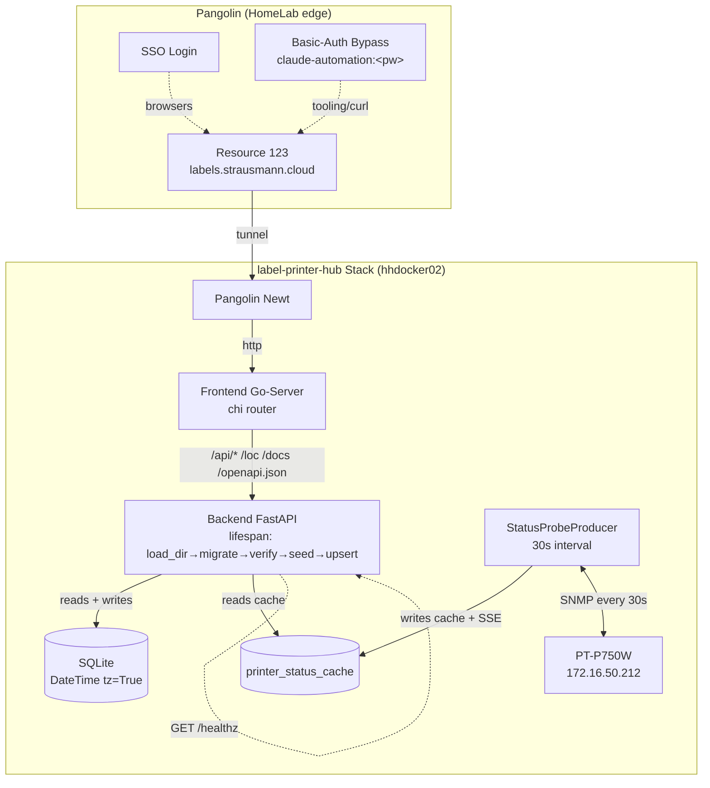

# Phase 7b — Foundation: Init-Robustheit, Health-Split, Pangolin-Bypass

**Status:** Spec — awaiting user review before writing-plans
**Datum:** 2026-05-17
**Author:** Brainstorming-Session zusammen mit dem Maintainer
**Master-Tracking:** strausmann/label-printer-hub#22 (Phase 7b cluster)
**Vorgaenger:** Phase 7a (Frontend-Basis)
**Nachfolger:** Phase 7c (Webhook-Multi-Tenancy), Phase 7d (Doku-Refresh)

## Zusammenfassung

Phase 7b behebt Foundation-Luecken, die im ersten Produktions-Deploy auf hhdocker02 (labels.strausmann.cloud) entdeckt wurden. Es ist keine Feature-Phase — Stabilisierung der Phase-5/6/7a-Basis, sodass Phase 7c (Webhook-Multi-Tenancy) auf einem korrekt initialisierten Backend aufsetzen kann.

Neun Cluster werden zusammen umgesetzt:

| Cluster | Thema |
|---|---|
| 1a | Lifespan Init-Order Fix (load_dir vor seed_templates) |
| 1b | Drucker-Persistenz (deterministische UUIDv5, Auto-Upsert in DB) |
| 1c | Datetime-TZ-Serialisierung (3-Layer-Fix: SQLAlchemy + Pydantic + Alembic) |
| 1d | Post-Migration Verify (alembic at head) |
| 1e | `/healthz` Liveness + `/readiness` Deep-Check |
| 1f | SNMP-Cache aktiv nutzen (statt sync Polling pro Request) |
| 2 | Pangolin Header-Auth via Blueprint Labels (bereits live, Dokumentation) |
| 3 | Frontend Proxy: `/docs` + `/openapi.json` + `/redoc` weiterleiten |

## Goal

Eine HomeLab-Ops-Person soll nach Phase-7b einen frischen Deploy starten koennen und im UI sofort einen konfigurierten Drucker plus 12 Default-Templates sehen, ohne manuelle DB-Eingriffe. Drucker-Status-Anzeigen muessen <100ms antworten (auch bei Offline-Hardware). Externe Tools (curl, CI, Agents) sollen via Pangolin Basic-Auth-Bypass die API + Swagger-UI ohne SSO-Login erreichen. Healthchecks muessen klar zwischen "Container braucht Restart" und "externe Abhaengigkeit nicht ready" unterscheiden, sodass Docker-Autoheal nicht in Restart-Loops bei Offline-Hardware faellt.

## In Scope

### Cluster 1a — Lifespan Init-Order Fix

**Problem:** `seed_templates(s, TemplateLoader)` laeuft in `app/main.py` VOR `TemplateLoader.load_dir(_SEED_TEMPLATES_DIR)`. Der Cache ist beim Seed leer → `TemplateLoader.seed_db()` upserted 0 Rows ohne Fehler. Heute beobachtet: DB-Tabelle `templates` leer, Frontend zeigt "No templates found".

**Loesung:** Re-Order in `app/main.py` lifespan:

1. `await run_migrations()`
2. `await verify_alembic_at_head()` (NEU, siehe Cluster 1d)
3. `TemplateLoader.load_dir(_SEED_TEMPLATES_DIR)` — VOR DB-Operationen
4. `async with async_session()` → `recover_inflight_jobs`, `seed_templates`, `upsert_runtime_printer`, `ensure_printer_state`
5. Plugin Discovery + Runtime printer + Producers (bestehend)

**Defensive Layer:** `seed_templates()` prueft `loader._cache` und wirft `RuntimeError` wenn leer — verhindert dass der Bug bei spaeteren Re-Orderings stillschweigend zurueckkommt.

**Docstring-Korrektur:** `app/db/lifespan.py` Top-of-file docstring listet die korrekte 6-Schritt-Sequenz mit `load_dir()` als Schritt 2.

### Cluster 1b — Drucker-Persistenz

**Problem:** DB-Tabelle `printers` ist leer. Lifespan erzeugt `printer = driver.make_queue_printer(tape_registry)` mit zufaelliger UUID4. `app.state.printer_id` referenziert diese Runtime-UUID, die nirgends in der DB existiert. UI liest `GET /api/printers` aus DB → zeigt nichts. Print-Jobs wuerden auf der Runtime-UUID landen, die in keiner DB-Row existiert.

**Loesung:**

**Application-Level deterministische UUIDv5** in `app/services/printer_identity.py` (NEU):

```python
from uuid import UUID, uuid5

_PRINTER_NAMESPACE = UUID("6f1b3c7e-9d6a-4f48-9a8c-d4e0e1c5a3b2")  # const im Repo

def derive_printer_id(model: str, host: str, port: int) -> UUID:
    return uuid5(_PRINTER_NAMESPACE, f"{model}|{host}|{port}")
```

Konstante Namespace-UUID ist im Repo committed. Gleiche env-Werte → immer dieselbe UUID, auch Cross-Environment.

**Auto-Upsert in Lifespan** (`app/db/lifespan.py` neue Funktion `upsert_runtime_printer(session, settings) -> UUID`):

```python
async def upsert_runtime_printer(session: AsyncSession, settings: Settings) -> UUID | None:
    model = settings.printer_model
    host = settings.pt750w_host or settings.ql820_host or ""
    port = settings.pt750w_port if settings.pt750w_host else settings.ql820_port
    if not (model and host and port):
        return None
    printer_id = derive_printer_id(model, host, port)
    existing = await session.get(Printer, printer_id)
    if existing:
        existing.name = f"{model} ({host})"
        existing.connection = {"host": host, "port": port, "snmp": ..., "snmp_community": ...}
        existing.enabled = True
    else:
        printer = Printer(id=printer_id, name=f"{model} ({host})", model=model.lower(), backend=settings.printer_backend, connection={...}, enabled=True)
        session.add(printer)
    await session.flush()
    return printer_id
```

**Driver-Signatur-Erweiterung:** `driver.make_queue_printer()` akzeptiert optional `printer_id` als Parameter statt immer `uuid4()` zu generieren. Lifespan ruft `make_queue_printer(tape_registry, printer_id=db_printer_id)` damit Runtime und DB konsistent sind.

**Migration:** Existing rows mit nicht-deterministischen UUIDs werden in einer Alembic-Migration optional eliminiert (heute: 1 manuell eingefuegte Row auf hhdocker02). Empfehlung: Migration mappt rows mit gleichem `name+host` auf die neue deterministische ID; falls keine Match, wird die Row geloescht.

Multi-Drucker bleibt Phase 7c (mehrere env-Vars oder Config-File mit mehreren Printer-Sektionen).

### Cluster 1c — Datetime-TZ-Serialisierung

**Problem:** Heute direkt beobachtet: Frontend Go-Server crasht mit 503 fuer `/templates`:

```
parsing time "2026-05-17T11:51:33.798110" cannot parse "" as "Z07:00"
```

Backend Pydantic-Schema serialisiert `created_at` als naive datetime ohne `Z`/`+00:00`-Suffix. Frontend oapi-codegen `time.Time` verlangt strict RFC3339 mit Timezone → Parse-Fehler → 503. Existing Tests fixen das nicht ab, weil sie TZ-aware Datetimes als Fixtures injizieren.

**Loesung in 3 Schichten:**

**Schicht 1 — SQLAlchemy Models:** Alle Datetime-Spalten auf `DateTime(timezone=True)`. `default_factory=lambda: datetime.now(timezone.utc)`.

```python
created_at: datetime = Field(
    default_factory=lambda: datetime.now(timezone.utc),
    sa_column=Column(DateTime(timezone=True), nullable=False),
)
```

**Schicht 2 — Pydantic-Serializer** in `app/schemas/_datetime.py`:

```python
def serialize_datetime_utc(dt: datetime, _info) -> str:
    if dt.tzinfo is None:
        dt = dt.replace(tzinfo=timezone.utc)
    return dt.isoformat().replace("+00:00", "Z")
```

In allen Read-Schemas (TemplateRead, PrinterRead, JobRead, PresetRead): `@field_serializer("created_at", "updated_at")` → ruft `serialize_datetime_utc`.

**Schicht 3 — Alembic-Datenmigration** `alembic/versions/20260517_phase7b_datetime_tz.py`:

```python
def upgrade():
    op.execute("UPDATE templates SET created_at = created_at || '+00:00' WHERE created_at NOT LIKE '%+%' AND created_at NOT LIKE '%Z'")
    op.execute("UPDATE templates SET updated_at = updated_at || '+00:00' WHERE ...")
    # ... fuer printers, jobs, presets, printer_state, printer_status_cache
```

Migration ist idempotent (`WHERE NOT LIKE`).

### Cluster 1d — Post-Migration Verify

**Problem:** `run_migrations()` ruft `alembic upgrade head`. Bei einem partial-applied state oder Connection-Verlust mid-migration koennte `alembic_version` inkonsistent sein, und Lifespan macht trotzdem weiter ohne Pruefung.

**Loesung:** Neue Funktion `verify_alembic_at_head()` in `app/db/lifespan.py`:

```python
async def verify_alembic_at_head() -> None:
    """Pruefe dass DB.alembic_version == script head_revision."""
    ini_path = Path(__file__).resolve().parents[2] / "alembic.ini"
    def _check():
        cfg = Config(str(ini_path))
        script = ScriptDirectory.from_config(cfg)
        head_rev = script.get_current_head()
        sync_engine = create_engine(settings.database_url.replace("+aiosqlite", ""))
        with sync_engine.connect() as conn:
            ctx = MigrationContext.configure(conn)
            current_rev = ctx.get_current_revision()
        return current_rev, head_rev
    current_rev, head_rev = await asyncio.to_thread(_check)
    if current_rev != head_rev:
        raise RuntimeError(f"Alembic migration drift: DB at {current_rev!r}, expected {head_rev!r}")
```

Lifespan ruft `verify_alembic_at_head()` direkt nach `run_migrations()`. Fail-Fast → Backend startet nicht bei Drift.

Log-Output bei normalem Start: `INFO: Alembic at head_revision 20260517_phase7b (current=20260517_phase7b)`.

### Cluster 1e — `/healthz` Liveness + `/readiness` Deep

**Design-Prinzip (Self-Heal-Logik):**

- **`/healthz`:** Nur Dinge wo Container-Restart das Problem loest. Docker-Autoheal pollt das.
- **`/readiness`:** Tiefer Check. Bei fail → Pangolin entfernt Routing. **Kein** Restart-Trigger (sonst Restart-Loops bei Drucker-Offline).

**`/healthz` (existing, unveraendert):** Nur `{status, version, revision, build_date, repository}`. Kein DB-Query.

**`/readiness` (NEU):** Liefert acht Checks aggregiert:

```python
class CheckStatus(BaseModel):
    status: Literal["ok", "fail", "skipped", "stale"]
    detail: str | None = None
    metric: dict[str, Any] | None = None

class ReadinessResponse(BaseModel):
    status: Literal["ready", "degraded", "not-ready"]
    checks: dict[str, CheckStatus]
    version: str
    revision: str
```

| Check | Beschreibung |
|---|---|
| `database` | `SELECT 1` against session, misst latency_ms |
| `alembic` | Wiederholt verify_alembic_at_head() (defense-in-depth) |
| `template_seed` | `SELECT count(*) FROM templates` >= 1 |
| `printer_runtime` | `app.state.printer_id` ist gesetzt |
| `printer_db_sync` | `app.state.printer_id` existiert in DB |
| `snmp_discovery` | `printer_status_cache.last_probe_at` <90s → ok, <600s → stale, >600s → fail |
| `print_queue` | Print-Queue worker alive (`app.state.print_queue.is_alive()`) |
| `sse_bus` | SSE subscriber count < max |

**Aggregations-Regel:**

| Checks-Status | `status` | HTTP |
|---|---|---|
| Alle ok | `ready` | 200 |
| Mindestens ein fail, aber DB+Alembic+template_seed ok | `degraded` | 200 |
| DB- oder Alembic- oder template_seed-fail | `not-ready` | 503 |

**Pangolin-Compose-Label Update:**

```yaml
- "pangolin.public-resources.label-printer-hub.targets[0].healthcheck.path=/readiness"
```

Statt `/healthz`. Docker-`healthcheck:` weiterhin `/healthz` (Liveness only).

### Cluster 1f — SNMP-Cache aktiv nutzen

**Problem:** Heute beobachtet: `GET /api/printers/{id}/status` blockt 5+ Sekunden, wenn PT-P750W offline ist, weil das Endpoint synchron einen SNMP-Probe macht. Phase 5 hat eine `printer_status_cache` Tabelle angelegt, die aktuell aber nicht beschrieben wird.

**Loesung:**

**Writer:** `StatusProbeProducer` (existing fuer SSE) schreibt zusaetzlich in `printer_status_cache`:

```python
async def _probe_once(self):
    try:
        snmp_result = await self._snmp_probe()  # 5s timeout
        await self._upsert_cache(snmp_result)
        await self._publish_event(snmp_result)
    except SnmpTimeoutError as exc:
        await self._mark_offline(exc)
        await self._publish_event_offline(exc)
```

**Reader:** `GET /api/printers/{id}/status` antwortet aus Cache:

```python
@router.get("/api/printers/{printer_id}/status")
async def get_printer_status(printer_id: UUID, session: AsyncSession = Depends(get_session)):
    cache_row = await session.get(PrinterStatusCache, printer_id)
    if not cache_row:
        return PrinterStatusRead(printer_id=printer_id, online=None, last_probe_at=None,
                                  note="No probe yet — wait up to 30s for first probe cycle")
    age_s = (datetime.now(timezone.utc) - cache_row.last_probe_at).total_seconds()
    return PrinterStatusRead(
        printer_id=printer_id, online=cache_row.online,
        tape_width_mm=cache_row.tape_width_mm,
        last_probe_at=cache_row.last_probe_at,
        last_probe_age_s=int(age_s),
        last_error=cache_row.last_error,
    )
```

Antwortzeit nach Fix: <10ms (DB-Read). Frische Daten via SSE-Stream oder beim naechsten Probe-Cycle (max 30s).

**Schema-Erweiterung:** Spalte `printer_status_cache.last_error` (TEXT NULL) wird ergaenzt fuer SNMP-Timeout-Details.

### Cluster 2 — Pangolin Header-Auth (bereits live, Dokumentation)

**Stand 2026-05-17:** Resource 123 (`labels.strausmann.cloud`) hat `auth.basic-auth.user=claude-automation` und `auth.basic-auth.password=<32-byte hex>` als hartcoded Blueprint Labels im Compose. Password ist in Vault persistiert (Item-ID `f6329e97-5bf5-49e9-b5bf-ad5d7838cc9b`). User-Naming-Konvention `claude-automation` ist konsistent mit anderen HomeLab-Resources (Patchmon, Traefik, Crowdsec Manager).

**Anti-Pattern:** Hartcoded Passwort im Compose. Begruendung: Dockhand Stack-Env-Variablen werden nicht in `.env`-File neben `compose.yaml` geschrieben (verifiziert auf hhdocker02: `.env` ist 1 byte), daher schlaegt `${VAR}` Interpolation in Compose-Labels fehl mit `Too small: expected string to have >=1 characters at "public-resources.*.auth.basic-auth.user"`. Phase 7c soll ein Dockhand-Upstream-Issue eroeffnen.

**Bekannter Pangolin-Bug:** [fosrl/pangolin#3099](https://github.com/fosrl/pangolin/issues/3099) (Regression). Pangolin sendet `WWW-Authenticate: Basic` auf No-Auth-Requests obwohl `auth.sso-enabled=true` ebenfalls gesetzt ist. Erwartet: SSO-priority + Basic-Auth nur als Bypass.

**Phase-7b Tasks fuer Cluster 2:**

1. Pangolin Skill `references/troubleshooting.md` mit `auth.basic-auth` Workaround-Pattern erweitern (hartcoded, Vault als SoT, Variable-Interpolation funktioniert NICHT).
2. HomeLab-Rule `.claude/rules/pangolin-resource-standard.md` (NEU) — definiert dass jede neue Pangolin-Resource Header-Auth + Vault-Item mit `claude-automation`-User bekommt.
3. Tracking-Issue strausmann/homelab-pangolin-client#245 ist verlinkt mit fosrl/pangolin#3099 und wird beim Upstream-Fix aktualisiert.

### Cluster 3 — Frontend Proxy Erweiterung

**Problem:** `https://labels.strausmann.cloud/docs` und `/openapi.json` antworten mit 404. Frontend Go-Server (chi router in `frontend/cmd/server/main.go`) mounted Proxy nur unter `/api/*`, `/loc`, `/asset`, `/spool`, `/product` — FastAPI-eigene Routes wie `/docs` werden nicht durchgereicht.

**Loesung:** 3-Zeilen-Aenderung in `newRouter()`:

```go
r.Mount("/docs", prx)
r.Mount("/openapi.json", prx)
r.Mount("/redoc", prx)
```

Nach Fix: Swagger UI via Browser (SSO) und via curl (Basic-Auth-Bypass) erreichbar.

## Out of Scope

- **Webhook-Multi-Tenancy** (DB-Schema `webhooks`, UI-CRUD, Key-Rotation, ACL Webhook→Printer) → Phase 7c
- **Job-Audit-Trail** mit `source_ip` + `webhook_id` → Phase 7c
- **API-Key-Verwaltung UI** → Phase 7c
- **`examples/compose.pangolin.yml` Refresh** mit korrektem Pangolin Label-Prefix + `PRINTER_HUB_` Env-Naming → Phase 7d (Tracking-Issue #73)
- **README + Docs Site Refresh** → Phase 7d
- **Upstream-Pangolin-Issue #3099 Resolution** → extern, abgewartet
- **Dockhand Label-Variable-Interpolation** → eigenes Upstream-Issue (Phase 7c)

## Erfolgs-Kriterien

1. Frischer Deploy (leere DB) zeigt sofort 12 Templates + 1 Drucker im UI ohne manuelle DB-Eingriffe.
2. Stack-Restart erhaelt Daten + Header-Auth + Pangolin-Resource Status.
3. `GET /api/printers/{id}/status` antwortet in <100ms (auch wenn PT-P750W offline ist).
4. `GET /readiness` Response zeigt mindestens 8 Checks und deckt heute beobachtete Failure-Modes auf (leere DB, kaputtes Datetime-Format, SNMP-Drucker offline).
5. Browser-User mit Pangolin SSO **UND** Agent mit Pangolin Basic-Auth koennen beide via `labels.strausmann.cloud` arbeiten.
6. CI-Tests fangen Datetime-TZ-Drift und Drucker-DB-Drift kuenftig.

## Architektur-Übersicht



## Test-Strategie

### Neue Test-Dateien

| Datei | Cluster | Was getestet wird |
|---|---|---|
| `backend/tests/unit/test_lifespan_order.py` | 1a | seed_templates RuntimeError bei leerem Cache, lifespan order assertions |
| `backend/tests/unit/test_printer_identity.py` | 1b | UUIDv5 deterministisch, distinct bei Host-Change |
| `backend/tests/integration/test_lifespan_printer_upsert.py` | 1b | DB-Row erzeugt, idempotent, runtime_id == db_id |
| `backend/tests/integration/test_api_datetime_format.py` | 1c | TZ-Suffix in allen Datetime-Feldern aller Endpoints |
| `backend/tests/integration/test_oapi_codegen_contract.py` | 1c | Go-Client kann Backend-Response parsen (slow marker) |
| `backend/tests/unit/test_alembic_verify.py` | 1d | Verify success, raise on drift |
| `backend/tests/integration/test_readiness_endpoint.py` | 1e | ok/degraded/not-ready scenarios |
| `backend/tests/integration/test_healthz_minimal.py` | 1e | Healthz bleibt minimal, kein DB-Query |
| `backend/tests/integration/test_status_cache_writer.py` | 1f | Probe schreibt online/offline in Cache |
| `backend/tests/integration/test_status_endpoint_cached.py` | 1f | <100ms response, kein sync-SNMP |
| `frontend/cmd/server/main_test.go` | 3 | Proxy mounts /docs + /openapi.json |

### Existing Tests anpassen

- `backend/tests/unit/test_lifespan.py`: Fixtures muessen `load_dir()` vor `seed_templates` aufrufen.
- Alle `datetime.utcnow()` (deprecated, naive) → `datetime.now(timezone.utc)`.

### CI-Anpassungen

- `pytest --cov=app --cov-fail-under=80` (vorher 75).
- `pytest --slow` optional; ohne `--slow` werden langsame Tests uebersprungen.
- `tests/integration/test_oapi_codegen_contract.py` braucht Go-Toolchain in CI-Container.

## Acceptance Criteria

### Funktional

- [ ] Frischer Deploy (leere DB) → 12 Templates + 1 Drucker im UI ohne manuelle DB-Eingriffe.
- [ ] Stack-Restart erhaelt alle Daten + Header-Auth + Pangolin-Resource Health.
- [ ] `GET /api/printers/{id}/status` antwortet in <100ms (auch wenn PT-P750W offline).
- [ ] `GET /readiness` zeigt mindestens 8 Checks (database/alembic/template_seed/printer_runtime/printer_db_sync/snmp_discovery/print_queue/sse_bus).
- [ ] `GET /readiness` returns 200 + `status=degraded` wenn PT-P750W offline.
- [ ] `GET /readiness` returns 503 + `status=not-ready` wenn DB unreachable.
- [ ] `GET /docs` und `/openapi.json` mit Pangolin Basic-Auth → 200.
- [ ] Browser-User mit Pangolin SSO → 12 Templates + 1 Drucker + funktionierende Status-Cards.

### Code-Qualität

- [ ] Coverage ≥ 80%.
- [ ] Alle neuen Tests in `tests/unit/` und `tests/integration/` gruen.
- [ ] Frontend Go-Tests `make test` gruen.
- [ ] `mypy app` + `ruff check` + `ruff format --check` gruen.

### Doku

- [ ] README mentions `/readiness` Endpoint.
- [ ] CHANGELOG-Eintrag (semantic-release manages).
- [ ] Master-Tracking-Issue #22 mit Phase 7b ✓ markiert.

### Review-Workflow

- [ ] gemini-code-assist Review adressiert.
- [ ] copilot-pull-request-reviewer Review adressiert.
- [ ] CodeQL/GitGuardian Findings adressiert oder mit Begruendung dismissed.
- [ ] Mindestens 15 Min nach letztem Push gewartet vor Merge (Rule `review-feedback-policy.md`).

### Production-Smoke

Nach Merge + Image-Build + Stack-Update auf hhdocker02:

- [ ] `curl -u claude-automation:<pw> https://labels.strausmann.cloud/healthz` → 200 `{"status":"ok"}`.
- [ ] `curl -u claude-automation:<pw> https://labels.strausmann.cloud/readiness` → 200 mit `status=ready` (Drucker online) oder `degraded` (offline).
- [ ] Browser-User loggt sich SSO ein, sieht 12 Templates + 1 Drucker mit Live-Status.
- [ ] `curl -u claude-automation:<pw> https://labels.strausmann.cloud/openapi.json` → JSON Schema.
- [ ] Test-Druck-Job via Webhook → erfolgreicher Print auf PT-P750W (sofern Drucker online).

## Risiko-Übersicht

| Cluster | Risiko | Mitigation |
|---|---|---|
| 1a Init-Order | Low | Defensive Check + Tests |
| 1b Drucker-Persistenz | Medium | Migration fuer existing rows + Tests |
| 1c Datetime-TZ | Low | 3-Layer-Fix, Data-Migration idempotent |
| 1d Verify | Low | Read-only Check |
| 1e Healthz/Readiness | Low | Neuer Endpoint, kein Breaking |
| 1f SNMP-Cache | Low | Existing Schema + Worker |
| 2 Pangolin Doku | None | Bereits live, nur dokumentieren |
| 3 Frontend Proxy | Low | 3-Zeilen-Mount |

## Referenzen

| Dokument | Pfad / Link |
|---|---|
| Master-Tracking | strausmann/label-printer-hub#22 |
| Pangolin Upstream Issue | https://github.com/fosrl/pangolin/issues/3099 |
| Pangolin Internal Tracking | strausmann/homelab-pangolin-client#245 |
| Phase 7a Frontend Base Design | `docs/superpowers/specs/2026-05-16-phase7a-frontend-base-design.md` |
| Phase 6b SSE EventBus Design | `docs/superpowers/specs/2026-05-16-phase6b-sse-eventbus-design.md` |
| Phase 6a REST API Design | `docs/superpowers/specs/2026-05-16-phase6a-rest-api-design.md` |
| Phase 5 Persistence Design | `docs/superpowers/specs/2026-05-16-phase5-persistence-design.md` |
| Vault-Item Header-Auth | Vaultwarden Item-ID `f6329e97-5bf5-49e9-b5bf-ad5d7838cc9b` |
