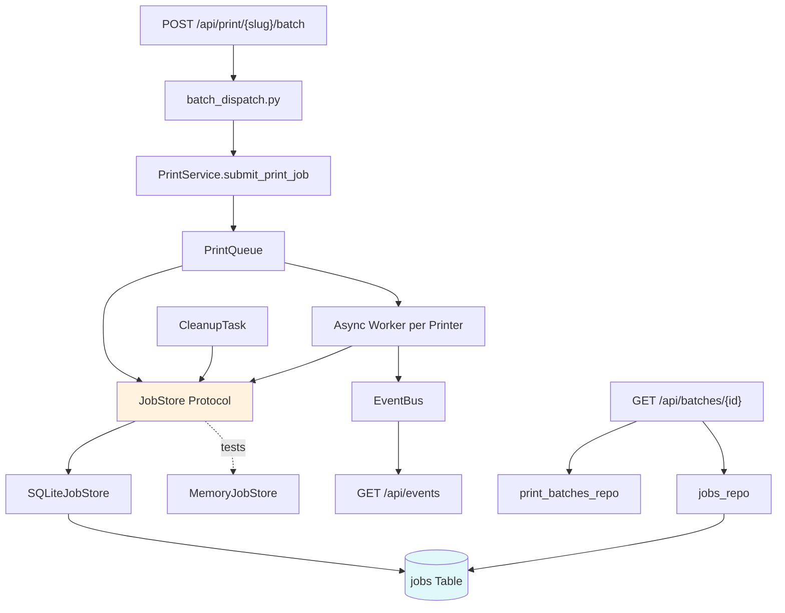
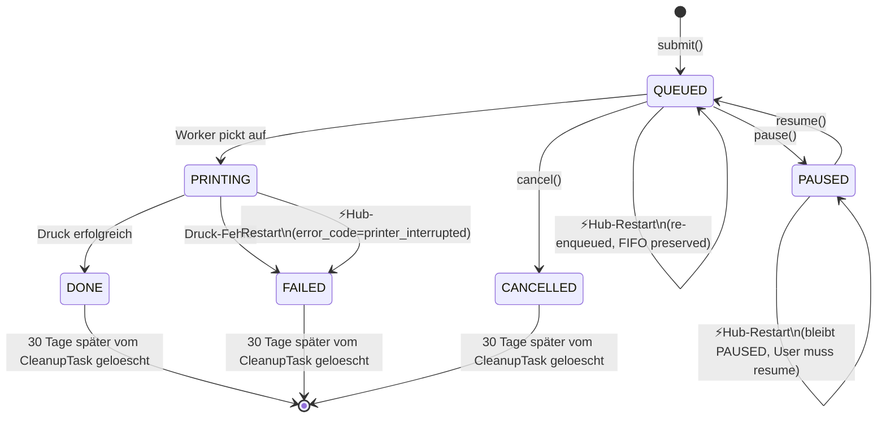
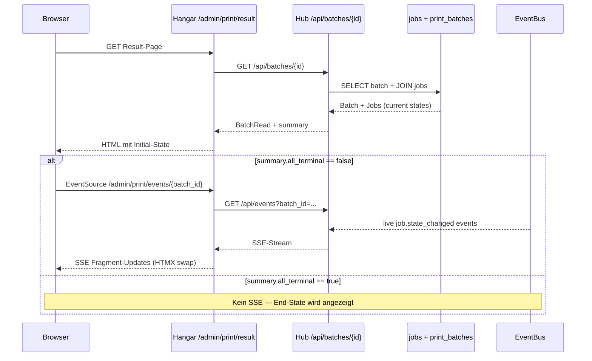

# Phase 2 — Job Persistence Design

**Status:** Draft
**Datum:** 2026-05-31
**Issue:** [strausmann/Label-Printer-Hub#93](https://github.com/strausmann/Label-Printer-Hub/issues/93)
**Bezug:** Entblockt [strausmann/hangar#81](https://git.strausmann.de/strausmann/hangar/-/work_items/81) (Result-Page Live-Updates)
**Spec Author:** Orchestrator (Brainstorming-Session 26 Continuation)

---

## Motivation

Phase 1 (PR #92) lieferte einen Batch-Endpoint der physisch erfolgreich druckt. Trotzdem zeigt die Hangar-Result-Page nach erfolgreichem Druck dauerhaft "ausstehend" — `GET /api/jobs/{id}` liefert 404, die `jobs`-Tabelle bleibt leer obwohl Etiketten phyisch rausgekommen sind.

Ursache: `PrintQueue._jobs` ist ein In-Memory `dict[UUID, Job]` ohne DB-Persistierung. Der Header-Comment in `app/services/print_queue.py` plante dieses Refactor bereits explizit:

> Jobs live in-memory (MVP). Phase 5 will add SQLite persistence behind a JobStore protocol that this module will accept by dependency injection.

Folgen des aktuellen Designs:

- `GET /api/jobs/{id}` und `GET /api/batches/{id}` liefern keinen Stand
- Container-Restart loescht alle Jobs (Audit-Trail unmoeglich)
- SSE-Stream-Reconnect kann nichts nachholen
- Hangar's Result-Page bleibt auf Initial-Render-Default "ausstehend"

## Ziele

1. **Persistenz** — Job-State `queued → printing → done/failed` wird in der `jobs`-Tabelle persistiert, jede Transition synchron geschrieben
2. **Restart-Recovery** — beim Hub-Restart werden `PRINTING`-Jobs als `FAILED` mit `error_code=printer_interrupted` markiert; `QUEUED`-Jobs werden in FIFO-Reihenfolge erneut in die Worker-Queue gelegt
3. **Snapshot-Endpoint** — neuer `GET /api/batches/{batch_id}` liefert kompletten aktuellen Stand aller Jobs einer Batch, inklusive `summary.all_terminal` damit Clients entscheiden ob ein SSE-Stream noch Sinn macht
4. **Retention** — automatisches Cleanup der `jobs`-Tabelle: terminal Jobs (`done`, `failed`, `cancelled`) aelter als ein konfigurierbares Fenster (Default 30 Tage) werden taeglich vom `CleanupTask` geloescht

## Nicht-Ziele

- **Hangar Phase 1d Implementation** — eigener MR im Hangar-Repo nach Hub-Merge ([#81](https://git.strausmann.de/strausmann/hangar/-/work_items/81))
- **Worker resume von PRINTING-Jobs** — explizit als `FAILED` markiert, kein Auto-Retry (User-Entscheidung Q3)
- **Per-Drucker-Konfigurierbarkeit** der Recovery-Strategie — alle Drucker nutzen gleichen `JobStore`
- **Multi-Process-Support** — `JobStore` ist async-safe fuer SQLite-WAL, aber Single-Process. Multi-Worker via gunicorn nicht in Scope
- **Schema-Migrationen fuer Job-Modell** — `jobs`-Tabelle existiert bereits in Migration `b2668b6e8845`, kein neuer Alembic-Revision noetig
- **SSE-Event-Replay** — User-Entscheidung Q5 fuer Snapshot-GET + Live-SSE; Hub haelt keine Event-Historie

## Architektur



**Boundaries:**

- `PrintQueue` kennt nur das `JobStore`-Interface (keine SQLAlchemy-Imports)
- `JobStore` ist ein `Protocol` mit `save`, `get`, `list_pending`, `evict_terminal_older_than`, `mark_interrupted`
- `SQLiteJobStore` implementiert `JobStore` und schreibt direkt mit `AsyncSession` (kein `jobs_repo`, eigene Layer-Semantik)
- `MemoryJobStore` ist die Test- und Migration-Phase Implementation; gleiches Protocol
- `GET /api/batches/{id}` ist ein neuer Endpoint der `print_batches` + alle zugehoerigen Jobs joined
- `CleanupTask` ist ein Background `asyncio.Task` der `evict_terminal_older_than(retention_days)` periodisch aufruft

## Komponenten

### JobStore Protocol

Datei: `backend/app/services/job_store.py` (neu).

```python
from typing import Protocol, runtime_checkable
from uuid import UUID
from datetime import timedelta
from app.models.job import Job


@runtime_checkable
class JobStore(Protocol):
    """Persistente Backing-Store fuer Jobs."""

    async def save(self, job: Job) -> None:
        """Persistiert den aktuellen Job-State (upsert nach id).

        Wird bei jeder State-Transition aufgerufen:
        QUEUED -> PRINTING -> DONE/FAILED. Synchron im Worker-Loop.
        """

    async def get(self, job_id: UUID) -> Job | None:
        """Laedt einen Job aus dem Store. None wenn nicht vorhanden."""

    async def list_pending(self, printer_id: UUID | None = None) -> list[Job]:
        """Alle Jobs in nicht-terminal States (QUEUED, PRINTING, PAUSED).

        Wird beim Worker-Start aufgerufen fuer Restart-Recovery.
        Optional gefiltert nach Drucker. Order: created_at (FIFO).
        """

    async def mark_interrupted(self, printer_id: UUID) -> int:
        """Recovery-Helper: setzt alle PRINTING-Jobs des Druckers auf
        FAILED mit error_code=printer_interrupted.

        Wird in PrintQueue.start() VOR list_pending aufgerufen.
        Returns: Anzahl Jobs die als interrupted markiert wurden.
        """

    async def evict_terminal_older_than(self, age: timedelta) -> int:
        """Loescht terminal Jobs (DONE, FAILED, CANCELLED) aelter als age.

        Returns: Anzahl geloeschter Rows.
        """
```

**Design-Entscheidungen:**

- `@runtime_checkable` erlaubt `isinstance(obj, JobStore)` Checks in Tests
- Alle Methoden async fuer Konsistenz mit dem Rest des Codes
- Keine Streaming/Pagination in `list_pending` — wir erwarten <100 pending Jobs im Normalfall
- `mark_interrupted` als separater Step erlaubt sauberen Recovery-Ablauf

### SQLiteJobStore

Datei: `backend/app/services/job_store_sqlite.py` (neu).

```python
from datetime import datetime, timedelta, timezone
from uuid import UUID

from sqlalchemy.ext.asyncio import async_sessionmaker
from sqlmodel import delete, select, update

from app.models.job import Job, JobState
from app.services.job_store import JobStore

_NON_TERMINAL = {JobState.QUEUED, JobState.PRINTING, JobState.PAUSED}
_TERMINAL = {JobState.DONE, JobState.FAILED, JobState.CANCELLED}


class SQLiteJobStore(JobStore):
    """SQLite-Backed JobStore via SQLModel/SQLAlchemy AsyncSession."""

    def __init__(self, session_factory: async_sessionmaker) -> None:
        self._session_factory = session_factory

    async def save(self, job: Job) -> None:
        async with self._session_factory() as session:
            await session.merge(job)
            await session.commit()

    async def get(self, job_id: UUID) -> Job | None:
        async with self._session_factory() as session:
            result = await session.execute(select(Job).where(Job.id == job_id))
            return result.scalar_one_or_none()

    async def list_pending(self, printer_id: UUID | None = None) -> list[Job]:
        async with self._session_factory() as session:
            stmt = select(Job).where(Job.state.in_(_NON_TERMINAL))
            if printer_id is not None:
                stmt = stmt.where(Job.printer_id == printer_id)
            stmt = stmt.order_by(Job.created_at)
            result = await session.execute(stmt)
            return list(result.scalars().all())

    async def mark_interrupted(self, printer_id: UUID) -> int:
        async with self._session_factory() as session:
            stmt = (
                update(Job)
                .where(Job.printer_id == printer_id, Job.state == JobState.PRINTING)
                .values(
                    state=JobState.FAILED,
                    error_code="printer_interrupted",
                    error_message="Hub restarted while printing — printer state unclear",
                    finished_at=datetime.now(timezone.utc),
                )
            )
            result = await session.execute(stmt)
            await session.commit()
            return result.rowcount or 0

    async def evict_terminal_older_than(self, age: timedelta) -> int:
        cutoff = datetime.now(timezone.utc) - age
        async with self._session_factory() as session:
            stmt = (
                delete(Job)
                .where(Job.state.in_(_TERMINAL))
                .where(Job.finished_at < cutoff)
            )
            result = await session.execute(stmt)
            await session.commit()
            return result.rowcount or 0
```

**Design-Entscheidungen:**

- `session.merge()` macht implizit Upsert via Primary Key — kein manuelles `get-then-update-or-insert`
- `session_factory` injected statt globaler Session — testbar, kein Singleton-Lock-in
- Eigene Session pro Operation — kurze Transaktionen, kein Connection-Pool-Starvation
- `order_by(created_at)` in `list_pending` — FIFO bleibt erhalten beim Restart-Recovery
- `mark_interrupted` setzt `finished_at` — sonst wuerden interrupted-Jobs nie vom Cleanup-Task erfasst
- Repository-Layer wird **nicht** genutzt — `jobs_repo` hat andere Patterns (Pydantic, Pagination); JobStore ist naeher am SQL

### MemoryJobStore

Datei: `backend/app/services/job_store_memory.py` (neu).

```python
from datetime import datetime, timedelta, timezone
from uuid import UUID

from app.models.job import Job, JobState
from app.services.job_store import JobStore

_NON_TERMINAL = {JobState.QUEUED, JobState.PRINTING, JobState.PAUSED}
_TERMINAL = {JobState.DONE, JobState.FAILED, JobState.CANCELLED}


class MemoryJobStore(JobStore):
    """In-Memory JobStore fuer Tests und Migration-Phase."""

    def __init__(self) -> None:
        self._jobs: dict[UUID, Job] = {}

    async def save(self, job: Job) -> None:
        self._jobs[job.id] = job

    async def get(self, job_id: UUID) -> Job | None:
        return self._jobs.get(job_id)

    async def list_pending(self, printer_id: UUID | None = None) -> list[Job]:
        items = [j for j in self._jobs.values() if j.state in _NON_TERMINAL]
        if printer_id is not None:
            items = [j for j in items if j.printer_id == printer_id]
        return sorted(items, key=lambda j: j.created_at)

    async def mark_interrupted(self, printer_id: UUID) -> int:
        count = 0
        for job in self._jobs.values():
            if job.printer_id == printer_id and job.state == JobState.PRINTING:
                job.state = JobState.FAILED
                job.error_code = "printer_interrupted"
                job.error_message = "Hub restarted while printing"
                job.finished_at = datetime.now(timezone.utc)
                count += 1
        return count

    async def evict_terminal_older_than(self, age: timedelta) -> int:
        cutoff = datetime.now(timezone.utc) - age
        to_delete = [
            jid for jid, j in self._jobs.items()
            if j.state in _TERMINAL and j.finished_at is not None and j.finished_at < cutoff
        ]
        for jid in to_delete:
            del self._jobs[jid]
        return len(to_delete)
```

### PrintQueue Refactor

Aenderungen in `backend/app/services/print_queue.py`:

1. **Konstruktor:** neuer Parameter `store: JobStore`
2. **`_jobs` dict entfernt** — `JobStore` ist Source of Truth
3. **`start()`** ruft VOR Worker-Spawn `mark_interrupted` und `list_pending` pro Printer
4. **`submit()`** ruft `await self._store.save(job)` nach Job-Erstellung
5. **`submit_paused()`** ruft `await self._store.save(job)` nach Pause-Transition
6. **`_worker()`** ruft `await self._store.save(job)` bei jeder State-Transition (QUEUED→PRINTING, PRINTING→DONE/FAILED)

**Pseudocode des refactored Worker:**

```python
async def _worker(self, printer_id: UUID) -> None:
    queue = self._queues[printer_id]
    while not self._stopping:
        job = await queue.get()

        JobStateMachine.transition(job, JobState.PRINTING)
        await self._store.save(job)          # NEU
        self._bus.publish(...)

        try:
            await self._backend.print(job.image_payload, ...)
            JobStateMachine.transition(job, JobState.DONE)
            await self._store.save(job)      # NEU
            self._bus.publish(...)
        except PrinterError as exc:
            JobStateMachine.transition(job, JobState.FAILED)
            job.error_code = exc.code
            job.error_message = str(exc)
            await self._store.save(job)      # NEU
            self._bus.publish(...)

        queue.task_done()
```

**Recovery in `start()`:**

```python
async def start(self) -> None:
    if self._running:
        return

    # Phase-2 Recovery
    for printer_id in self._queues:
        interrupted = await self._store.mark_interrupted(printer_id)
        if interrupted > 0:
            logger.warning(
                "Recovery: %d printing jobs on printer %s marked as interrupted",
                interrupted, printer_id,
            )
        pending = await self._store.list_pending(printer_id=printer_id)
        for job in pending:
            if job.state == JobState.QUEUED:
                await self._queues[printer_id].put(job)
                logger.info("Recovery: re-enqueued QUEUED job %s on %s",
                            job.id, printer_id)
            elif job.state == JobState.PAUSED:
                logger.info("Recovery: PAUSED job %s found, awaiting resume",
                            job.id)

    # Original Worker-Spawn
    for printer_id in self._queues:
        self._workers[printer_id] = asyncio.create_task(
            self._worker(printer_id), name=f"printer-worker-{printer_id}"
        )
    self._running = True
```

### GET /api/batches/{batch_id} Endpoint

Datei: `backend/app/api/routes/batches.py` (neu, oder in `batch.py` ergaenzt).

```python
@router.get("/api/batches/{batch_id}", response_model=BatchRead)
async def get_batch(
    batch_id: UUID,
    session: SessionDep,
    auth: ReadAuthDep,
) -> BatchRead:
    """Liefert Batch-Metadaten + aktuellen State aller zugehoerigen Jobs.

    Quelle fuer Hangar's Result-Page Initial-Render — wird VOR dem SSE-Connect
    aufgerufen damit der User sofort den aktuellen Stand sieht.
    """
    batch = await batches_repo.get(session, batch_id)
    if batch is None:
        raise HTTPException(404, detail="Batch not found")

    jobs = await jobs_repo.list_by_ids(session, batch.job_ids)

    # Order entspricht batch.job_ids damit Items in Reihenfolge angezeigt werden
    job_map = {j.id: j for j in jobs}
    ordered_jobs = [job_map[jid] for jid in batch.job_ids if jid in job_map]

    return BatchRead(
        id=batch.id,
        printer_id=batch.printer_id,
        created_by=batch.created_by,
        created_at=batch.created_at,
        jobs=[JobRead.model_validate(j) for j in ordered_jobs],
        summary=BatchSummary(
            total=len(ordered_jobs),
            queued=sum(1 for j in ordered_jobs if j.state == JobState.QUEUED),
            printing=sum(1 for j in ordered_jobs if j.state == JobState.PRINTING),
            done=sum(1 for j in ordered_jobs if j.state == JobState.DONE),
            failed=sum(1 for j in ordered_jobs if j.state == JobState.FAILED),
        ),
    )
```

**Pydantic-Schemas** (`backend/app/schemas/batch.py`):

```python
class BatchSummary(BaseModel):
    total: int
    queued: int
    printing: int
    done: int
    failed: int

    @computed_field
    @property
    def all_terminal(self) -> bool:
        return (self.queued + self.printing) == 0


class BatchRead(BaseModel):
    id: UUID
    printer_id: UUID
    created_by: UUID
    created_at: datetime
    jobs: list[JobRead]
    summary: BatchSummary
```

**Repository-Erweiterung** (`backend/app/repositories/jobs.py`):

```python
async def list_by_ids(session: AsyncSession, job_ids: list[UUID]) -> list[Job]:
    """Bulk-Fetch — Order ist nicht garantiert, Caller muss neu ordnen."""
    if not job_ids:
        return []
    result = await session.execute(select(Job).where(Job.id.in_(job_ids)))
    return list(result.scalars().all())
```

### CleanupTask

Datei: `backend/app/services/cleanup_task.py` (neu).

```python
import asyncio
import logging
from datetime import timedelta

from app.services.job_store import JobStore

logger = logging.getLogger(__name__)

_CLEANUP_INTERVAL = timedelta(hours=24)


class CleanupTask:
    """Background-Task der periodisch terminal Jobs aelter als retention_days loescht."""

    def __init__(
        self,
        store: JobStore,
        retention_days: int,
        interval: timedelta = _CLEANUP_INTERVAL,
    ) -> None:
        if retention_days < 1:
            raise ValueError("retention_days must be >= 1")
        self._store = store
        self._retention = timedelta(days=retention_days)
        self._interval = interval
        self._task: asyncio.Task[None] | None = None
        self._stopping = asyncio.Event()

    async def start(self) -> None:
        if self._task is not None:
            return
        self._task = asyncio.create_task(self._loop(), name="job-cleanup")

    async def stop(self, timeout_s: float = 5.0) -> None:
        self._stopping.set()
        if self._task is not None:
            try:
                await asyncio.wait_for(self._task, timeout=timeout_s)
            except asyncio.TimeoutError:
                self._task.cancel()
                logger.warning("CleanupTask did not stop in %ss, cancelled", timeout_s)
            self._task = None

    async def _loop(self) -> None:
        await self._run_once()  # initial run on start
        while not self._stopping.is_set():
            try:
                await asyncio.wait_for(
                    self._stopping.wait(),
                    timeout=self._interval.total_seconds(),
                )
            except asyncio.TimeoutError:
                await self._run_once()

    async def _run_once(self) -> None:
        try:
            deleted = await self._store.evict_terminal_older_than(self._retention)
            if deleted > 0:
                logger.info(
                    "CleanupTask: deleted %d terminal jobs older than %d days",
                    deleted, self._retention.days,
                )
        except Exception:
            logger.exception("CleanupTask: run_once failed")
```

**Config-Erweiterung** (`backend/app/config.py`):

```python
class Settings(BaseSettings):
    # Existing fields...

    job_retention_days: int = Field(
        default=30,
        ge=1,
        description="Terminal Jobs werden nach diesem Zeitraum vom CleanupTask geloescht",
    )
```

Env-Var: `PRINTER_HUB_JOB_RETENTION_DAYS=30` (via BaseSettings prefix).

### Lifespan Integration

`backend/app/main.py` `lifespan`:

```python
@asynccontextmanager
async def lifespan(app: FastAPI):
    # ... existing setup (DB-Engine, EventBus) ...

    # Phase 2 NEU
    job_store = SQLiteJobStore(session_factory=async_sessionmaker(engine))
    cleanup = CleanupTask(
        store=job_store,
        retention_days=settings.job_retention_days,
    )
    await cleanup.start()
    app.state.cleanup_task = cleanup

    queue = PrintQueue(
        printer_ids=...,
        backend_factory=...,
        bus=event_bus,
        store=job_store,  # NEU
    )
    await queue.start()  # ruft intern mark_interrupted + list_pending

    yield

    await cleanup.stop()
    await queue.stop()
    await event_bus.aclose()
```

## State-Machine



## Hangar Result-Page Datenfluss



## Edge-Cases

| Szenario | Verhalten |
|----------|-----------|
| Hub-Crash zwischen `save(QUEUED)` und Worker-Pickup | Recovery findet Job in DB -> re-enqueue -> Worker bearbeitet weiter |
| Hub-Crash mitten in `_backend.print()` | Job ist PRINTING in DB -> Recovery markiert als FAILED `printer_interrupted` |
| Hub-Crash zwischen Print-Success und `save(DONE)` | Schlimmster Fall — Drucker hat gedruckt, DB sagt PRINTING. Recovery markiert FAILED. User sieht doppelten Druck wenn er retryed. **Trade-off akzeptiert** (User-Entscheidung Q3) |
| Hub-Crash zwischen `save(DONE)` und `bus.publish` | DB ist konsistent, nur live-SSE-Listener hat das Event verpasst. Beim Reconnect kommt Snapshot-GET mit DONE |
| Worker findet Job mit unknown state in DB | Soll nicht passieren (State-Machine hat alle States definiert); logger.error + skip |
| Batch hat job_ids wo manche schon vom Cleanup geloescht | `list_by_ids` ueberspringt fehlende; `ordered_jobs` kann kleiner sein als `batch.job_ids` |

## Cleanup-Strategie

| Tabelle | Cleanup? |
|---------|----------|
| `jobs` | Ja, terminal-States >= retention_days |
| `print_batches` | Nein, Audit-Trail. Bei Job-Delete bleiben `job_ids` Referenzen in Batches als Geister-IDs |
| `printers`, `templates`, `api_keys`, `tape` | Nein, Stamm-Daten |
| `printer_state`, `printer_status_cache` | Nein, aktuelles State |

**Trade-off Batch-Geister-IDs:** wenn alte Jobs geloescht aber Batch-Row noch da, liefert `GET /api/batches/{id}` leere `jobs[]`. Akzeptiert weil nach 30 Tagen sowieso niemand die Result-Page oeffnet.

## Test-Plan (TDD-Pflicht)

**Unit-Tests** (`backend/tests/unit/services/`):

| Datei | Was wird getestet |
|-------|-------------------|
| `test_job_store_protocol.py` | `MemoryJobStore` Round-Trip (save -> get), `list_pending` Filter, `mark_interrupted` Idempotenz, `evict_terminal_older_than` Cutoff-Boundary |
| `test_job_store_sqlite.py` | `SQLiteJobStore` mit echter SQLite-temp-DB, alle Methoden, gleiche Asserts wie `MemoryJobStore` (Protocol-Conformance) |
| `test_cleanup_task.py` | Start/Stop, Initial-Run, periodisches Aufrufen via mocked sleep, fail-soft bei Exception |

**Integration-Tests** (`backend/tests/integration/`):

| Datei | Was wird getestet |
|-------|-------------------|
| `test_print_queue_persistence.py` | Job-Lifecycle persist: submit -> DB hat QUEUED, worker pickt auf -> DB hat PRINTING, print fertig -> DB hat DONE. Jeder Transition-Save via DB-Query verifiziert |
| `test_print_queue_recovery.py` | PrintQueue-Restart-Szenario: Setup mit Jobs in QUEUED + PRINTING + PAUSED States, neue PrintQueue mit gleichem JobStore startet, prueft `mark_interrupted` + re-enqueue Verhalten |
| `test_batch_snapshot_endpoint.py` | `GET /api/batches/{id}` mit verschiedenen Job-States, summary computation, `all_terminal` field, Job-Reihenfolge entspricht `batch.job_ids` |

**Edge-Case-Tests:**

| Test | Szenario |
|------|----------|
| `test_recovery_paused_stays_paused` | PAUSED-Jobs werden beim Recovery NICHT re-enqueued |
| `test_recovery_done_unchanged` | DONE-Jobs bleiben in DB unveraendert, kommen nicht in Queue |
| `test_cleanup_keeps_recent_terminal` | DONE-Job 29 Tage alt bleibt, 31 Tage alt wird geloescht |
| `test_cleanup_skips_non_terminal` | QUEUED/PRINTING-Jobs werden nie geloescht, egal wie alt |
| `test_save_concurrent_state_transitions` | Race: zwei gleichzeitige `save()` fuer unterschiedliche Jobs blocken sich nicht (eigene Sessions) |
| `test_get_batch_with_missing_jobs` | Batch mit job_ids wo manche schon vom Cleanup geloescht sind -> `ordered_jobs` ueberspringt geister-IDs |

**Erwartung:** ~25 neue Tests insgesamt. Bestehende 831 Tests laufen weiter gruen (kein Breaking-Change).

## Migration (Deploy)

Schema-Aenderung: **keine**. `jobs`-Tabelle existiert bereits in Migration `b2668b6e8845`.

**Deploy-Checkliste:**

1. **Pre-Deploy:** Mit `GET /api/jobs?state=printing` pruefen ob aktive Jobs laufen. Falls ja: 30s warten oder User informieren.
2. **Deploy:** Container restart via Dockhand `down/start` (CleanupTask + neue PrintQueue starten automatisch).
3. **Post-Deploy:** Logs pruefen auf `Recovery: re-enqueued QUEUED job ...` — sollte 0 sein bei erstem Deploy (keine alten Jobs in DB).
4. **Smoke:** SMOKE-001 + SMOKE-002 erneut, plus expliziter Crash-Recovery-Test:
   - Batch mit 5 Items submitten
   - Waehrend Job 2 druckt: Container hart restarten (`docker kill -s SIGKILL`)
   - Erwartet: Job 1 = DONE, Job 2 = FAILED (printer_interrupted), Jobs 3-5 = QUEUED -> Worker prozesst weiter
5. **Hangar Result-Page:** verifizieren dass States in Echtzeit + nach Page-Reload korrekt angezeigt werden (per `GET /api/batches/{id}`).

## Backward-Compatibility

| Was | Status |
|-----|--------|
| `POST /api/print/{slug}/batch` | Unveraendert (gibt weiterhin `batch_id` + `job_ids` zurueck) |
| `GET /api/jobs` + `GET /api/jobs/{id}` | Unveraendert (waren schon DB-basiert) |
| `GET /api/events` (SSE) | Unveraendert |
| `GET /api/batches/{id}` | **Neu** — kein Breaking-Change |
| `PrintQueue` interne API | Breaking (neuer `store` Parameter) — aber nur interner Consumer ist `lifespan` selbst |
| Env-Var `PRINTER_HUB_JOB_RETENTION_DAYS` | **Neu**, Default 30, kein User-Action noetig |

## Referenzen

- Issue: [strausmann/Label-Printer-Hub#93](https://github.com/strausmann/Label-Printer-Hub/issues/93)
- Bezug: [strausmann/hangar#81](https://git.strausmann.de/strausmann/hangar/-/work_items/81) (Hangar Result-Page entblockt)
- Phase 1 Spec: `docs/superpowers/specs/2026-05-30-hub-batch-endpoint-design.md` (hangar repo)
- Brainstorming-Q&A: HomeLab Session 26 (Memory `briefing_session26.md`)
- Code-Comment-Vorbereitung: `backend/app/services/print_queue.py:7-9` (Phase-5-Marker)
- Existing Migration: `b2668b6e8845_phase_7c_api_keys.py`

## Offene Fragen

Keine — alle Design-Entscheidungen sind durch Brainstorming-Q&A (Sessions 26) beantwortet:

- Q1 Scope: Alles drei (Persist + Recovery + Snapshot)
- Q2 PRINTING-Recovery: FAILED mit `printer_interrupted`
- Q3 Write-Granularitaet: Jede Transition synchron
- Q4 Retention: Konfigurierbar, Default 30 Tage
- Q5 SSE-Replay: Snapshot-GET + Live-SSE (kein Replay im Hub)
- Q6 Approach: JobStore-Protocol mit DI

---

## Errata (Stand 2026-05-31, post-spec)

Beim Plan-Schreiben sind drei Codebase-Eigenheiten aufgefallen, die Spec-Snippets ueberschreiben. Plan und Implementation folgen dieser Errata, nicht den frueheren Code-Snippets.

### Erratum 1 — Zwei Job-Klassen + zwei JobState-Enums

Die Codebase hat **getrennt**:

| Klasse | Typ | Felder | Zweck |
|--------|-----|--------|-------|
| `app/services/job_lifecycle.py:Job` | `@dataclass` | `image_payload: bytes`, `tape_mm`, `options`, `state`, `error_message` | In-Memory Lifecycle in PrintQueue |
| `app/models/job.py:Job` | `SQLModel(table=True)` | `template_key`, `payload: dict`, `state: str`, `error: str \| None`, `api_key_id`, `source_ip` | DB-Tabelle `jobs` |

Plus zwei `JobState`-Enums mit unterschiedlichen Werten:
- `job_lifecycle.JobState`: `QUEUED`, `PAUSED`, `PRINTING`, `COMPLETED`, `FAILED`, `CANCELLED`
- `models/job.JobState`: `QUEUED`, `PRINTING`, `DONE`, `FAILED`, `CANCELLED`, `FAILED_RESTART`

**Konsequenz fuer Phase 2:** JobStore arbeitet auf der **SQLModel-Klasse** (`app/models/job.py:Job`). Die Dataclass `Job` aus `job_lifecycle` bleibt In-Memory-Wrapper im Worker fuer den aktuellen Print-Vorgang. Beide referenzieren sich ueber `job.id`.

Recovery rerendert das Bild aus `template_key + payload` (kein BLOB in DB).

### Erratum 2 — Bestehende `jobs_repo` Funktionen wiederverwenden

Das Repository hat bereits viele State-Transition-Helper. `SQLiteJobStore` nutzt diese statt eigene Queries zu bauen:

| JobStore Methode | Existing repo function | Neu noetig? |
|------------------|------------------------|-------------|
| `save_queued(...)` | `jobs.create_queued(session, ...)` | Nein |
| `mark_printing(id)` | `jobs.mark_printing(session, id)` | Nein |
| `mark_done(id)` | `jobs.mark_done(session, id, result)` | Nein |
| `mark_failed(id, error)` | `jobs.mark_failed(session, id, error)` | Nein |
| `mark_interrupted(printer_id)` | `jobs.mark_inflight_as_failed_restart(session)` aber **ohne** QUEUED-Filter | **Ja**, neuer Helper `jobs.mark_printing_as_failed_restart(session, printer_id)` der NUR PRINTING affected (nicht QUEUED — die werden re-enqueued) |
| `list_pending(printer_id)` | `jobs.list_active(session)` aber filterbar nach printer_id | **Ja**, optional `printer_id` Parameter an `list_active` |
| `evict_terminal_older_than(age)` | nicht vorhanden | **Ja**, neuer Helper |
| `get(id)` | `jobs.get(session, id)` | Nein |

`JobStore` Protocol bleibt unveraendert (gleiche Methoden-Namen wie Spec); SQLiteJobStore delegiert intern an `jobs_repo`.

### Erratum 3 — State-Mapping und Error-Field

Im JobStore wird intern uebersetzt:

- Spec sagte `FAILED + error_code=printer_interrupted` -> Tatsaechlich: **`FAILED_RESTART` + `error="printer_interrupted"`** (kein separates error_code-Field im SQLModel)
- Spec sagte `DONE` als terminal-success -> bleibt `DONE` (matched models/job.JobState bereits)
- Spec sagte `printing` -> `PRINTING` (matched bereits)

Worker-Pseudocode wird zu (real):

```python
async def _worker(self, printer_id: UUID) -> None:
    queue = self._queues[printer_id]
    while not self._stopping:
        job = await queue.get()  # dataclass Job mit image_payload

        await self._store.mark_printing(job.id)  # DB-write via jobs_repo
        self._bus.publish(...)

        try:
            await self._backend.print(...)
            await self._store.mark_done(job.id)  # DB-write
            self._bus.publish(...)
        except PrinterError as exc:
            await self._store.mark_failed(job.id, str(exc))  # DB-write
            self._bus.publish(...)

        queue.task_done()
```

Recovery in `PrintQueue.start()`:

```python
for printer_id in self._queues:
    interrupted = await self._store.mark_interrupted(printer_id)  # PRINTING -> FAILED_RESTART
    pending_db_jobs = await self._store.list_pending(printer_id)  # QUEUED only
    for db_job in pending_db_jobs:
        # Rerender image aus template_key + payload
        image = await self._renderer.rerender_from_db_job(db_job)
        wrapper = Job(  # dataclass
            id=db_job.id,
            image_payload=image_to_png_bytes(image),
            tape_mm=db_job.payload.get("tape_mm"),
            options=db_job.payload.get("options", {}),
            state=JobState.QUEUED,
        )
        await self._queues[printer_id].put(wrapper)
```

`PrintService.submit_print_job(request)` flow wird:

1. Render image (bestehend)
2. Create DB-row via `await self._store.save_queued(printer_id, template_key, payload, api_key_id, source_ip)` -> liefert `job.id`
3. Wrap as dataclass `Job(id=job.id, image_payload=png_bytes, tape_mm=..., options=...)` und an `queue.submit_existing(wrapper)` reichen
4. Return `job.id`

### Erratum 4 — PrintService bekommt JobStore-Reference

`PrintService` bekommt im Konstruktor jetzt auch `store: JobStore`, damit Schritt 2 oben moeglich ist. Lifespan-Wiring aktualisiert (kein Breaking-Change in API).
