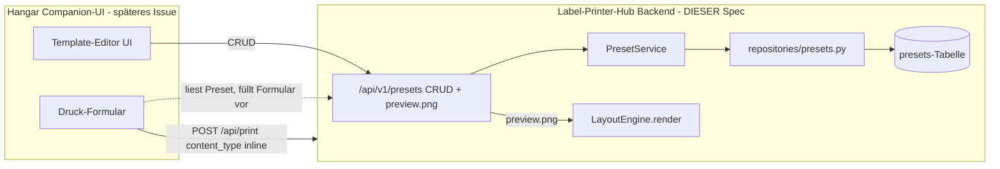

# Phase 1k.3 — User-Presets (Hub-Seite) — Design

**Datum:** 2026-06-23
**Status:** Entwurf
**Issue:** #104 (Phase 1k.3) — Prämisse veraltet, muss neu zugeschnitten werden
**Parent:** #101 (Phase 1k Umbrella)
**Ziel-Repo:** `label-printer-hub` (Backend), Companion-UI später in Hangar

---

## Ausgangslage / Warum dieser Spec von #104 abweicht

Issue #104 wurde geschrieben, **bevor** die Layout-Engine (#103 / Phase 1k.1a)
gelandet ist. Der Refactor war radikaler als #104 annimmt. Eine Code-Untersuchung
(2026-06-23, HEAD `eedb323`) ergab:

| #104 nimmt an | Realität im Code |
|---------------|------------------|
| `templates`-Tabelle mit `source='seed'\|'user'` | **Gelöscht** (Phase 1k.1a, `seed_templates()` ist No-op-Stub, `lifespan.py:117`) |
| `TemplateLoader` lädt YAML, soll user-source ergänzen | **Komplett entfernt** (`print_service.py:3`) |
| 21 YAML-Templates + `hub-layouts.yaml` | **Alle gelöscht** |
| `PrintRequest` referenziert `template_id` | **Entfernt** — heute `content_type` + geladenes Band (`print_request.py:3`) |
| `GET /api/templates/{key}/preview-svg` | Obsolet — es gibt bereits `POST /api/render/preview` (PNG, `print.py:298`) |
| Auth-Scope `templates:write` | Existiert nicht — Scopes sind 3-stufig `read ⊂ print ⊂ admin` (`scope_deps.py:41-43`) |

Das **Ziel** von #104 bleibt gültig: User sollen eigene benannte Layout-Presets
speichern können (pro Möbeltyp/Fach/Schublade). Der Weg dahin ändert sich.

### Schlüssel-Fund: Es gibt bereits eine `presets`-Tabelle

`models/preset.py` + `repositories/presets.py` definieren ein vollständiges
SQLModel-Aggregat mit CRUD-Repository — **das aber an keinen Route/Service
angeschlossen ist** (ungenutzt). Docstring (`preset.py:3`):

> Phase 1k.1a (Task 25): template_id foreign key removed — the templates table
> and Template model were deleted. Presets are now independent of templates.

Aktuelles Schema:

```python
class Preset(SQLModel, table=True):
    __tablename__ = "presets"
    id: UUID                      # PK
    name: str
    printer_id: UUID | None       # FK printers.id (optional)
    field_values: dict[str, Any]  # JSON
    created_at: datetime
    updated_at: datetime
```

---

## Entscheidung

| Frage | Entscheidung | Begründung |
|-------|--------------|------------|
| Integration mit Druck-Pfad | **B — Hub als Store + Preview, Druck-Pfad bleibt template-agnostisch** | Variante A (`template_key` in `PrintRequest`) würde die `template_id`-Kopplung wieder einführen, die 1k.1a gerade bewusst entfernt hat. Gegen die Richtung des Codebestands. |
| Datenmodell | **B1 — bestehende `presets`-Tabelle erweitern** | Model + Repository existieren bereits; kein neues Aggregat. Bewusst akzeptierter Semantik-Blur (Preset = gespeicherte Feldwerte ⇒ jetzt auch Layout-Preset). |
| Geometrie-Overrides (qr_position/font_size pro Template) | **Defern (YAGNI)** | Die `LayoutEngine` rendert aus frozen `TAPE_GEOMETRY`; Overrides würden 7 Render-Methoden aufbohren. Erster Wurf ist auch ohne nützlich. Eigenes Folge-Issue. |

---

## Architektur



**Kern:** Der Druck-Pfad (`POST /api/print`) bleibt **unverändert** und
template-agnostisch. Presets sind ein **getrennter** Store, den die UI nutzt, um
das Druck-Formular vorzubefüllen. Der Druck sendet `content_type` weiterhin inline.

---

## Datenmodell

`presets`-Tabelle erweitern (Alembic-Migration; Tabelle ist in Produktion leer,
daher konfliktfrei):

| Spalte | Status | Typ / Default |
|--------|--------|---------------|
| `id` | bestehend | UUID PK |
| `name` | bestehend | str |
| `printer_id` | bestehend | UUID \| None (FK printers.id) |
| `field_values` | bestehend | JSON — Default-/Beispieldaten für Preview |
| `content_type` | **neu** | String (ContentType-Enum), `server_default='qr_three_lines'`, NOT NULL |
| `tape_mm` | **neu** | Integer, `server_default='12'`, NOT NULL |
| `created_at` / `updated_at` | bestehend | DateTime(tz) |

`field_values` hält die label-data-Felder (`primary_id`, `title`, `qr_payload`,
`secondary`, `items`) als Default-Werte. Für die Preview werden sie in `LabelData`
gemappt (analog `_PreviewRequest`-Handling in `print.py:298`).

**Default-`content_type` = `qr_three_lines`** (User-Vorgabe). Erfordert Felder
`qr_payload + primary_id + title + secondary[0]` (`_REQUIRED_FIELDS`,
`layout_engine.py:40`).

### Alembic-Migration

Neue Revision (Vorlage: bestehende Migrationen unter `backend/alembic/versions/`):
- `add_column presets.content_type String NOT NULL server_default 'qr_three_lines'`
- `add_column presets.tape_mm Integer NOT NULL server_default '12'`
- Downgrade: beide Spalten droppen.

---

## API

Neuer Router `backend/app/api/routes/presets_api.py` (Struktur-Vorlage:
`admin_printers_api.py` — Router + `SessionDep`/`AuthDep` + Service-Layer mit
typisierten Domain-Errors → HTTPException).

| Methode | Pfad | Auth | Erfolg | Fehler |
|---------|------|------|--------|--------|
| GET | `/api/v1/presets` | `require_read` | 200 (Liste) | — |
| POST | `/api/v1/presets` | `require_print` | 201 | 409 (Name-Duplikat), 422 (invalid content_type/tape/fields) |
| GET | `/api/v1/presets/{id}` | `require_read` | 200 | 404 |
| PUT | `/api/v1/presets/{id}` | `require_print` | 200 | 404, 409, 422 |
| DELETE | `/api/v1/presets/{id}` | `require_print` | 204 | 404 |
| GET | `/api/v1/presets/{id}/preview.png` | `require_read` | 200 (image/png) | 404, 409 (unsupported tape), 422 (fehlende Felder) |

### Validierung (im PresetService, vor Persistenz)

1. `content_type ∈ ContentType` (Pydantic-Enum, automatisch).
2. `tape_mm ∈ TAPE_GEOMETRY` → sonst 422 (`unsupported_tape` analog `UnsupportedTapeError`).
3. `field_values` deckt die `_REQUIRED_FIELDS[content_type]` ab → sonst 422
   (`content_type_data_mismatch`, wiederverwendet aus LayoutEngine-Validierung).
4. `name` eindeutig (case-insensitive) → sonst 409 (`DuplicateNameError`).

### Preview-Endpoint

`GET /api/v1/presets/{id}/preview.png`:
1. Preset aus DB laden (404 wenn fehlt).
2. `field_values` → `LabelData` mappen (`source_app='preview'`).
3. `LayoutEngine().render(preset.tape_mm, preset.content_type, label_data)` →
   PNG (identische Logik wie `render_preview` in `print.py`, in CPU-Thread).
4. **Kein neuer Render-Pfad** — LayoutEngine wird unverändert wiederverwendet.

### Auth-Begründung (Review-Punkt)

Writes = `require_print`, **nicht** `require_admin`. Grund: Der Companion ist ein
Hangar-Editor; Hangars API-Key hat Scope `print`. Mit `admin`-Pflicht könnte der
Editor keine Presets verwalten. Browser-User (SSO) sind nach ADR 0014 ohnehin für
alle Scopes trusted. **Falls Presets als Infra-Admin-Ressource gelten sollen →
auf `require_admin` ändern.** Dieser Punkt ist bewusst markiert.

---

## Komponenten (Isolation)

| Unit | Datei | Verantwortung | Abhängigkeiten |
|------|-------|---------------|----------------|
| `Preset` Model | `models/preset.py` (erweitert) | Tabellen-Schema | SQLModel |
| Preset-Repository | `repositories/presets.py` (erweitert) | DB-CRUD | AsyncSession |
| `PresetService` | `services/preset_service.py` (**neu**) | Validierung + Domain-Errors + Orchestrierung | Repository, ContentType, TAPE_GEOMETRY |
| Preset-Schemas | `schemas/preset.py` (**neu**) | Create/Update-Payloads + Response | Pydantic |
| Preset-Router | `api/routes/presets_api.py` (**neu**) | HTTP-Mapping, Auth-Deps | PresetService, LayoutEngine |
| Migration | `alembic/versions/*` (**neu**) | Schema-Erweiterung | Alembic |

---

## Fehlerbehandlung

Domain-Errors im Service (Muster wie `printer_admin_service.py`):
`PresetNotFoundError` → 404, `DuplicateNameError` → 409,
`UnsupportedTapeError` (wiederverwendet) → 409/422, `ContentTypeDataMismatchError`
(wiederverwendet) → 422. Router mappt Domain-Errors → `HTTPException` mit
`ProblemDetail`-Body (`schemas/problem.py`).

---

## Tests (Test-Coverage-Pflicht — VERBINDLICH)

TDD strict: Test zuerst. Schwelle Mutation-Logic 85% (`coverage-gate-strict.sh`).

| Ebene | Test | Pfade |
|-------|------|-------|
| Repository | create/get/list/update/delete Roundtrip | Happy + not-found |
| PresetService | Validierung | invalid content_type, unsupported tape, fehlende Required-Fields, Name-Duplikat |
| PresetService | Mutationen | create/update/delete Happy + Error |
| Router | CRUD-Endpoints | 200/201/204 + 404/409/422 je Endpoint |
| Router | Auth | `require_print`-Enforcement auf Writes (403 ohne Scope), `require_read` auf Reads |
| Preview | preview.png | 200 image/png Happy, 404, 409 (bad tape), 422 (fehlende Felder) |

---

## Out of Scope

- **Geometrie-Overrides** (qr_position/font_size pro Preset) → eigenes Folge-Issue (Phase 1k.3.x / 1l).
- **Editor-UI** → Hangar-Companion-Issue.
- **Versionierung / Sharing / Marketplace** von Presets.
- **Bereinigung der `presets`-Semantik** (Feldwert-Preset vs. Layout-Preset) — bewusst akzeptierter Blur.
- **`PrintRequest`-Änderungen** — Druck-Pfad bleibt unangetastet.

---

## Risiken / Offene Punkte

1. **Auth-Scope für Writes** (`print` vs `admin`) — siehe Begründung oben. User-Review.
2. **Semantik-Blur `presets`** — die Tabelle vermischt künftig zwei Konzepte. Akzeptiert; falls später Reibung → Trennung in Folge-Issue.
3. **`printer_id`-Feld** bleibt optional und ungenutzt im ersten Wurf — Preset ist druckerunabhängig (tape_mm zählt). Nicht entfernen (Migration-Aufwand), aber dokumentieren dass es vorerst informell ist.
4. **#104 muss vom PM neu zugeschnitten werden** (veraltete Prämisse) + Label `superpowers:brainstorming` setzen.

---

## Referenzen

- Layout-Engine Spec: `docs/superpowers/specs/2026-06-05-phase-1k1-layout-engine-design.md`
- LayoutEngine: `backend/app/services/layout_engine.py`
- Preview-Endpoint: `backend/app/api/routes/print.py:298` (`POST /api/render/preview`)
- CRUD-Vorlage: `backend/app/api/routes/admin_printers_api.py` (#124)
- Bestehendes Preset-Aggregat: `backend/app/models/preset.py`, `backend/app/repositories/presets.py`
- Scopes: `backend/app/auth/scope_deps.py`
- Issue #104: https://github.com/strausmann/Label-Printer-Hub/issues/104
